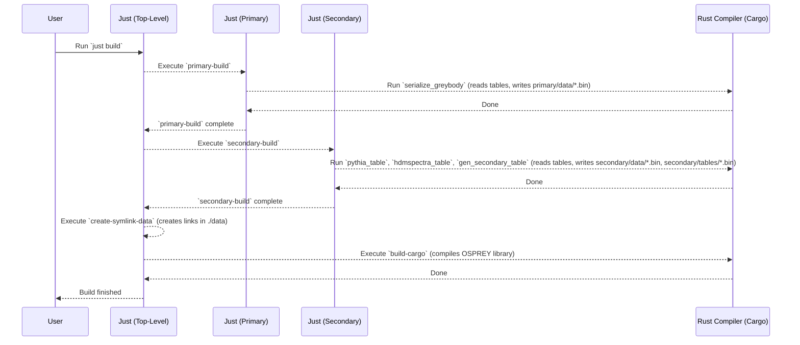

# Chapter 1: Build & Data Preparation Workflow

Welcome to OSPREY! Before you can start exploring the fascinating physics of Primordial Black Holes (PBHs), there's a small but crucial preparation step we need to take. Think of it like cooking: before you start mixing ingredients, you need to chop your vegetables, measure your spices, and preheat the oven. This preparation is called 'mise en place'.

In OSPREY, our "mise en place" is the **Build & Data Preparation Workflow**. This chapter will guide you through this essential setup process.

## Why Do We Need This Step?

OSPREY performs complex calculations involving large datasets, such as:

1.  **Greybody Factors:** These describe how likely particles are to be emitted by a rotating black hole. (We'll learn more about these in [Chapter 5: GreyBody Factor Handling](05_greybody_factor_handling_.md)).
2.  **Secondary Particle Spectra:** These describe the particles (like photons or electrons) produced when initially emitted particles decay or interact. (More details in [Chapter 6: Secondary Spectrum Handling](06_secondary_spectrum_handling_.md)).

These datasets originally come as large text tables (often from external sources like the `BlackHawk` code). Reading and processing these text files *every time* you run a calculation would be very slow!

To speed things up dramatically, we perform a one-time conversion. We read these text tables and **serialize** them into a compact, efficient binary format (files ending in `.bin`). Think of it like compressing a huge folder of documents into a single, smaller zip file. Computers can read these binary `.bin` files much, much faster than the original text tables.

This chapter explains how to run this conversion process.

## The Magic Wand: `just`

How do we tell OSPREY to do this preparation? We use a handy tool called `just`.

`just` is a command-line task runner. It reads instructions from special files named `justfile` (think of them as recipe files) and executes the steps defined within them. OSPREY comes with `justfile`s that contain the "recipes" for building the code and preparing the data.

## Running the Workflow: The `just build` Command

Getting everything ready is surprisingly simple. You only need to run one command in your terminal, from the main OSPREY project directory:

```bash
just build
```

That's it!

**What happens when you run `just build`?**

This command tells `just` to look for a `justfile` in the current directory and execute the recipe named `build`. Let's peek inside the main `justfile`:

```makefile
# --- File: justfile (Simplified) ---
default: build

# Recipe to build the primary data (Greybody factors)
primary-build:
    just --working-directory ./primary --justfile ./primary/justfile build

# Recipe to build the secondary data (Particle spectra)
secondary-build:
    just --working-directory ./secondary --justfile ./secondary/justfile build

# Recipe to create shortcuts (links) to the prepared data
create-symlink-data:
    # ... commands to create links ...
    @echo "Creating data links..."

# Recipe to compile the main OSPREY code
build-cargo:
    cargo build --release

# The main 'build' recipe that runs all the steps
build: primary-build secondary-build create-symlink-data build-cargo

# ... other recipes like 'clean' ...
```

*   **`justfile`:** This file contains recipes (like `primary-build`, `secondary-build`, `build`).
*   **`build:`:** This defines the main `build` recipe.
*   **Dependencies:** The last line (`build: primary-build ...`) tells `just` that to run `build`, it must first run `primary-build`, then `secondary-build`, then `create-symlink-data`, and finally `build-cargo`.

So, running `just build` triggers a chain reaction:

1.  **`primary-build`:** Runs the `build` recipe inside the `primary/justfile`. This compiles a small program that reads raw Greybody factor tables and saves them as `.bin` files in the `primary/data/` directory.
2.  **`secondary-build`:** Runs the `build` recipe inside the `secondary/justfile`. This compiles programs that read raw particle decay tables (from Pythia and HDMSpectra, often bundled with BlackHawk) and saves them as `.bin` files in `secondary/data/` and `secondary/tables/`.
3.  **`create-symlink-data`:** Creates shortcuts (symbolic links) in a central `./data` directory, pointing to the `.bin` files created in the `primary/data` step. This makes it easy for the main OSPREY code to find the prepared data.
4.  **`build-cargo`:** Compiles the main OSPREY Rust code itself using `cargo`, Rust's build tool.

**Expected Outcome:**

After running `just build`, you won't see specific numbers printed (unless there are errors). Instead, you should see messages indicating progress, like "Generating PYTHIA table...", "Building cargo...", "Creating data links...".

The important result is that:
*   The OSPREY code is compiled and ready to run.
*   Several `.bin` files containing the prepared Greybody factors and secondary spectra now exist in the `primary/data/`, `secondary/data/`, and `secondary/tables/` directories.
*   A `./data` directory exists with links pointing to the primary `.bin` files.

## Under the Hood: A Closer Look

Let's visualize the process when you run `just build`:



**Code Snippets Explained:**

1.  **Primary Data Preparation (`primary/justfile`):**
    ```makefile
    # --- File: primary/justfile (Snippet) ---
    prepare_data:
        @echo "Preparing data..."
        @mkdir -p {{data_dir}} # Create ./data if it doesn't exist
        # Run the Rust program to serialize Greybody data
        cargo run --release --bin serialize_greybody -- "{{gamma_tables_dir}}"

    build: prepare_data build_cargo # build needs prepare_data first
    ```
    This snippet shows the `prepare_data` recipe. It runs a Rust program called `serialize_greybody`, passing it the location of the raw Greybody tables (`gamma_tables_dir`, usually found within your `BlackHawk` directory).

2.  **Serialization Code (`primary/src/bin/serialize_greybody.rs`):**
    ```rust
    // --- File: primary/src/bin/serialize_greybody.rs (Simplified) ---
    use primary::core::{GreyBodyData, Spin};
    // ... other imports ...
    use std::path::PathBuf;

    fn main() -> Result<(), Box<dyn std::error::Error>> {
        // ... code to get gamma_tables_dir from command line ...
        let gamma_tables_dir = PathBuf::from(&args[1]);
        let data_dir = PathBuf::from("./data"); // Output directory
        fs::create_dir_all(&data_dir)?; // Create ./data if needed

        // Process data for different particle spins
        for spin in vec![Spin::Zero, Spin::Half, Spin::One /* ... */] {
            // Load raw data from text tables using OSPREY's internal logic
            println!("Loading raw data for spin {}...", spin);
            let data = GreyBodyData::from_table(spin, &gamma_tables_dir)?;

            // Define the output binary filename
            let data_path = data_dir.join(format!("spin_{}.bin", f64::from(spin)));
            println!("Writing binary data to {}...", data_path.display());
            // Write the data structure to the binary file
            // (Serialization happens here!)
            // data.write_bin(&data_path)?; // Simplified - actual uses rkyv::to_bytes + file write

             let mut file = File::create(data_path)?;
             let mut writer = BufWriter::new(&mut file);
             // Convert the data structure into binary bytes
             let bytes = rkyv::to_bytes::<rancor::Error>(&data).unwrap();
             // Write the bytes to the file
             writer.write_all(&bytes)?;
             writer.flush()?; // Ensure all data is written

            println!("Successfully wrote binary file for spin {}.", spin);
        }
        Ok(())
    }
    ```
    This Rust code snippet shows the core logic:
    *   It loops through different particle spins.
    *   `GreyBodyData::from_table` reads the text files for a given spin.
    *   `rkyv::to_bytes` converts the loaded data into a binary format.
    *   `writer.write_all` saves these binary bytes into a `.bin` file (e.g., `spin_0.bin`, `spin_0.5.bin`).

Similar processes happen within the `secondary` directory for the Pythia and HDMSpectra data, using programs like `pythia_table.rs` and `hdmspectra_table.rs` to parse different text file formats and save them as `.bin` files.

## Conclusion

You've now learned about the crucial first step in using OSPREY: the **Build & Data Preparation Workflow**. By running the simple `just build` command, you trigger a series of tasks orchestrated by `justfile`s. These tasks compile necessary helper programs, read large raw data tables (like Greybody factors and secondary particle spectra), serialize them into efficient `.bin` binary files, and finally compile the main OSPREY library.

This "mise en place" ensures that when you run your actual physics calculations, OSPREY can load the necessary data extremely quickly, saving you valuable time.

With the build and data preparation complete, you're ready to move on to the next step: configuring your OSPREY calculations.

**Next Chapter:** [Chapter 2: Configuration Management](02_configuration_management_.md)

---

Generated by [AI Codebase Knowledge Builder](https://github.com/The-Pocket/Tutorial-Codebase-Knowledge)