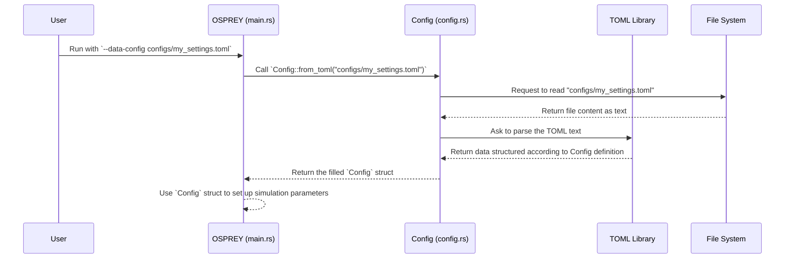

# Chapter 2: Configuration Management

Welcome back! In [Chapter 1: Build & Data Preparation Workflow](01_build___data_preparation_workflow_.md), we got OSPREY ready by preparing all the necessary background data, like getting our ingredients prepped and the oven preheated. Now that the kitchen is ready, it's time to decide *exactly* what we want to cook!

This chapter introduces **Configuration Management** – how we tell OSPREY the specific details of the calculation we want to perform.

## Why Do We Need Configuration? The Recipe Card

Imagine you have a super-advanced oven (OSPREY) capable of cooking many different things. How do you tell it whether you want to bake a small cake or roast a large chicken? You need a **recipe card**!

In OSPREY, the configuration file acts like this recipe card. It tells the program things like:

*   What **range of Primordial Black Hole (PBH) masses** are we interested in? (e.g., tiny ones, medium ones, or a wide range?)
*   What **range of particle energies** should we consider?
*   How many **data points** should we calculate within those ranges?
*   When calculating the particles produced (secondary spectra), which simulation tool (Hazma, Pythia, HDMSpectra) should be used for different energy levels?

Without a configuration file, OSPREY wouldn't know the specifics of the simulation you want to run. Configuration files let us easily change these parameters without modifying the core OSPREY code itself.

## The Recipe Format: TOML Files

OSPREY reads its instructions from files written in **TOML** (Tom's Obvious, Minimal Language). TOML is designed to be easy for humans to read and write. It uses simple `key = value` pairs, organized into sections using square brackets `[SectionName]`.

Here's a small taste of what a configuration file might look like:

```toml
# --- File: configs/data_v0.toml (Simplified) ---

# Settings for the Primordial Black Holes
[PBH]
mass_min = 1.0e+8     # Smallest PBH mass to simulate (in grams)
mass_max = 1.0e+17    # Largest PBH mass to simulate (in grams)
mass_num = 10         # How many different masses to simulate between min and max
interpolation = "log" # How to space the masses (logarithmically)

# Settings for the energy grid of particles
[Primary]
E_min = 1.0e-6        # Minimum energy (in MeV)
E_max = 1.0e+12       # Maximum energy (in MeV)
E_num = 1000          # Number of energy points
interpolation = "log" # How to space the energy points (logarithmically)

# Settings for switching between secondary particle simulators
[EnergyCut]
E_hazma_max = 5.0e+3  # Use Hazma for energies BELOW this (in MeV)
E_hdm_min = 1.0e+7    # Use HDMSpectra for energies ABOVE this (in MeV)
                      # (Use Pythia for energies in between)
```

*   Lines starting with `#` are comments (ignored by the program).
*   `[PBH]`, `[Primary]`, `[EnergyCut]` define sections.
*   Inside each section, `key = value` lines set specific parameters.

You can find example configuration files in the `configs/` directory of the OSPREY project. Feel free to open `configs/data_v0.toml` or look inside `configs/templates/` to see more examples.

## The `Config` Struct: Reading the Recipe in Code

Inside the OSPREY Rust code, there's a special container, a `struct` called `Config`, designed to hold all these settings. Think of it like a structured form where the program neatly stores all the values it reads from the TOML file.

The `Config` struct is defined in `src/config.rs` and has fields that directly correspond to the sections and keys in the TOML file.

## How to Use Configuration

Using a configuration file with OSPREY is straightforward. When you run the main OSPREY program, you tell it which configuration file to use via a command-line argument.

While the exact command might vary depending on how you run OSPREY, the core idea involves specifying the path to your chosen TOML file. If you're running directly using `cargo` (Rust's build tool), it looks like this:

```bash
# From the main OSPREY project directory
cargo run --release -- --data-config configs/data_v0.toml
```

Let's break down this command:
*   `cargo run --release`: Tells Rust to compile (if needed) and run the main OSPREY program in optimized (`release`) mode.
*   `--`: Separates arguments for `cargo` from arguments for *your* program (OSPREY).
*   `--data-config configs/data_v0.toml`: This is the crucial part! It tells OSPREY to load its settings from the file located at `configs/data_v0.toml`.

**What happens when you run this?**

1.  OSPREY starts up.
2.  It looks at the `--data-config` argument to find the path to the TOML file.
3.  It reads the specified TOML file (`configs/data_v0.toml` in this case).
4.  It parses the contents and stores the values in its internal `Config` struct.
5.  It then uses the settings stored in the `Config` struct to set up and perform the calculation (e.g., creating the list of PBH masses, defining the energy ranges).

Let's peek at the code in `src/main.rs` that handles this:

```rust
// --- File: src/main.rs (Simplified Snippet) ---
use clap::Parser; // Used for parsing command-line arguments
use osprey::config::Config; // Import the Config struct
use std::path::PathBuf;

// Define expected command-line arguments
#[derive(Parser, Debug)]
struct CliArgs {
    data_config: PathBuf, // Expects an argument named data_config which is a file path
}

fn main() -> Result<(), Box<dyn std::error::Error>> {
    // Parse the arguments provided by the user (like --data-config ...)
    let args = CliArgs::parse();
    let data_config_file = args.data_config;

    // --- This is the key step! ---
    // Load the configuration from the specified TOML file
    let data_config = Config::from_toml(data_config_file.to_str().unwrap())?;

    // Print the loaded configuration (for verification)
    println!("Loaded Configuration: {:?}", data_config);

    // Now use the data_config object to set up the rest of the calculation...
    let pbhs = data_config.generate_pbhs();
    let primary_energies = data_config.generate_primary_energies();
    // ... and so on ...

    Ok(())
}
```

This code first defines that it expects a `data_config` argument. Then, `Config::from_toml(...)` is called with the file path provided by the user. This function does the work of reading and parsing the file, returning the `data_config` object filled with settings. The rest of the program then uses this object (e.g., `data_config.generate_pbhs()`) to guide the simulation.

## Under the Hood: How `Config::from_toml` Works

Let's trace the journey of your configuration settings from the file into the program:



Essentially:
1.  The main program gets the filename you provided.
2.  It asks the `Config` module to load settings from that file.
3.  The `Config` module asks the operating system (File System) to read the file's text content.
4.  It passes this text to a specialized library (`toml-rs`) that understands the TOML format.
5.  The TOML library parses the text and automatically fills in the fields of the `Config` struct.
6.  The filled `Config` struct is returned to the main program, ready to be used.

Let's look at the relevant code in `src/config.rs`:

```rust
// --- File: src/config.rs (Simplified Snippets) ---
use serde::Deserialize; // Library feature for reading data into structs
use std::fs; // For file system operations (reading files)

// Define structs that match the TOML structure
#[derive(Debug, Deserialize, Clone)] // Deserialize tells Rust how to read TOML into this
struct PBHConfig {
    mass_min: f64,
    mass_max: f64,
    mass_num: u64,
    interpolation: String,
}

// ... similar structs for PrimaryConfig and EnergyCutConfig ...

#[derive(Debug, Deserialize, Clone)] // Can also deserialize the top-level structure
pub struct Config {
    #[serde(rename = "PBH")] // Maps the TOML section [PBH] to this field
    pbh: PBHConfig,
    #[serde(rename = "Primary")]
    primary: PrimaryConfig,
    #[serde(rename = "EnergyCut")]
    energy_cut: EnergyCutConfig,
}

impl Config {
    // Function to load configuration from a TOML file path
    pub fn from_toml(path: &str) -> Result<Self, Box<dyn std::error::Error>> {
        // Read the entire file content into a string
        let contents = fs::read_to_string(path)?;
        // Use the 'toml' crate to parse the string into our Config struct
        let config: Config = toml::from_str(&contents)?;
        // Return the successfully parsed configuration
        Ok(config)
    }

    // Helper function to generate PBH masses based on config
    pub fn generate_pbhs(&self) -> Vec<PBH> {
        // Uses self.pbh.mass_min, self.pbh.mass_max, etc.
        // ... logic to create a list of PBH objects ...
        // (More about PBH objects in Chapter 3)
    }

    // Helper function to generate energy points based on config
    pub fn generate_primary_energies(&self) -> Vec<f64> {
        // Uses self.primary.E_min, self.primary.E_max, etc.
        // ... logic to create a list of energy values ...
    }

    // Helper function to get energy cut values
    pub fn energy_cut(&self) -> (f64, f64) {
        // Returns the thresholds for switching between Hazma, Pythia, HDMSpectra
        // (More about secondary spectra in Chapter 6)
        (self.energy_cut.E_hazma_max, self.energy_cut.E_hdm_min)
    }
}
```

*   `#[derive(Deserialize)]`: This is an instruction to the Rust compiler (via the `serde` library) to automatically generate the code needed to fill the struct (`Config`, `PBHConfig`, etc.) from formats like TOML.
*   `#[serde(rename = "PBH")]`: This tells `serde` that the `pbh` field in the Rust struct corresponds to the `[PBH]` section in the TOML file.
*   `Config::from_toml`: This function reads the file using `fs::read_to_string` and then uses `toml::from_str` (from the `toml` crate) to parse the text into the `Config` struct.
*   Helper functions like `generate_pbhs`, `generate_primary_energies`, and `energy_cut` provide convenient ways for the rest of the code to access the configuration values in a useful format (e.g., getting a ready-made list of masses instead of just the min/max/num values). These functions use the values stored within the `self` (the `Config` object itself) that were read from the TOML file.

## Conclusion

You've now learned how OSPREY uses **Configuration Management** to understand the specific simulation you want to run. By editing simple, human-readable **TOML files**, you can easily control parameters like PBH mass ranges, energy grids, and simulation choices without touching the main code. The program reads these TOML files using the `Config` struct and helper functions, ensuring your desired settings guide the calculation.

Think of the TOML file as your recipe card, and the `Config` struct as how the OSPREY program reads and understands that recipe.

With our data prepared and our recipe written, we can now start looking at the specific ingredients mentioned in the recipe. The first key ingredient is the star of the show: the Primordial Black Hole itself.

**Next Chapter:** [Chapter 3: Primordial Black Hole (PBH)](03_primordial_black_hole__pbh__.md)

---

Generated by [AI Codebase Knowledge Builder](https://github.com/The-Pocket/Tutorial-Codebase-Knowledge)