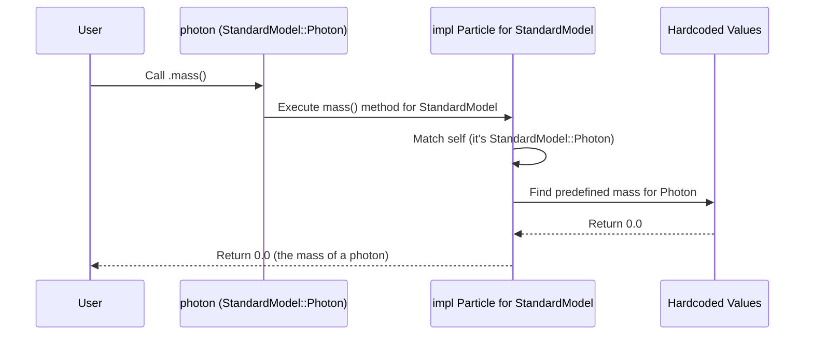

# Chapter 2: Particle / StandardModel

In [Chapter 1: PBH (Primordial Black Hole)](01_pbh__primordial_black_hole__.md), we learned how to represent the star of our show, the Primordial Black Hole (`PBH`), which acts as the source of particles. But *what kind* of particles does it actually emit? And how do we represent these particles in our code?

That's where the `Particle` / `StandardModel` concept comes in!

## What's the Big Idea? Meet the Cast of Characters

Imagine our PBH simulation is like a movie. The PBH is the main character, maybe the powerful engine driving the plot. But what other characters are involved? Our PBH doesn't just exist in a vacuum; it interacts with the universe by emitting various fundamental particles.

These particles are the "cast of characters" in our physics simulation. They include familiar names like photons (light particles) and electrons, as well as more exotic ones like pions, muons, and quarks. We need a way to:

1.  **List all possible particles:** Define the complete cast recognized by our simulation.
2.  **Know their key attributes:** For each particle, we need specific information like its mass, spin, and how many different ways it can exist (called "degrees of freedom" or DOF). These details are crucial for calculating *how often* the PBH emits each particle type.

**Our Goal:** We want to represent these fundamental particles and their properties within OSPREY so we can later use them in calculations, like figuring out the emission rate for photons versus electrons from our `PBH`.

## What are Particles in OSPREY?

OSPREY uses two main tools to handle particles:

1.  **`StandardModel` Enum:** This is like our official **list of all possible particle types** the simulation knows about. An "enum" (short for enumeration) is just a way to define a type that can only be one of a fixed set of named values. Think of it like a dropdown menu where you can select "Photon", "Electron", "NeutralPion", etc.

2.  **`Particle` Trait:** This is like a **template or "character sheet"** that defines the *essential information* we must know about *any* particle in our simulation. A "trait" in Rust defines a set of methods that a type must provide. The `Particle` trait says, "If you want to be considered a particle in OSPREY, you *must* be able to tell me your mass, your spin, and your degrees of freedom."

By combining these, we ensure that every particle listed in `StandardModel` has all the necessary information defined by the `Particle` trait.

## How to Use Particles in OSPREY

Using particles is straightforward. You typically just select the particle type you're interested in from the `StandardModel` enum.

Let's say we want to work with photons and electrons:

```rust
// Import the necessary items from osprey
use primary::core::{StandardModel, Particle}; // Assuming these are in osprey::primary::core

// Select the Photon particle type
let photon = StandardModel::Photon;

// Select the Electron particle type
let electron = StandardModel::Electron;

// Now 'photon' and 'electron' represent these specific particles.
println!("Selected particle: {}", photon.to_string()); // .to_string() gives a readable name
println!("Selected particle: {}", electron.to_string());

// We can access their properties defined by the Particle trait:
println!("Photon mass: {} MeV", photon.mass());
println!("Photon spin: {:?}", photon.spin()); // Spin is another enum
println!("Photon DOF: {}", photon.dof());

println!("Electron mass: {:.6f} MeV", electron.mass());
println!("Electron spin: {:?}", electron.spin());
println!("Electron DOF: {}", electron.dof());
```

**Explanation:**

1.  `use primary::core::{StandardModel, Particle};`: We import the `StandardModel` enum and the `Particle` trait.
2.  `let photon = StandardModel::Photon;`: We create a variable `photon` and assign it the `Photon` variant from the `StandardModel` enum.
3.  `let electron = StandardModel::Electron;`: Similarly, we create a variable `electron` for the `Electron` variant.
4.  `photon.to_string()`: We can get a nice string name for the particle.
5.  `photon.mass()`, `photon.spin()`, `photon.dof()`: Because `StandardModel` implements the `Particle` trait, we can directly call these methods on our `photon` and `electron` variables to get their properties (mass in Mega-electron Volts (MeV), spin value, and number of degrees of freedom).

**Input:** Choosing a variant from the `StandardModel` enum (e.g., `StandardModel::Photon`).
**Output:** A variable representing that particle type, ready to be used. We can then query its properties like mass, spin, and DOF.

These particle representations (`photon`, `electron`) are essential inputs for other core OSPREY functions, most importantly the `PBH::emission_rate` function we glimpsed in Chapter 1. That function needs to know *which* particle's emission rate we want to calculate.

```rust
// Sneak peek (Detailed in Chapter 4)
// let my_pbh = PBH::new(1e15);
// let energies = vec![1.0, 10.0, 100.0]; // Example energies in MeV

// We pass the 'photon' variable to calculate the photon emission rate
// let photon_emission_rate = my_pbh.emission_rate(photon, &energies);

// We pass the 'electron' variable to calculate the electron emission rate
// let electron_emission_rate = my_pbh.emission_rate(electron, &energies);
```

## Under the Hood: How Properties are Stored

How does OSPREY know the mass of an electron or the spin of a photon when you call `.mass()` or `.spin()`? It's not magic; it's pre-defined within the code!

1.  **`StandardModel` Enum:** Defines the list of names.
2.  **`Particle` Trait:** Defines *what* methods must exist (`mass()`, `spin()`, `dof()`).
3.  **Implementation (`impl Particle for StandardModel`):** This is the crucial part where we provide the actual code for the `mass()`, `spin()`, and `dof()` methods specifically for the `StandardModel` enum. Inside these methods, there's a `match` statement (like a big switch or if-else chain) that checks *which* `StandardModel` variant is being used and returns the corresponding hardcoded value based on known physics data (like the Particle Data Group tables).

Here's a simplified view of the process when you call `photon.mass()`:



Let's look at simplified versions of the relevant code:

**File:** `primary/src/core.rs`

```rust
// --- 1. The List of Particles ---
/// Enum representing Standard Model particles considered for PBH emission.
#[derive(Debug, Copy, Clone, Hash, PartialEq, Eq)]
pub enum StandardModel {
    Photon,      // Photon
    Electron,    // Electron and Positron
    NeutralPion, // Pi^0 meson
    // ... many other particles like Muon, Tau, Quarks, W/Z Bosons, etc.
}

// --- 2. The "Character Sheet" Template ---
/// Trait defining the essential properties of a particle species.
pub trait Particle {
    /// Returns the mass of the particle (in MeV).
    fn mass(&self) -> f64;
    /// Returns the spin of the particle.
    fn spin(&self) -> Spin; // Spin is another enum (Spin::Zero, Spin::Half, etc.)
    /// Returns the number of internal degrees of freedom (DOF).
    fn dof(&self) -> f64;
}

// --- 3. Filling the Character Sheet for StandardModel Particles ---
/// Implementation of the `Particle` trait for `StandardModel` particles.
impl Particle for StandardModel {
    /// Returns the mass of the Standard Model particle in MeV.
    fn mass(&self) -> f64 {
        match self {
            StandardModel::Photon => 0.0,            // Massless
            StandardModel::Electron => 0.5109989461, // ~0.511 MeV
            StandardModel::NeutralPion => 134.9768,  // ~135.0 MeV
            // ... cases for all other particles
        }
    }

    /// Returns the spin (`Spin` enum value) of the Standard Model particle.
    fn spin(&self) -> Spin {
        match self {
            StandardModel::Photon => Spin::One,      // Spin 1
            StandardModel::Electron => Spin::Half,   // Spin 1/2
            StandardModel::NeutralPion => Spin::Zero, // Spin 0
            // ... cases for all other particles
        }
    }

    /// Returns the number of degrees of freedom (DOF).
    fn dof(&self) -> f64 {
        match self {
            StandardModel::Photon => 2.0,      // 2 polarization states
            StandardModel::Electron => 4.0,    // electron/positron * 2 spin states
            StandardModel::NeutralPion => 1.0, // 1 state
            // ... cases for all other particles
        }
    }
}
```

**Explanation:**

*   The `StandardModel` enum lists the particle types.
*   The `Particle` trait defines the required methods (`mass`, `spin`, `dof`).
*   The `impl Particle for StandardModel` block provides the actual implementations. Inside each method (`mass`, `spin`, `dof`), a `match self { ... }` block checks which specific `StandardModel` variant was used (e.g., `Photon` or `Electron`) and returns the correct, hardcoded value.

## Conclusion

In this chapter, we learned how OSPREY represents the fundamental particles emitted by PBHs:

*   The **`StandardModel` enum** acts as a complete list of all particle types the simulation knows (the "cast of characters").
*   The **`Particle` trait** defines the essential information needed for each particle (mass, spin, DOF) – the "character sheet".
*   By implementing the `Particle` trait for `StandardModel`, OSPREY ensures that every particle in the list has its properties readily available through simple method calls (e.g., `photon.mass()`).
*   These particle objects are crucial inputs for calculating how PBHs radiate.

We now have our source (the `PBH` from Chapter 1) and the list of possible things it can emit (the `StandardModel` particles from this chapter). But *how* does the PBH actually emit them? The process isn't perfectly efficient; the black hole's gravity and the particle's properties affect the emission probability. This is described by something called "Greybody Factors".

Let's explore these factors in the next chapter: [Chapter 3: GreyBody Factors (GreyBody / GreyBodyData / GreyBodyFit)](03_greybody_factors__greybody___greybodydata___greybodyfit__.md)!

---

Generated by [AI Codebase Knowledge Builder](https://github.com/The-Pocket/Tutorial-Codebase-Knowledge)