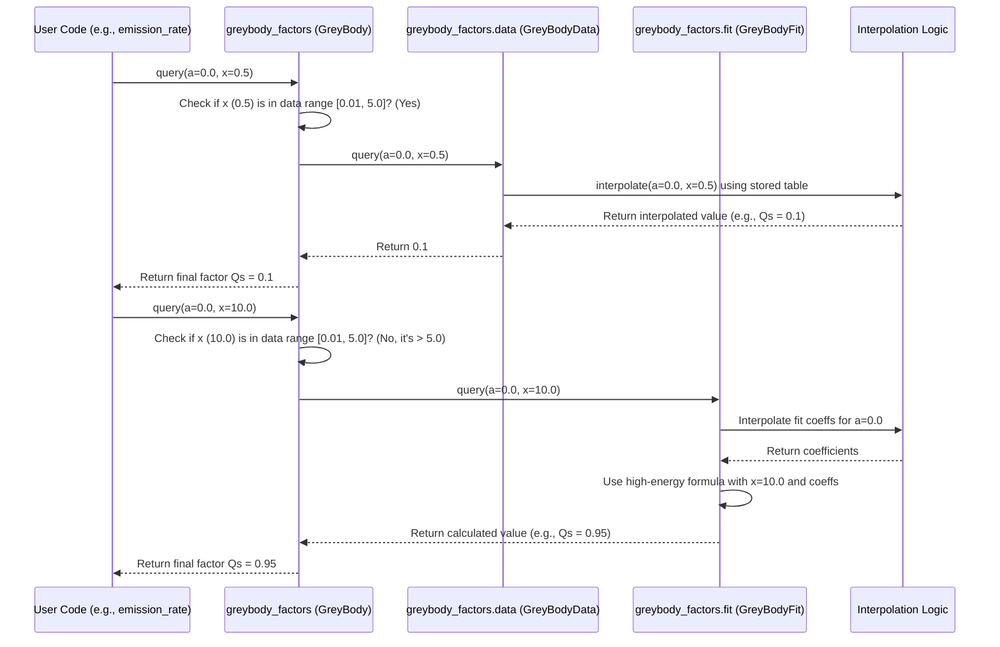

# Chapter 3: GreyBody Factors (GreyBody / GreyBodyData / GreyBodyFit)

In the previous chapters, we met our particle source, the [PBH (Primordial Black Hole)](01_pbh__primordial_black_hole__.md), and the cast of characters it can potentially emit, the [Particle / StandardModel](02_particle___standardmodel_.md) particles.

Now, imagine our PBH is like a tiny star trying to shine. Stephen Hawking figured out that black holes *do* radiate particles (Hawking radiation), much like a hot object glows (blackbody radiation). But there's a catch! A black hole has incredibly strong gravity.

**The Problem:** Not every particle created near the black hole manages to escape. Especially lower-energy particles are likely to get pulled back in by the black hole's gravity before they can travel far away. Think of it like trying to launch a rocket from Earth – if it doesn't have enough speed (energy), gravity pulls it back down.

**Our Goal:** We need a way to figure out the *probability* that a particle of a certain type (like a photon or electron) and a certain energy, created by the PBH, will actually *escape* its gravitational pull and reach us, the observers far away. This escape probability is what "Greybody Factors" represent. They act as an energy-dependent filter on the raw Hawking radiation.

## What are Greybody Factors in OSPREY?

In OSPREY, the concept of Greybody factors encapsulates this escape probability. It's not just a single number; it depends on:

1.  **The Particle's Energy:** Higher energy particles escape more easily.
2.  **The Particle's Spin:** Particles with different spins (like spin-0 Higgs vs. spin-1 Photons vs. spin-1/2 Electrons) interact with the black hole's gravitational field differently. We learned about spin in [Chapter 2: Particle / StandardModel](02_particle___standardmodel_.md).
3.  **The Black Hole's Mass:** This determines the strength of the gravity well (we saw mass is key in [Chapter 1: PBH (Primordial Black Hole)](01_pbh__primordial_black_hole__.md)).

Calculating these factors precisely from first principles involves complex physics (solving wave equations in curved spacetime!). OSPREY takes a practical approach by combining two methods:

1.  **`GreyBodyData` (The Cheat Sheet):** For a "middle range" of particle energies where calculations are trickiest but well-studied, OSPREY uses pre-calculated tables of greybody factors. Think of this as looking up the answers in a detailed reference book. This data is stored efficiently in binary files.
2.  **`GreyBodyFit` (The Formulas):** For very low and very high particle energies, the greybody factors follow simpler mathematical patterns. OSPREY uses analytical formulas (or "fits") that approximate these patterns very well. These formulas are defined by a set of parameters, also stored efficiently.

3.  **`GreyBody` (The Manager):** This is the main structure we interact with (usually indirectly). It holds both the `GreyBodyData` table and the `GreyBodyFit` formulas for a *specific particle spin*. When asked for a greybody factor, it intelligently decides whether to look it up in the table or calculate it using the formulas based on the particle's energy.

Think of `GreyBody` like a librarian who has a detailed reference book (`GreyBodyData`) for common questions and knows simple rules (`GreyBodyFit`) for very easy or very specialized questions.

## How Greybody Factors are Used (Usually Behind the Scenes)

Most of the time, you won't directly call `GreyBody` functions yourself. They are a crucial *internal* component used by the `PBH::emission_rate` method, which we'll cover in detail in [Chapter 4: Emission Rate Calculation (PBH::emission_rate)](04_emission_rate_calculation__pbh__emission_rate__.md).

Here's the conceptual idea of how `PBH::emission_rate` uses it:

1.  Calculate a "raw" emission rate based purely on the PBH's temperature (like a perfect blackbody).
2.  Determine the particle's spin (using methods from [Chapter 2: Particle / StandardModel](02_particle___standardmodel_.md)).
3.  Load the correct `GreyBody` object (data + fits) for that specific spin.
4.  For the particle's energy `E` and the PBH's mass `M` (which defines its size/radius `r_S`), calculate a dimensionless energy `x = E * r_S`.
5.  Ask the `GreyBody` object for the escape probability factor (called `Q_s`) using `greybody.query(a, x)` (where `a` is the black hole's spin, usually 0 for PBHs).
6.  Multiply the "raw" rate by this `Q_s` factor.

The result is the *actual* emission rate of particles that escape to infinity.

**Loading `GreyBody` Data:** Although usually internal, you *can* load the greybody data yourself if needed, for example, to study the factors directly. This is done using `GreyBody::from_bin`, which loads pre-compiled data for efficiency.

```rust
// Import necessary items from osprey
use primary::core::{GreyBody, Spin}; // Assuming GreyBody and Spin are here

// We need greybody factors for a specific particle spin.
// Let's choose Spin::Zero (like for Higgs or Pions).
let particle_spin = Spin::Zero;

// Load the combined data table and analytical fits for this spin.
// This reads data from binary files prepared during the build process.
match GreyBody::from_bin(particle_spin) {
    Ok(greybody_factors) => {
        println!("Successfully loaded GreyBody factors for Spin {:?}", particle_spin);
        // Now 'greybody_factors' holds the data and fits for spin-0 particles.
    }
    Err(e) => {
        eprintln!("Error loading GreyBody data: {}", e);
    }
}
```

**Explanation:**

1.  `use primary::core::{GreyBody, Spin};`: Imports the necessary types.
2.  `let particle_spin = Spin::Zero;`: Selects the spin we are interested in.
3.  `GreyBody::from_bin(particle_spin)`: This function attempts to load the `GreyBodyData` and `GreyBodyFit` for the given spin from binary files (like `spin_0.0.bin` and `spin_0.0_fit.bin`). These files are typically generated and packaged when OSPREY is built. We'll touch on this process in [Chapter 8: Data Serialization/Deserialization (rkyv, Parquet)](08_data_serialization_deserialization__rkyv__parquet__.md).
4.  `Ok(greybody_factors)`: If loading is successful, we get the `GreyBody` object.
5.  `Err(e)`: If the files are missing or corrupt, an error is returned.

**Querying the Factor:** Once loaded, you can query the dimensionless factor $Q_s$ (related to the escape probability) using the `query` method. You need the dimensionless black hole spin `a` (usually 0 for PBHs) and the dimensionless energy `x = E * r_S$.

```rust
// Assuming greybody_factors was loaded successfully in the previous snippet
use primary::core::{GreyBody, Spin};
fn test() -> Result<(), Box<dyn std::error::Error>> {
  let greybody_factors = GreyBody::from_bin(Spin::Zero)?;
  // Dimensionless black hole spin (0 for non-spinning PBH)
  let a = 0.0;

  // Dimensionless energy x = E * r_S (Schwarzschild Radius)
  // Let's try different energy regimes:
  let x_low_energy = 0.005; // Very low energy (x < 0.01)
  let x_mid_energy = 0.5;   // Intermediate energy (0.01 <= x <= 5.0)
  let x_high_energy = 10.0; // Very high energy (x > 5.0)

  // Query the greybody factor (dimensionless single d.o.f. emissivity Q_s)
  let factor_low = greybody_factors.query(a, x_low_energy);
  let factor_mid = greybody_factors.query(a, x_mid_energy);
  let factor_high = greybody_factors.query(a, x_high_energy);

  // The query method automatically uses the Fit or the Data table!
  println!("Factor (Qs) at low energy (x={}): {:.4e} (uses Fit)", x_low_energy, factor_low);
  println!("Factor (Qs) at mid energy (x={}): {:.4e} (uses Data)", x_mid_energy, factor_mid);
  println!("Factor (Qs) at high energy (x={}): {:.4e} (uses Fit)", x_high_energy, factor_high);
  Ok(())
}
test().unwrap(); // Helper to make the example runnable
```

**Explanation:**

1.  `let a = 0.0;`: We set the dimensionless black hole spin parameter (relevant for rotating black holes, but OSPREY primarily deals with non-spinning, `a=0`, PBHs).
2.  `let x_... = ...;`: We define example dimensionless energy values (`x`). Remember `x` combines particle energy `E` and PBH size `r_S`. A small `x` means low energy relative to the black hole size.
3.  `greybody_factors.query(a, x_...)`: We call the `query` method on our loaded `GreyBody` object.
4.  **Input:** Dimensionless spin `a`, dimensionless energy `x`.
5.  **Output:** A single number (`f64`) representing the dimensionless factor $Q_s$. This factor is directly proportional to the escape probability and modifies the raw emission rate.
6.  Notice how the output comments indicate whether the `query` method internally used the `GreyBodyFit` (for low/high `x`) or the `GreyBodyData` (for intermediate `x`).

## Under the Hood: Loading and Querying

Let's peek behind the curtain to see what happens when you load and query greybody factors.

**1. Loading (`GreyBody::from_bin`)**

*   **Input:** A `Spin` value (e.g., `Spin::Zero`).
*   **Process:**
    *   Determines the filenames for the binary data and fit files based on the spin (e.g., `spin_0.0.bin`, `spin_0.0_fit.bin`). These files live in a special directory (`OUT_DIR/data`) managed by the build process.
    *   Reads the raw bytes from `spin_S.bin`.
    *   Uses the `rkyv` library (see [Chapter 8: Data Serialization/Deserialization (rkyv, Parquet)](08_data_serialization_deserialization__rkyv__parquet__.md)) to efficiently deserialize these bytes directly into a `GreyBodyData` struct. This struct contains the grid of `a` values, `x` values, and the corresponding $Q_s$ factors (`gamma` matrix).
    *   Reads the raw bytes from `spin_S_fit.bin`.
    *   Uses `rkyv` again to deserialize these bytes into a `GreyBodyFit` struct. This contains the parameters for the low-energy and high-energy analytical formulas.
    *   Creates a `GreyBody` struct, placing the loaded `GreyBodyData` and `GreyBodyFit` inside it.
*   **Output:** A `Result<GreyBody, Error>`.

**2. Querying (`GreyBody::query`)**

*   **Input:** Dimensionless spin `a`, dimensionless energy `x`.
*   **Process:** The `GreyBody` object acts as the manager:
    *   It checks the value of `x`.
    *   **If `x` is in the "middle range" (e.g., `0.01 <= x <= 5.0`):** It decides to use the table. It calls the `query` method on its internal `GreyBodyData` object.
        *   The `GreyBodyData::query` method uses the provided `a` and `x` to perform interpolation on its stored grid (`gamma` matrix). It finds the four nearest grid points surrounding the input (`a`, `x`) and uses [BilinearInterpolation](07_data_interpolation___querying__bilinearinterpolation__find_index_or_lower_bound__secondarytable__query__.md) to estimate the $Q_s$ value at the exact input point.
    *   **If `x` is outside the "middle range" (`x < 0.01` or `x > 5.0`):** It decides to use the formulas. It calls the `query` method on its internal `GreyBodyFit` object.
        *   The `GreyBodyFit::query` method first finds the analytical formula parameters appropriate for the input `a` (by interpolating the stored coefficient table if `a` is not exactly on a grid point). Then, it plugs the input `x` into the selected low-energy or high-energy formula using these parameters to calculate $Q_s$.
*   **Output:** The calculated $Q_s$ factor (`f64`).

Here's a diagram showing the decision process inside `GreyBody::query`:



**Simplified Code Structure:**

Let's look at the definitions (simplified) in `primary/src/core.rs`:

```rust
// File: primary/src/core.rs (Simplified)

use peroxide::structure::matrix::Matrix; // For data tables
use rkyv::{Archive, Deserialize, Serialize}; // For loading binary data

// The 'Manager' struct
#[derive(Debug, Clone)]
pub struct GreyBody {
    /// Tabulated greybody factor data (the 'cheat sheet')
    pub data: GreyBodyData,
    /// Analytical fits for low/high energy (the 'formulas')
    pub fit: GreyBodyFit,
}

impl GreyBody {
    // Function to load from binary files (uses rkyv)
    pub fn from_bin(spin: Spin) -> Result<Self, Box<dyn std::error::Error>> {
        // ... (implementation reads files, deserializes data and fit) ...
        # let data = GreyBodyData::from_bin(spin)?;
        # let fit = GreyBodyFit::from_bin(spin)?;
        # Ok(GreyBody{ data, fit }) // Simplified placeholder
    }

    // The main query function that decides strategy
    pub fn query(&self, a: f64, x: f64) -> f64 {
        if x >= 0.01 && x <= 5.0 { // Check if x is in the table range
            // Use the table data via interpolation
            self.data.query(a, x)
        } else {
            // Use the analytical formulas
            self.fit.query(a, x)
        }
    }
}

// The 'Cheat Sheet' data structure
#[derive(Debug, Archive, Serialize, Deserialize, Clone)]
pub struct GreyBodyData {
    pub s: f64,       // Spin value this data is for
    pub a: Vec<f64>,  // Grid of BH spin values
    pub x: Vec<f64>,  // Grid of dimensionless energy values
    pub gamma: Matrix,// The table of Qs factors
}

impl GreyBodyData {
    // Query using interpolation (details in Chapter 7)
    pub fn query(&self, a: f64, x: f64) -> f64 {
        // ... (calls BilinearInterpolation::interpolate) ...
        # // Placeholder for actual interpolation call
        # BilinearInterpolation::new(self.a.clone(), self.x.clone(), self.gamma.clone()).interpolate(a, x)
    }
    # pub fn from_bin(spin: Spin) -> Result<Self, Box<dyn std::error::Error>> { unimplemented!() } // Dummy
}

// The 'Formulas' parameter structure
#[derive(Debug, Archive, Serialize, Deserialize, Clone)]
pub struct GreyBodyFit {
    pub s: f64,      // Spin value this fit is for
    pub a: Vec<f64>, // Grid of BH spin values
    pub coeffs: Matrix, // Table of coefficients for the formulas
}

impl GreyBodyFit {
    // Query using analytical formulas
    pub fn query(&self, a: f64, x: f64) -> f64 {
        // ... (interpolates coeffs based on 'a', then applies low/high energy formula) ...
        // Placeholder for actual calculation
        if x < 0.01 { 1e-6 * x } else { 1.0 - 1.0/x }
    }
    pub fn from_bin(spin: Spin) -> Result<Self, Box<dyn std::error::Error>> { unimplemented!() } // Dummy
}

// --- Dummy implementations needed for the example ---
#[derive(Debug, Copy, Clone)] pub enum Spin { Zero }
impl Spin { fn from(s: f64) -> Self { Spin::Zero } }
impl From<Spin> for f64 { fn from(s: Spin) -> Self { 0.0 } }
pub struct BilinearInterpolation { x: Vec<f64>, y: Vec<f64>, z: Matrix }
impl BilinearInterpolation {
    pub fn new(x: Vec<f64>, y: Vec<f64>, z: Matrix) -> Self { BilinearInterpolation{x,y,z} }
    pub fn interpolate(&self, a: f64, x: f64) -> f64 { 0.1 } // Dummy value
}
// --- End Dummy ---
```

**Explanation:**

*   `GreyBody`: Holds an instance of `GreyBodyData` and `GreyBodyFit`. Its `query` method contains the core logic to choose between them based on `x`.
*   `GreyBodyData`: Contains vectors `a` and `x` defining the grid axes, and a `Matrix` `gamma` holding the pre-calculated $Q_s$ values. Its `query` method performs interpolation (covered in [Chapter 7: Data Interpolation & Querying](07_data_interpolation___querying__bilinearinterpolation__find_index_or_lower_bound__secondarytable__query__.md)).
*   `GreyBodyFit`: Contains the `a` grid and a `Matrix` `coeffs` holding the parameters needed for the low-energy and high-energy analytical formulas. Its `query` method uses these formulas.
*   `#[derive(Debug, Archive, Serialize, Deserialize, Clone)]`: These annotations are used by the `rkyv` library to automatically generate the code needed to efficiently save (`Serialize`) and load (`Deserialize`) these structures from binary files.

## Conclusion

In this chapter, we explored the crucial concept of **Greybody Factors**, which account for the fact that not all particles created by Hawking radiation escape the PBH's gravity. We learned:

*   Greybody factors act as an **energy-dependent filter** or escape probability.
*   They depend on particle **energy**, **spin**, and PBH **mass**.
*   OSPREY uses a hybrid approach:
    *   `GreyBodyData`: Tabulated data for intermediate energies.
    *   `GreyBodyFit`: Analytical formulas for very low and high energies.
    *   `GreyBody`: The manager struct that holds both and decides which to use via its `query` method.
*   Loading is done efficiently from pre-compiled binary files using `GreyBody::from_bin`.
*   These factors are essential internal components for calculating the actual observable particle emission rates.

We now have the source (`PBH`), the potential emissions (`StandardModel` particles), and the filter (`GreyBody`) that determines which emissions escape. We're finally ready to combine these pieces!

In the next chapter, we'll see exactly how OSPREY puts this all together to calculate the primary emission spectrum of particles escaping the PBH. Let's move on to [Chapter 4: Emission Rate Calculation (PBH::emission_rate)](04_emission_rate_calculation__pbh__emission_rate__.md)!

---

Generated by [AI Codebase Knowledge Builder](https://github.com/The-Pocket/Tutorial-Codebase-Knowledge)