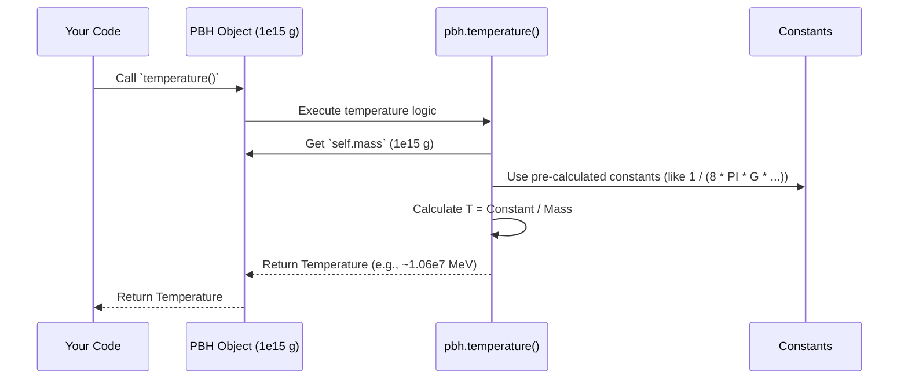

# Chapter 3: Primordial Black Hole (PBH)

Welcome back! In [Chapter 2: Configuration Management](02_configuration_management_.md), we learned how to write the "recipe card" (our TOML configuration file) that tells OSPREY exactly what kind of simulation we want to run. We specified things like the range of PBH masses we're interested in.

Now, let's zoom in on the main character of our simulation: the **Primordial Black Hole (PBH)** itself. This chapter explains what a PBH represents in OSPREY and how we work with it in the code.

## What is a PBH in OSPREY? The Tiny, Hot Stove

Imagine a tiny, incredibly dense object left over from the very early universe. This is a Primordial Black Hole. Unlike the giant black holes formed from collapsing stars, PBHs can be much, much smaller – even microscopic!

Because they are so small and follow the rules of quantum mechanics and gravity (specifically, Stephen Hawking's theories), they aren't completely "black". Instead, they radiate energy and particles, a process called **Hawking radiation**.

Think of a PBH in OSPREY like a **tiny, super-hot stove**. Instead of just radiating heat, it radiates all sorts of fundamental particles described in the Standard Model of particle physics ([Chapter 4: Standard Model Particle](04_standard_model_particle_.md)).

The **most important property** of a PBH in our simulation is its **mass**. Just like the temperature dial on a stove, the mass of the PBH dictates:

1.  **Its Temperature:** Smaller PBHs are *hotter*!
2.  **What it Radiates:** Its temperature determines the energy and types of particles it emits.
3.  **How Fast it Radiates:** Hotter (smaller) PBHs radiate much faster and evaporate quicker.

In OSPREY, the `PBH` object is the central piece representing this radiating source. Its main job is to hold the mass and provide ways to calculate its properties, like its temperature, which is crucial for figuring out the particle emissions.

## Using the `PBH` Object

Let's say our configuration file (from Chapter 2) specified that we want to simulate a PBH with a mass of 1 quadrillion grams (1e15 g). How do we represent this in the code?

OSPREY provides a structure (like a blueprint) called `PBH`. We create an *instance* of this structure, representing our specific black hole.

**1. Creating a PBH:**

We use the `PBH::new()` function, giving it the mass in grams.

```rust
// Import the PBH structure from the primary::core module
use primary::core::PBH;

// Define the mass (e.g., 1e15 grams)
let pbh_mass_grams = 1.0e15;

// Create a PBH object representing a black hole with this mass
let my_pbh = PBH::new(pbh_mass_grams);

println!("Created a PBH with mass: {} g", my_pbh.mass);
```

*   `use primary::core::PBH;`: This line tells Rust where to find the `PBH` blueprint.
*   `let pbh_mass_grams = 1.0e15;`: We define a variable to hold the mass. `1.0e15` is scientific notation for 1 followed by 15 zeros.
*   `let my_pbh = PBH::new(pbh_mass_grams);`: This is the key step! We call the `new` function associated with `PBH`, passing the mass. This creates our specific `PBH` object, stored in the `my_pbh` variable.
*   The `println!` macro just shows that the `my_pbh` object now correctly stores the mass we gave it.

**2. Calculating its Temperature:**

Once we have our `PBH` object, we can easily calculate its Hawking Temperature using the `temperature()` method. Remember, smaller mass means higher temperature!

```rust
// (Continuing from the previous snippet)

// Calculate the Hawking temperature of our PBH
let hawking_temperature_mev = my_pbh.temperature();

println!("PBH Temperature: {:.2} MeV", hawking_temperature_mev);
```

*   `my_pbh.temperature()`: We call the `temperature` function *on* our `my_pbh` object. This function performs the calculation based on the mass stored inside `my_pbh`.
*   The result is the temperature in units of Mega-electron Volts (MeV), a common unit in particle physics. For a 1e15 g PBH, the temperature is around 10.6 TeV (10.6 million MeV), which is incredibly hot!

**3. What's Next? Emission Rate:**

Knowing the temperature is the first step towards figuring out *what* particles the PBH emits and *how many* per second. OSPREY has another important method, `emission_rate()`, which uses the PBH's properties (like temperature) and information about particles ([Chapter 4: Standard Model Particle](04_standard_model_particle_.md)) and how they escape the black hole's gravity ([Chapter 5: GreyBody Factor Handling](05_greybody_factor_handling_.md)) to calculate this.

```rust
// --- Conceptual Example (Details in later chapters) ---
// let energy_points = vec![100.0, 1000.0, 10000.0]; // Example energies in MeV
// let particle_type = StandardModel::Photon; // Example particle type

// Calculate emission rate for photons at specific energies
// let rates = my_pbh.emission_rate(particle_type, &energy_points);
// println!("Emission rates: {:?}", rates);
// --- End Conceptual Example ---
```

We won't dive deep into `emission_rate` here, but it's the ultimate goal: using the `PBH` object as the source term for all the particle calculations done by the [SpectrumCalculator](07_spectrumcalculator_.md).

## Under the Hood: How `PBH` Works

What happens internally when you create a `PBH` and calculate its temperature?

**1. `PBH::new(mass)`:**

This is very simple. The `PBH` structure essentially just holds the mass value you provide.

```rust
// --- File: primary/src/core.rs (Simplified Snippet) ---

/// Represents a Schwarzschild (non-spinning) Primordial Black Hole.
#[derive(Debug, Copy, Clone, PartialEq)]
pub struct PBH {
    /// Mass of the Primordial Black Hole (in grams, g).
    pub mass: f64, // f64 means a 64-bit floating-point number
}

impl PBH {
    /// Creates a new PBH instance.
    /// # Arguments
    /// * `mass` - Mass of the PBH in grams (g).
    pub fn new(mass_grams: f64) -> Self {
        // Simply store the provided mass in the 'mass' field
        PBH { mass: mass_grams }
    }
    // ... other methods like temperature() ...
}
```

*   The `struct PBH` definition just says a `PBH` contains one piece of data: `mass`, which is a floating-point number (`f64`).
*   The `impl PBH` block defines functions (methods) associated with `PBH`.
*   `pub fn new(mass_grams: f64) -> Self`: This defines the `new` function. It takes `mass_grams` as input and returns `Self` (which means it returns a `PBH` object).
*   `PBH { mass: mass_grams }`: This creates a new `PBH` structure, setting its internal `mass` field to the value passed into the function. That's it!

**2. `pbh.temperature()`:**

This method applies the Hawking temperature formula:
$$ T = \frac{\hbar c^3}{8 \pi G k_B M} $$
where $\hbar, c, G, k_B$ are fundamental physical constants (Planck's constant, speed of light, gravitational constant, Boltzmann constant) and $M$ is the mass of the black hole.

OSPREY's code pre-calculates the combination of constants to make the calculation direct: Temperature (in MeV) is inversely proportional to the mass (in grams).

Let's trace the call:



The code looks like this:

```rust
// --- File: primary/src/core.rs (Simplified Snippet) ---
use crate::constants::pbh_mass_to_schwarzschild_radius; // Import helper constant/function
use std::f64::consts::PI; // Import PI

// Inside the `impl PBH` block:
impl PBH {
    // ... PBH struct and new() function ...

    /// Calculates the Hawking temperature of the PBH in MeV.
    pub fn temperature(&self) -> f64 {
        // Get the mass stored inside this specific PBH object
        let mass_g = self.mass;

        // Calculate Schwarzschild radius (proportional to mass) in MeV^-1 units
        // The constant includes G, c, and unit conversions.
        let radius_mev_inv = pbh_mass_to_schwarzschild_radius(mass_g);

        // Temperature formula: T = 1 / (4 * pi * R_s) in natural units (hbar=c=kB=1)
        // Factor of 1e3 converts GeV result to MeV.
        let temp_mev = 1e3 / (4.0 * PI * radius_mev_inv);

        temp_mev // Return the calculated temperature
    }
    // ... emission_rate() method etc ...
}
```

*   `self.mass`: Accesses the mass stored within the specific `PBH` object (`my_pbh` in our example).
*   `pbh_mass_to_schwarzschild_radius(mass_g)`: This helper function (defined elsewhere) converts the mass in grams to the Schwarzschild radius ($R_s$) in units of inverse MeV. This conversion bundles up the fundamental constants $G$ and $c$. Larger mass means larger radius.
*   `1e3 / (4.0 * PI * radius_mev_inv)`: This implements the core formula $T \propto 1/R_s$. Since $R_s \propto M$, this means $T \propto 1/M$. The `1e3` factor handles the final unit conversion to MeV.

So, the `temperature()` method takes the stored mass, applies a formula involving fundamental constants (hidden in the helper function and the main calculation), and returns the resulting Hawking temperature.

## Conclusion

In this chapter, we met the central object of OSPREY: the **Primordial Black Hole (`PBH`)**. We learned that it's conceptualized as a tiny, hot source radiating particles via Hawking radiation. Its key defining property is its **mass**, which we use to create a `PBH` object in the code using `PBH::new()`.

We saw how to calculate the PBH's **Hawking temperature** using the `pbh.temperature()` method, understanding that temperature is inversely proportional to mass. This temperature is fundamental for determining the particle emission spectrum, which is calculated using methods like `pbh.emission_rate()`.

The `PBH` object, defined primarily by its mass, serves as the foundation upon which all subsequent particle emission calculations are built. Now that we understand the source, let's look at the particles it emits.

**Next Chapter:** [Chapter 4: Standard Model Particle](04_standard_model_particle_.md)

---

Generated by [AI Codebase Knowledge Builder](https://github.com/The-Pocket/Tutorial-Codebase-Knowledge)