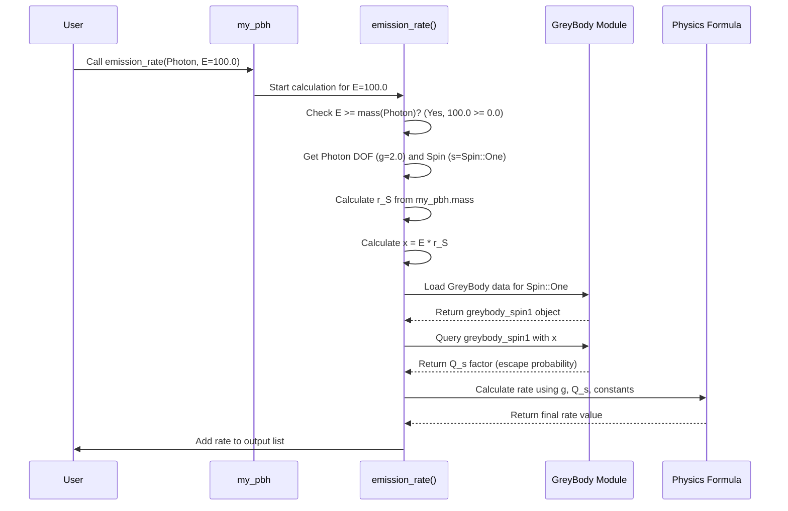

# Chapter 4: Emission Rate Calculation (PBH::emission_rate)

In the previous chapters, we learned about the source of particles, the [PBH (Primordial Black Hole)](01_pbh__primordial_black_hole__.md), the types of particles it can emit, the [Particle / StandardModel](02_particle___standardmodel_.md), and the crucial filter that determines if these particles escape, the [GreyBody Factors](03_greybody_factors__greybody___greybodydata___greybodyfit__.md).

Now, we have all the ingredients! It's time to put them together and answer the big question: **How many particles of a specific type and energy does our PBH actually emit per second?**

## What's the Big Idea? The PBH's Output Specs

Imagine our PBH is like a special kind of cosmic light bulb. We know it "shines" by emitting particles due to Hawking radiation. But just saying it "shines" isn't enough. We want to know its exact "specifications":

*   *What colors* (particle types like photons, electrons) does it emit?
*   *How brightly* does it shine at each color (how many particles of each type)?
*   *How does the brightness change* depending on the energy (like the color temperature) of the light?

**Our Goal:** We need a function that takes our PBH, a specific particle type, and a list of energies, and tells us the *rate* (number per second per unit of energy) at which that particle escapes the PBH at each of those energies. This is the primary emission spectrum.

In OSPREY, the function that does exactly this is called `PBH::emission_rate`.

## Meet `PBH::emission_rate`

This is the workhorse function in the `primary` crate. It combines everything we've learned:

1.  **The PBH:** It uses the PBH's mass (from [Chapter 1](01_pbh__primordial_black_hole__.md)) to determine its temperature. Hotter (lighter) PBHs emit more particles.
2.  **The Particle:** It uses the particle's properties (from [Chapter 2](02_particle___standardmodel_.md)) like its spin and degrees of freedom (DOF). Different particles interact differently.
3.  **The Filter:** It uses the [GreyBody Factors](03_greybody_factors__greybody___greybodydata___greybodyfit__.md) to figure out the escape probability for that particle type at a given energy.

Think of it as the PBH's detailed "output specification sheet."

## How to Use `PBH::emission_rate`

Using the function is quite straightforward. You need three things:

1.  A `PBH` object (which you know how to create from Chapter 1).
2.  A `StandardModel` particle type (which you know how to select from Chapter 2).
3.  A slice (`&[f64]`) or `Vec<f64>` of energy values (in Mega-electron Volts, MeV) for which you want to calculate the emission rate.

Let's calculate the emission rate for photons at a few different energies from a PBH with mass $10^{15}$ g:

```rust
// Import necessary items
use primary::core::{PBH, StandardModel, Particle};

// 1. Create our PBH (from Chapter 1)
let pbh_mass_grams = 1e15; // 10^15 g
let my_pbh = PBH::new(pbh_mass_grams);

// 2. Choose our particle (from Chapter 2)
let particle_type = StandardModel::Photon;

// 3. Define the energies we're interested in (in MeV)
let energies_mev = vec![10.0, 100.0, 1000.0]; // 10 MeV, 100 MeV, 1 GeV

// 4. Call the emission_rate function!
let rates = my_pbh.emission_rate(particle_type, &energies_mev);

// The 'rates' variable now holds the results
println!("Calculating emission rate for {} from a {:.1e}g PBH",
         particle_type.to_string(), my_pbh.mass);
println!("Energies (MeV): {:?}", energies_mev);
println!("Rates (MeV⁻¹ s⁻¹): {:?}", rates);
```

**Explanation:**

1.  We create our `PBH` object `my_pbh`.
2.  We specify we want the rate for `StandardModel::Photon`.
3.  We define a vector `energies_mev` containing the energy points we want to query.
4.  We call `my_pbh.emission_rate(...)`, passing the chosen particle and a reference to our energy vector (`&energies_mev`).

**Input:**
*   `my_pbh`: Our PBH object.
*   `particle_type`: The `StandardModel::Photon`.
*   `&energies_mev`: Our list of energies `[10.0, 100.0, 1000.0]`.

**Output:**
*   `rates`: A `Vec<f64>` where each element corresponds to the emission rate at the respective energy in `energies_mev`. The rates are in units of "particles per MeV per second" (MeV⁻¹ s⁻¹). The actual numbers will depend on the PBH mass and the complex physics involved, but you'll get a vector of numbers like `[rate_at_10MeV, rate_at_100MeV, rate_at_1000MeV]`.

That's it! You've calculated the primary emission spectrum for photons at those specific energies. You could repeat this for other particles (like `StandardModel::Electron`) or a wider range of energies.

## Under the Hood: The Calculation Recipe

What happens inside `PBH::emission_rate` when you call it? It follows a recipe based on the theory of Hawking radiation, adjusted by the greybody factors. Here's a simplified step-by-step:

For *each* energy `E` in the input list:

1.  **Kinematic Check:** Can the PBH even emit a particle of this energy? It checks if the energy `E` is greater than or equal to the particle's rest mass (`particle.mass()`). If `E < mass`, the rate is simply 0. (You can't create a particle if you don't have enough energy for its mass!).
2.  **Get Ingredients:** If `E >= mass`, it gathers the necessary properties:
    *   Particle's Degrees of Freedom (`g = particle.dof()`).
    *   Particle's Spin (`s = particle.spin()`).
    *   PBH's Temperature (`T`, calculated from `pbh.mass()`). *This isn't explicitly shown in the simplified code but is implicitly used in the underlying physics.*
    *   PBH's Size (Schwarzschild Radius `r_S`, calculated from `pbh.mass()`).
3.  **Load the Filter:** It loads the correct `GreyBody` object (containing the data table and fit formulas from [Chapter 3](03_greybody_factors__greybody___greybodydata___greybodyfit__.md)) for the particle's specific spin `s`. This uses `GreyBody::from_bin(s)`.
4.  **Calculate Dimensionless Energy:** It calculates a special "dimensionless energy" `x = E * r_S`. This `x` value tells us how the particle's energy compares to the energy scale set by the black hole's size.
5.  **Apply the Filter:** It queries the loaded `GreyBody` object using the dimensionless energy `x` (and the black hole spin `a`, which is 0 for our PBHs): `greybody.query(a=0.0, x)`. This gives the crucial dimensionless factor $Q_s$ which includes the escape probability.
6.  **Combine Everything:** It plugs the degrees of freedom `g`, the greybody factor $Q_s$, and fundamental constants (like $\pi$ and the conversion from natural units to seconds) into a formula derived from Hawking radiation theory. The simplified essence is: `Rate ∝ g * Q_s`.
7.  **Store Result:** The calculated rate for energy `E` is added to the output vector.

This process repeats for every energy in your input list.

Let's visualize the main flow for a single energy point:



## Under the Hood: Simplified Code View

Let's look at a *highly simplified* version of the code inside `PBH::emission_rate` in `primary/src/core.rs` to see the structure.

**File:** `primary/src/core.rs` (Simplified `emission_rate` logic)

```rust
// (Inside the impl PBH block)

// // --- Dummy types for simplification ---
// use std::f64::consts::PI;
// pub trait Particle { fn mass(&self) -> f64; fn spin(&self) -> Spin; fn dof(&self) -> f64; }
// #[derive(Debug, Copy, Clone)] pub enum Spin { Zero, Half, One }
// impl Spin { fn from(s: f64) -> Self { Spin::Zero } }
// impl From<Spin> for f64 { fn from(s: Spin) -> Self { 0.0 } }
// pub struct GreyBody;
// impl GreyBody {
//   pub fn from_bin(spin: Spin) -> Result<Self, String> { Ok(GreyBody) }
//   pub fn query(&self, a: f64, x: f64) -> f64 { 0.1 * x } // Dummy factor
// }
// const SEC_INV_TO_GEV: f64 = 1.0; // Dummy constant
// // --- End Dummy types ---

#[allow(non_snake_case)]
pub fn emission_rate<P: Particle>(
    &self,         // The PBH object itself
    particle: P,   // The particle type (e.g., Photon)
    E_values: &[f64] // The list of energies
) -> Vec<f64> {

    let m_particle = particle.mass();
    let particle_spin = particle.spin();
    let g = particle.dof(); // Get degrees of freedom

    // Load the greybody factors for this particle's spin (Chapter 3)
    let greybody = GreyBody::from_bin(particle_spin)
        .expect("Failed to load GreyBody data!");

    // Calculate rate for each energy in the input list
    E_values.iter().map(|&E| { // Loop through each energy E

        // 1. Kinematic Check
        if E < m_particle {
            return 0.0; // Cannot emit if E < mass
        }

        // 2. Calculate Schwarzschild radius (size) from mass
        // (Constant combines G, c, etc. and unit conversions)
        let r_sch = 7.5267552615e-18 * self.mass; // Units: MeV^-1

        // 3. Calculate Dimensionless Energy
        let x = E * r_sch;

        // 4. Apply the Greybody Filter (Chapter 3)
        // Query gets the dimensionless factor Q_s for non-spinning BH (a=0.0)
        let Q_s_dim_free = greybody.query(0.0, x);

        // 5. Combine factors into the final rate formula
        // Formula structure: Rate = (DOF / 2*pi) * Q_s * (Unit Conversion)
        let rate = (g / (2.0 * PI)) * Q_s_dim_free / SEC_INV_TO_GEV * 1e-3;
        // The 1e-3 converts from GeV^-1 s^-1 to MeV^-1 s^-1

        rate // Return the calculated rate for this energy E

    }).collect() // Collect all calculated rates into a Vec<f64>
}
```

**Explanation:**

1.  **Get Particle Info:** It retrieves the particle's mass, spin, and degrees of freedom (`dof`).
2.  **Load Greybody:** It uses `GreyBody::from_bin` with the particle's spin to load the necessary greybody data and fits we discussed in [Chapter 3](03_greybody_factors__greybody___greybodydata___greybodyfit__.md).
3.  **Iterate Energies:** It loops through each energy `E` provided in the `E_values` input slice.
4.  **Kinematic Check:** Inside the loop, it first checks if `E` is less than the particle's mass. If so, the rate is 0, and it moves to the next energy.
5.  **Calculate `r_S` and `x`:** It calculates the PBH's Schwarzschild radius (`r_sch`) based on its mass and then the dimensionless energy `x`.
6.  **Query Greybody:** It calls `greybody.query(0.0, x)` to get the dimensionless escape factor $Q_s$.
7.  **Calculate Rate:** It combines `g` (DOF), $Q_s$, and physical constants (`PI`, `SEC_INV_TO_GEV`, `1e-3` for unit conversion) to compute the final emission rate in MeV⁻¹ s⁻¹.
8.  **Collect Results:** The `map` operation calculates the rate for each energy, and `collect` gathers all these rates into the final `Vec<f64>` that the function returns.

*(Note: The actual formula involves the particle's statistical distribution (Bose-Einstein or Fermi-Dirac factor based on spin and temperature), which is implicitly included within the definition or calculation of $Q_s$ used by OSPREY and derived from sources like BlackHawk, but the simplified structure `Rate ∝ g * Q_s` captures the core dependencies we've discussed).*

## Conclusion

In this chapter, we learned about the central calculation in the `primary` crate: `PBH::emission_rate`.

*   It calculates the **rate at which particles escape** a PBH per unit energy and time.
*   It acts as the PBH's "output specification", combining the PBH's properties ([Chapter 1](01_pbh__primordial_black_hole__.md)), the particle's characteristics ([Chapter 2](02_particle___standardmodel_.md)), and the crucial escape probability filter ([Chapter 3](03_greybody_factors__greybody___greybodydata___greybodyfit__.md)).
*   Using it is simple: provide a `PBH`, a `StandardModel` particle, and a list of energies.
*   Internally, it loads greybody factors, calculates dimensionless energy, queries the escape probability, and combines these with particle DOF and constants.

We now know how to calculate the *primary* spectrum of particles directly emitted by the PBH. However, many of these primary particles (like pions, muons, W/Z bosons) are unstable and quickly decay, producing *secondary* particles like photons, electrons, and neutrinos. How do we calculate the spectrum of these secondary particles?

That's the topic of our next chapter: [Chapter 5: SecondaryGenerator / SecondaryTable](05_secondarygenerator___secondarytable_.md)!

---

Generated by [AI Codebase Knowledge Builder](https://github.com/The-Pocket/Tutorial-Codebase-Knowledge)