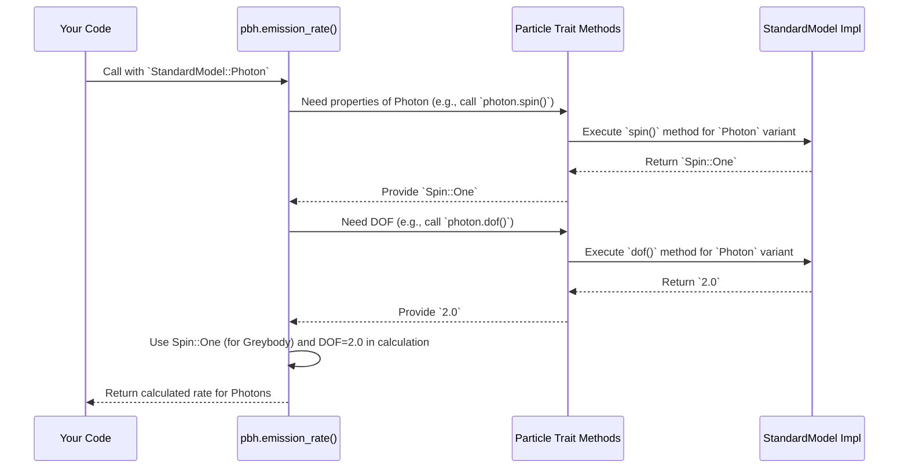

# Chapter 4: Standard Model Particle

In [Chapter 3: Primordial Black Hole (PBH)](03_primordial_black_hole__pbh__.md), we focused on the star of our show, the PBH, and learned how its mass determines its temperature. We thought of the PBH as a tiny, hot stove. Now, we need to figure out what kind of "sparks" or "embers" can actually fly off this stove.

This chapter introduces the **Standard Model Particle** concept in OSPREY. It's essentially the catalogue listing all the fundamental particle types that a PBH can emit through Hawking radiation.

## Why Do We Need a Particle Catalogue? The Menu of Emitted Particles

Our PBH stove doesn't just radiate generic heat; according to Hawking's theory, it can emit specific types of fundamental particles – the building blocks of matter and forces described by the Standard Model of particle physics. Think of things like photons (light particles), electrons, quarks (which make up protons and neutrons), and others.

To calculate *how much* of each particle type is emitted, OSPREY first needs a definitive list of *what* can be emitted. It also needs to know the key properties of each particle type.

This is where the `StandardModel` abstraction comes in. It acts like a **menu** or **catalogue**, listing all the possible particles that OSPREY knows how to handle.

## The `StandardModel` Enum: Listing the Particles

In the OSPREY code, this catalogue is implemented as a Rust `enum` (enumeration) called `StandardModel`. An enum is simply a way to define a type that can have one of several possible named values.

Here are some of the particles listed in the `StandardModel` enum:

*   `Photon`: The particle of light.
*   `Electron`: The familiar negatively charged particle found in atoms.
*   `Neutrinos`: Very light, weakly interacting particles.
*   `Up`, `Down`, `Charm`, `Strange`, `Top`, `Bottom`: Different types (flavors) of quarks.
*   `Gluon`: The particle that carries the strong force, holding quarks together.
*   `W`, `Z`: Particles that carry the weak force, involved in radioactive decay.
*   `Higgs`: The particle associated with the Higgs field, giving mass to other particles.
*   `NeutralPion`, `ChargedPion`: Composite particles made of quarks, also considered.

Think of this enum as defining the set of possible choices when we ask, "What kind of particle are we interested in?"

## Particle Properties: More Than Just a Name

Just listing the names isn't enough. To calculate emission rates correctly, OSPREY needs to know specific properties for each particle type. The `StandardModel` enum is designed so that each listed particle automatically knows its fundamental properties:

1.  **Mass:** How heavy the particle is (measured in energy units like MeV). This is crucial because a PBH generally cannot emit a particle if the particle's mass-energy (E=mc²) is much higher than the PBH's temperature. You can't get a heavy ember from a lukewarm stove.
2.  **Spin:** A quantum mechanical property, roughly analogous to angular momentum. It affects how the particle interacts with the black hole's gravitational field. Different spins have different probabilities of escaping. We'll see this is vital for [Chapter 5: GreyBody Factor Handling](05_greybody_factor_handling_.md).
3.  **Degrees of Freedom (DOF):** This counts how many distinct "versions" of the particle exist. For example:
    *   Electrons have 2 spin states (up and down) and an antiparticle (positron) which also has 2 spin states, giving 4 DOF in total.
    *   Photons have 2 polarization (helicity) states, giving 2 DOF.
    *   Quarks have spin states, color states (red, green, blue), and antiparticles.
    *   The DOF acts like a multiplier – if a particle type has more DOF, it contributes more to the total emission rate, assuming all else is equal.

These properties are built into OSPREY for each `StandardModel` particle.

## How to Use `StandardModel` Particles

You'll encounter `StandardModel` values when you need to specify *which* particle you're calculating something for. The most common place is when calculating the emission rate from a PBH.

Let's revisit the `emission_rate` function from [Chapter 3: Primordial Black Hole (PBH)](03_primordial_black_hole__pbh__.md). We need to tell it *which* particle's rate we want.

**1. Choosing a Particle:**

You select a particle type using the enum name, like `StandardModel::Photon` or `StandardModel::Electron`.

```rust
// Import the necessary items
use primary::core::{PBH, StandardModel};

// Assume we have our PBH object from Chapter 3
let pbh_mass_grams = 1.0e15;
let my_pbh = PBH::new(pbh_mass_grams);

// Choose the particle we are interested in
let particle_type = StandardModel::Photon;

println!("Selected particle type: {}", particle_type.to_string());
```

*   `use primary::core::StandardModel;`: Imports the enum definition.
*   `let particle_type = StandardModel::Photon;`: Assigns the `Photon` variant of the enum to the `particle_type` variable.
*   `.to_string()`: A helper method to get a human-readable name ("Photon").

**2. Using the Particle in Calculations:**

Now, we pass this chosen particle type to functions like `emission_rate`. The function uses the `particle_type` variable to look up the necessary properties (mass, spin, DOF) internally.

```rust
// (Continuing from the previous snippet)
// Define some example energy points (in MeV)
let energies_mev = vec![1000.0, 10000.0, 100000.0]; // 1 GeV, 10 GeV, 100 GeV

// Calculate the emission rate SPECIFICALLY for photons at these energies
// The function uses the properties of StandardModel::Photon internally
let photon_rates = my_pbh.emission_rate(particle_type, &energies_mev);

println!("Calculated photon emission rates (per MeV per second): {:?}", photon_rates);

// We could do the same for electrons
let electron_rates = my_pbh.emission_rate(StandardModel::Electron, &energies_mev);
println!("Calculated electron emission rates: {:?}", electron_rates);
```

*   `my_pbh.emission_rate(particle_type, &energies_mev)`: We provide the `PBH` object, the *chosen particle type*, and the list of energies.
*   The function calculates the rate for *that specific particle*. The results for photons and electrons will be different because they have different properties (mass, spin, DOF).

So, the `StandardModel` enum acts as a key to unlock the specific properties needed for calculations involving that particle type.

## Under the Hood: How Properties are Accessed

How does `emission_rate` know the mass, spin, and DOF of a `StandardModel::Photon`? It uses a mechanism called a **trait**.

**1. The `Particle` Trait:**

OSPREY defines a blueprint (a `trait` in Rust) called `Particle`. This trait declares that any type implementing it *must* provide methods to get its mass, spin, and DOF.

```rust
// --- Simplified Trait Definition from primary/src/core.rs ---

/// Trait defining the essential properties of a particle species.
pub trait Particle {
    /// Returns the mass of the particle (in MeV).
    fn mass(&self) -> f64;

    /// Returns the spin of the particle (`Spin` enum).
    fn spin(&self) -> Spin;

    /// Returns the number of internal degrees of freedom (DOF).
    fn dof(&self) -> f64;
}
```

*   This `trait` doesn't contain the actual values; it just defines the *required* functions (`mass()`, `spin()`, `dof()`).

**2. Implementing the Trait for `StandardModel`:**

The crucial part is that OSPREY provides an implementation of the `Particle` trait specifically for the `StandardModel` enum. This implementation contains the actual logic (often just returning a hardcoded value) for each particle type.

```rust
// --- Simplified Implementation from primary/src/core.rs ---
use primary::core::{Spin, StandardModel}; // Import Spin enum too

// This block says: "We are providing the implementation of the Particle trait
// for the StandardModel enum."
impl Particle for StandardModel {
    /// Returns the mass of the Standard Model particle in MeV.
    fn mass(&self) -> f64 {
        match self { // 'self' refers to the specific enum variant (e.g., Photon)
            StandardModel::Photon => 0.0,            // Photons are massless
            StandardModel::Electron => 0.511,        // Electron mass ~0.511 MeV
            StandardModel::Higgs => 125110.0,       // Higgs mass ~125.11 GeV
            // ... cases for all other particles ...
            _ => { /* ... return mass for other particles ... */ 0.0 }
        }
    }

    /// Returns the spin (`Spin` enum value) of the Standard Model particle.
    fn spin(&self) -> Spin {
        match self {
            StandardModel::Photon => Spin::One,      // Photons have spin 1
            StandardModel::Electron => Spin::Half,   // Electrons have spin 1/2
            StandardModel::Higgs => Spin::Zero,      // Higgs has spin 0
            // ... cases for all other particles ...
             _ => { /* ... return spin for other particles ... */ Spin::Zero }
        }
    }

    /// Returns the number of degrees of freedom (DOF).
    fn dof(&self) -> f64 {
        match self {
            StandardModel::Photon => 2.0,      // 2 polarization states
            StandardModel::Electron => 4.0,    // 2 spin states * 2 (particle/antiparticle)
            StandardModel::Higgs => 1.0,       // 1 scalar state
            // ... cases for all other particles ...
             _ => { /* ... return DOF for other particles ... */ 1.0 }
        }
    }
}
```

*   `impl Particle for StandardModel`: This line connects the `Particle` trait requirements to the `StandardModel` enum.
*   `match self { ... }`: Inside each function (`mass`, `spin`, `dof`), a `match` statement checks which specific `StandardModel` variant (`self`) we have (e.g., `Photon`, `Electron`).
*   Based on the variant, it returns the pre-defined, hardcoded value for that property.

**3. Putting it Together (Conceptual Flow):**

When `pbh.emission_rate(StandardModel::Photon, ...)` is called:



The `emission_rate` function uses the `Particle` trait methods (`spin()`, `dof()`, `mass()`) on the provided `StandardModel` value. Rust automatically calls the specific implementation block we just saw, retrieving the correct properties for the calculation.

## Conclusion

In this chapter, we learned about the **Standard Model Particle** abstraction in OSPREY, represented by the `StandardModel` enum. It serves as a fundamental catalogue of all the particle types a PBH can emit.

We saw that each particle in this catalogue comes with built-in properties: **mass**, **spin**, and **degrees of freedom (DOF)**. These properties are accessed through the `Particle` trait and are essential for accurately calculating particle emission rates. You use the `StandardModel` enum to tell functions like `pbh.emission_rate` *which* particle's properties should be used in the calculation.

Understanding the particle types and their properties is crucial. The particle's **spin**, in particular, plays a key role in determining how easily it can escape the black hole's intense gravity. This "escape probability" is quantified by something called the Greybody Factor, which is the topic of our next chapter.

**Next Chapter:** [Chapter 5: GreyBody Factor Handling](05_greybody_factor_handling_.md)

---

Generated by [AI Codebase Knowledge Builder](https://github.com/The-Pocket/Tutorial-Codebase-Knowledge)