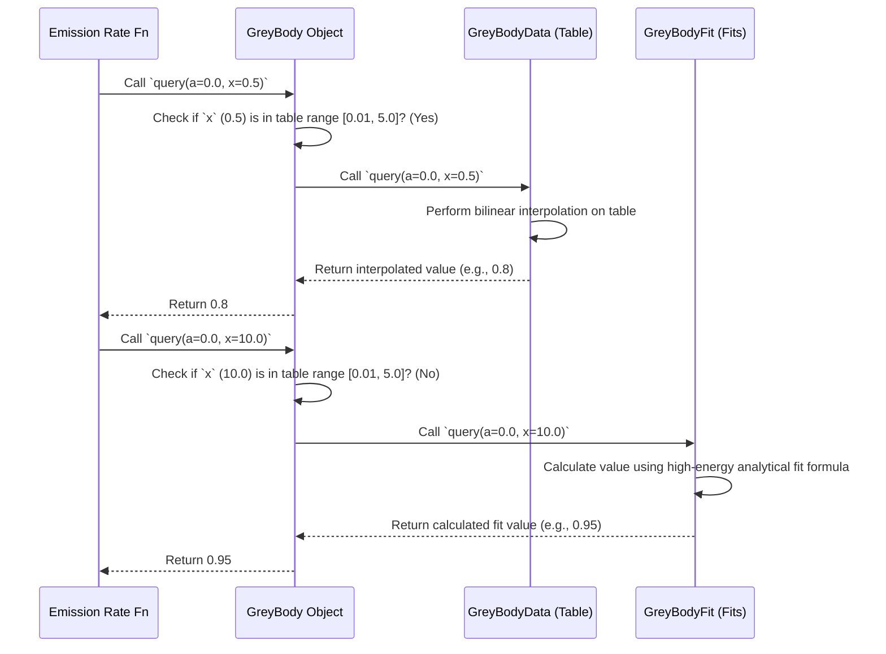

# Chapter 5: GreyBody Factor Handling

Welcome back! In [Chapter 4: Standard Model Particle](04_standard_model_particle_.md), we catalogued the types of particles our [Primordial Black Hole (PBH)](03_primordial_black_hole__pbh__.md) stove can emit, like photons, electrons, and quarks. We also learned that each particle has properties like mass and spin.

Now, we face a new question: just because the PBH *can* produce a particle near its event horizon, does that particle actually *escape* out into space? The PBH's intense gravity creates a barrier. Some particles get pulled back in, while others manage to escape. This chapter explores how OSPREY handles this **escape probability**, using **Greybody Factors**.

## What's the Problem? The Escape Room Challenge

Imagine the region around the PBH as an "escape room". Particles are generated near the center (the event horizon). To be detected far away, they need to navigate the gravitational potential barrier – the "puzzles" of the escape room.

Not all particles are equally good at escaping:

*   **Energy Matters:** Higher energy particles generally have a better chance of escaping.
*   **Spin Matters:** A particle's quantum spin affects how it interacts with the curved spacetime around the black hole. Particles with different spins face different "escape routes".
*   **Black Hole Properties Matter:** The PBH's mass (which determines the size of its gravitational well) is also key.

We need a way to quantify this escape probability. Naively calculating emission based *only* on the PBH's temperature (like we saw in [Chapter 3: Primordial Black Hole (PBH)](03_primordial_black_hole__pbh__.md)) would overestimate the number of particles we actually observe far away.

## The Solution: Greybody Factors - The Escape Efficiency Rating

Physicists have studied this escape problem using quantum mechanics in curved spacetime. The solution is encapsulated in something called the **Greybody Factor**, often denoted by $\Gamma$ (Gamma) or related quantities like $Q_s$.

Think of the Greybody Factor as an **energy- and spin-dependent efficiency rating** for particle escape.

*   It's a number, typically between 0 and 1 (or sometimes slightly larger due to effects like superradiance, though we often focus on non-rotating PBHs where it's simpler).
*   A value close to 1 means the particle escapes easily (high efficiency).
*   A value close to 0 means the particle is very likely to be re-absorbed by the black hole (low efficiency).

The actual emission rate we observe far from the PBH is the "naive" thermal rate multiplied by this Greybody Factor.

```
Observed Rate = (Naive Thermal Rate) x (Greybody Factor)
```

## The Challenge: Calculating Greybody Factors is Hard!

Calculating these Greybody Factors from first principles involves solving complex wave equations in the curved spacetime around a black hole. This is computationally intensive and requires specialized knowledge.

## OSPREY's Approach: Smart Data Handling

Instead of recalculating these factors every time, OSPREY takes a practical and efficient approach, leveraging work done by other tools like `BlackHawk`:

1.  **Use Pre-computed Tables:** OSPREY relies on tables of Greybody Factors that have been pre-calculated (often using `BlackHawk` or similar codes) for various particle spins (0, 1/2, 1, etc.) and a range of dimensionless energies. These tables store the escape efficiency ratings.
2.  **Load Binary Data:** During the [Build & Data Preparation Workflow](01_build___data_preparation_workflow_.md), these text-based tables are converted into efficient binary (`.bin`) files. OSPREY reads these `.bin` files at runtime, which is much faster.
3.  **Interpolate:** What if we need the Greybody Factor for an energy that's *between* the points listed in the table? OSPREY uses **interpolation** (specifically, bilinear interpolation) to estimate the value based on the nearest table entries. Think of it like estimating a value on a map between two marked altitude points.
4.  **Use Analytical Fits:** The tables usually cover a specific, most relevant range of energies. What about very low or very high energies? For these extremes, OSPREY uses **analytical formulas (fits)** – mathematical equations that approximate the Greybody Factor behavior in those limits.

## The `GreyBody` Struct: The Keeper of Escape Knowledge

In OSPREY's code, all this logic – handling the tables, the fits, and the interpolation – is neatly packaged into a struct called `GreyBody`.

You can think of the `GreyBody` struct as the expert librarian who knows exactly where to find the escape efficiency rating for any given particle situation.

Each `GreyBody` object is specific to a particular particle **spin**. For example, there's one for spin-0 particles (like the Higgs), one for spin-1/2 (like electrons), one for spin-1 (like photons), and so on.

## How is `GreyBody` Used? (Usually Internally)

Most of the time, you won't interact with the `GreyBody` struct directly. It works behind the scenes inside the `PBH::emission_rate` function we encountered in previous chapters.

Let's revisit a simplified version of `emission_rate`:

```rust
// --- Simplified Concept for PBH::emission_rate ---
use primary::core::{PBH, Particle, Spin, GreyBody}; // Assume these are imported
use std::f64::consts::PI;

impl PBH {
    pub fn emission_rate<P: Particle>(&self, particle: P, energy_mev: f64) -> f64 {
        let particle_spin = particle.spin(); // Get spin (e.g., Spin::One for Photon)
        let particle_dof = particle.dof();   // Get degrees of freedom (e.g., 2.0 for Photon)

        // 1. Load the correct GreyBody data for this particle's spin
        let greybody_handler = GreyBody::from_bin(particle_spin)
            .expect("Failed to load Greybody data!");

        // 2. Calculate dimensionless energy 'x'
        // x = Energy * SchwarzschildRadius
        // SchwarzschildRadius depends on self.mass (PBH mass)
        let r_sch = calculate_schwarzschild_radius(self.mass); // Placeholder function
        let x = energy_mev * r_sch;

        // 3. Query the GreyBody factor (escape efficiency) using the handler
        // We assume non-rotating PBH (a=0.0)
        let dimensionless_factor_q_s = greybody_handler.query(0.0, x);

        // 4. Combine factors (Simplified - real formula is more complex)
        // Naive thermal part depends on PBH temperature, energy, spin statistics
        // let thermal_part = calculate_thermal_part(self.temperature(), energy_mev, particle_spin);
        // let rate = thermal_part * dimensionless_factor_q_s * particle_dof / (2.0 * PI);

        // Actual OSPREY calculation combines these steps efficiently:
        let rate_per_mev_per_sec = dimensionless_factor_q_s / /* some constants */; // Simplified

        rate_per_mev_per_sec
    }
}

// Dummy function for illustration
fn calculate_schwarzschild_radius(mass_g: f64) -> f64 {
    // In reality, this involves physical constants (G, c) and unit conversions
    7.5267552615e-18 * mass_g // Returns radius in MeV^-1
}
```

**Explanation:**

1.  **Get Spin:** The function first gets the `spin` of the particle provided (e.g., `Spin::One` for a `Photon`).
2.  **Load `GreyBody`:** It uses `GreyBody::from_bin(particle_spin)` to load the specific pre-compiled data tables and fits for *that* spin.
3.  **Calculate `x`:** It calculates a dimensionless energy parameter `x`, which depends on the particle's energy `E` and the PBH's Schwarzschild radius $r_S$ (which depends on the PBH mass). This `x` is the standard input for Greybody functions.
4.  **Query `GreyBody`:** It calls `greybody_handler.query(0.0, x)`. The `0.0` represents the black hole spin parameter (assumed non-spinning), and `x` is the dimensionless energy. This call returns the crucial dimensionless Greybody factor $Q_s$.
5.  **Calculate Rate:** The function combines $Q_s$ with other factors (like the particle's degrees of freedom `dof` and physical constants) to get the final emission rate. (The actual formula used in `core.rs` is a bit more direct but incorporates the same physics).

So, `GreyBody` acts as an internal calculator providing the essential escape probability correction needed by `emission_rate`.

## Under the Hood: Loading and Querying

Let's peek inside the `GreyBody` struct and its methods.

**1. Loading Data (`GreyBody::from_bin`)**

When `GreyBody::from_bin(spin)` is called, it reads two pre-compiled binary files for the given spin:

*   `spin_{s}.bin`: Contains the tabulated Greybody data (`GreyBodyData` struct).
*   `spin_{s}_fit.bin`: Contains the coefficients for the analytical fits (`GreyBodyFit` struct).

```rust
// --- File: primary/src/core.rs (Simplified Snippet) ---
use crate::{GreyBodyData, GreyBodyFit}; // Structures holding the data/fits
use std::result::Result;

#[derive(Debug, Clone)]
pub struct GreyBody {
    pub data: GreyBodyData, // Holds the loaded table data
    pub fit: GreyBodyFit,   // Holds the loaded fit coefficients
}

impl GreyBody {
    // Loads data for a specific spin from pre-compiled binary files
    pub fn from_bin(spin: Spin) -> Result<Self, Box<dyn std::error::Error>> {
        // Load the table data from its .bin file
        let data = GreyBodyData::from_bin(spin)?;
        // Load the analytical fit coefficients from its .bin file
        let fit = GreyBodyFit::from_bin(spin)?;
        // Combine them into a GreyBody object
        Ok(GreyBody { data, fit })
    }
    // ... query method ...
}
```

*   This function simply calls helper functions (`GreyBodyData::from_bin` and `GreyBodyFit::from_bin`, not shown in detail here) that handle reading the bytes from the correct `.bin` files (found in `./data/`) and deserializing them into the `GreyBodyData` and `GreyBodyFit` structs.

**2. Querying the Factor (`GreyBody::query`)**

This is the core logic. Given the dimensionless spin `a` (usually 0.0) and dimensionless energy `x`, it decides whether to use the table or the fits:



The code implements this logic:

```rust
// --- File: primary/src/core.rs (Simplified Snippet) ---

impl GreyBody {
    // ... from_bin method ...

    /// Queries the dimensionless single d.o.f. emissivity Q_s(a, x).
    pub fn query(&self, a: f64, x: f64) -> f64 {
        // Define the energy range covered by the table data
        let table_x_min = 0.01;
        let table_x_max = 5.0;

        // Check if x is within the table's range
        if x >= table_x_min && x <= table_x_max {
            // Use bilinear interpolation on the grid data stored in self.data
            self.data.query(a, x) // Calls GreyBodyData's query method
        } else {
            // Use the analytical fit functions stored in self.fit
            self.fit.query(a, x) // Calls GreyBodyFit's query method
        }
    }
}
```

*   It checks if `x` falls within the hardcoded range `[0.01, 5.0]`.
*   If yes, it calls `self.data.query(a, x)`. This method (defined within `GreyBodyData`) performs the bilinear interpolation using the loaded tables (`self.data.a`, `self.data.x`, `self.data.gamma`).
*   If no, it calls `self.fit.query(a, x)`. This method (defined within `GreyBodyFit`) uses the loaded coefficients (`self.fit.coeffs`) and applies the appropriate low-energy or high-energy formula based on whether `x` is below 0.01 or above 5.0.

The details of the interpolation (`BilinearInterpolation` in `primary/src/util.rs`) and the exact fit formulas (`GreyBodyFit::query` in `primary/src/core.rs`) are more complex, but the `GreyBody::query` method provides the simple interface to access the correct result automatically.

## Conclusion

In this chapter, we explored **Greybody Factor Handling** in OSPREY. We learned that Greybody factors represent the crucial **escape probability** for particles emitted by a PBH, accounting for the black hole's gravitational barrier.

Calculating these factors is complex, so OSPREY uses a practical approach:
*   Loading **pre-computed data** (from `BlackHawk`) stored in efficient binary `.bin` files.
*   **Interpolating** this data for intermediate energies.
*   Using **analytical formulas (fits)** for very low or very high energies.

The `GreyBody` struct encapsulates this logic, providing the necessary escape efficiency factor (dependent on particle spin and energy) internally to functions like `PBH::emission_rate`. This ensures that the calculated particle spectra accurately reflect how many particles truly escape the PBH's vicinity.

Now that we understand how *primary* particles (those directly emitted via Hawking radiation) escape, what happens next? These primary particles might be unstable and decay, or they might interact with the surrounding environment, producing *secondary* particles (like photons, electrons, and positrons that we might actually detect). Our next chapter dives into how OSPREY handles these secondary emissions.

**Next Chapter:** [Chapter 6: Secondary Spectrum Handling](06_secondary_spectrum_handling_.md)

---

Generated by [AI Codebase Knowledge Builder](https://github.com/The-Pocket/Tutorial-Codebase-Knowledge)