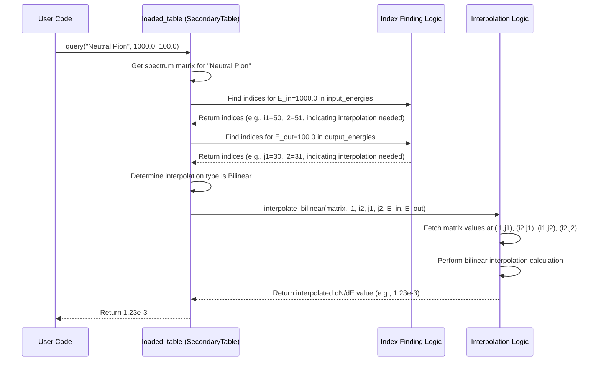

# Chapter 5: SecondaryGenerator / SecondaryTable

In [Chapter 4: Emission Rate Calculation (PBH::emission_rate)](04_emission_rate_calculation__pbh__emission_rate__.md), we learned how to calculate the *primary* spectrum of particles directly emitted by a [PBH (Primordial Black Hole)](01_pbh__primordial_black_hole__.md). These are particles like photons, electrons, quarks, pions, etc., that pop out directly from the Hawking radiation process, filtered by the [GreyBody Factors](03_greybody_factors__greybody___greybodydata___greybodyfit__.md).

However, the story doesn't end there! Many of the particles emitted directly by the PBH are unstable. Think of particles like neutral pions ($\pi^0$), charged pions ($\pi^\pm$), or muons ($\mu^\pm$). These particles don't live very long; they quickly decay into other, more stable particles. For example, a neutral pion almost always decays into two high-energy photons ($\pi^0 \to \gamma \gamma$).

These decay products are called **secondary particles**. If we want to know the total number of, say, photons coming from a PBH, we need to consider both the *primary* photons emitted directly and the *secondary* photons produced from the decay of other primary particles.

**Our Goal:** We need a way to calculate the spectrum of these secondary particles. Specifically, given a primary particle (like a pion) with a certain energy, what is the distribution (spectrum) of secondary particles (like photons) produced when it decays?

This is where `SecondaryGenerator` and `SecondaryTable` come into play.

## What's the Big Idea? From Decay Recipes to Pre-Cooked Ingredients

Imagine you're trying to figure out the final nutritional content of a complex dish. You start with primary ingredients (primary particles), but some of these ingredients transform during cooking (decay).

*   **`SecondaryGenerator`:** This is like the **recipe book**. It defines the *rules* or *models* for how unstable primary particles decay into secondary particles. OSPREY supports different "cookbooks" like `Hazma`, which uses specific physics calculations for decays. It knows, for instance, the physics governing $\pi^0 \to \gamma \gamma$.

*   **`SecondaryTable`:** Calculating these decays precisely every single time can be slow, especially if the recipes are complex. So, we pre-calculate the results for a range of "input ingredient amounts" (primary particle energies) and "output product amounts" (secondary particle energies). This is the `SecondaryTable` – it's like having a **pantry stocked with pre-cooked ingredients** or a detailed lookup table. When you need the decay result for a specific energy combination, you can quickly look it up in the table, possibly doing a quick mix (interpolation) if your exact energy isn't listed.

**Key Concepts:**

1.  **Primary vs. Secondary:** Primary particles come directly from the PBH (e.g., $\pi^0$). Secondary particles result from the decay of primary particles (e.g., the photons $\gamma$ from $\pi^0 \to \gamma \gamma$).
2.  **Decay Spectrum (`dN/dE_sec`):** When a primary particle with energy `E_prim` decays, it doesn't produce secondary particles all at one specific energy `E_sec`. Instead, it produces a distribution, or spectrum, of secondary particles across a range of energies. The decay spectrum tells us *how many* secondary particles are produced *per unit of secondary energy*.
3.  **Generator (`SecondaryGenerator`):** An enum that specifies *which physics model* (which recipe book) to use for calculating decays (e.g., `Hazma`, `Pythia`, `HDMSpectra`).
4.  **Table (`SecondaryTable`):** A data structure that stores the pre-calculated decay spectra. It maps (Primary Particle Type, Primary Energy, Secondary Energy) to the corresponding `dN/dE_sec` value.

## How to Use Them: Generating and Querying Decay Tables

The typical workflow involves two main steps:

**Step 1: Generate and Save the Decay Table (Usually Done Once)**

First, you choose a `SecondaryGenerator` model (like `Hazma`) and specify the energy ranges you care about. Then, you ask the generator to create the `SecondaryTable` containing the pre-calculated decay spectra for photons (or other secondaries).

```rust
// Import necessary items from the secondary crate
use secondary::prelude::*;
use peroxide::fuga::*; // For logspace function

// Define the energy grid for primary particles (e.g., pions)
// Let's use 100 points from 1 MeV to 5000 GeV (5e6 MeV), log-spaced
let input_energies = logspace(-0.0, (5e6).log10(), 100, 10.0);

// Define the energy grid for secondary photons
// Let's use 100 points from 1 MeV to 5000 GeV, log-spaced
let output_energies = logspace(-0.0, (5e6).log10(), 100, 10.0);

// Choose the recipe book: Hazma
let generator = SecondaryGenerator::Hazma;

// Ask Hazma to cook the results for photon production
println!("Generating photon decay table using {}...", generator.to_string());
let photon_table: SecondaryTable = generator.create_photon_table(
    &input_energies,
    &output_energies
);
println!("Table generated!");

// Save the table to a file for later use
let filename = "hazma_photon_table.bin";
match photon_table.write_bin(filename) {
    Ok(_) => println!("Table saved to {}", filename),
    Err(e) => println!("Error saving table: {}", e),
}
```

**Explanation:**

1.  `use secondary::prelude::*;`: Imports the necessary types like `SecondaryGenerator` and `SecondaryTable`.
2.  `logspace(...)`: Creates vectors of energy points spaced logarithmically, which is common for particle physics spectra covering many orders of magnitude.
3.  `let generator = SecondaryGenerator::Hazma;`: Selects the `Hazma` physics model for decays.
4.  `generator.create_photon_table(...)`: This is the key function call. It takes the `Hazma` generator, the primary energy grid, and the secondary photon energy grid. It performs the physics calculations (using functions detailed in [Chapter 6: Decay Spectrum Calculation](06_decay_spectrum_calculation__e_g___neutral_pion_decay_spectrum__.md)) for each relevant primary particle (like neutral pions, charged pions, muons) that can produce photons through decay.
    *   **Input:** The generator model, primary energy grid, secondary energy grid.
    *   **Output:** A `SecondaryTable` object containing the calculated spectra.
5.  `photon_table.write_bin(filename)`: Saves the generated `SecondaryTable` to a binary file (`.bin`). This uses efficient serialization (covered in [Chapter 8: Data Serialization/Deserialization](08_data_serialization_deserialization__rkyv__parquet__.md)) so we don't have to recalculate it every time we run our simulation.

**Step 2: Load and Query the Decay Table (Used in Simulations)**

Once the table is saved, you can load it quickly in your main simulation code whenever you need decay information.

```rust
// Import necessary items
use secondary::prelude::SecondaryTable;

// Define the filename where the table was saved
let filename = "hazma_photon_table.bin";

// Load the pre-cooked ingredients from the file
println!("Loading photon decay table from {}...", filename);
let loaded_table = match SecondaryTable::read_bin(filename) {
    Ok(table) => {
        println!("Table loaded successfully!");
        table
    }
    Err(e) => {
        eprintln!("Error loading table: {}", e);
        // In a real application, you might handle this error differently
        panic!("Could not load table");
    }
};

// Now, let's ask for a specific decay result:
// What is dN/dE_gamma for photons produced from a
// Neutral Pion with energy E_pi0 = 1000 MeV (1 GeV)
// at a photon energy E_gamma = 100 MeV?

let primary_particle_name = "Neutral Pion";
let primary_energy_mev = 1000.0; // 1 GeV
let secondary_energy_mev = 100.0; // 100 MeV

let dnde_photon: f64 = loaded_table.query(
    primary_particle_name,
    primary_energy_mev,
    secondary_energy_mev
);

println!(
    "Query Result: dN/dE(gamma) from {} (E={:.1} MeV) at E_gamma={:.1} MeV is {:.3e} MeV^-1",
    primary_particle_name, primary_energy_mev, secondary_energy_mev, dnde_photon
);
```

**Explanation:**

1.  `SecondaryTable::read_bin(filename)`: Loads the `SecondaryTable` data from the specified binary file. This is much faster than generating it from scratch.
    *   **Input:** Filename of the saved table.
    *   **Output:** The loaded `SecondaryTable` object.
2.  `loaded_table.query(...)`: This is how you get the specific decay spectrum value `dN/dE_sec`.
    *   **Input:** The name of the decaying primary particle (e.g., `"Neutral Pion"`), the energy of the primary particle (`primary_energy_mev`), and the energy of the secondary particle you're interested in (`secondary_energy_mev`).
    *   **Output:** A single number (`f64`) representing the value of the differential spectrum `dN/dE_sec` (in units of MeV⁻¹) at that specific energy combination. If the exact energies aren't in the table, `query` automatically performs interpolation (see [Chapter 7: Data Interpolation & Querying](07_data_interpolation___querying__bilinearinterpolation__find_index_or_lower_bound__secondarytable__query__.md)).

Now you have the value `dnde_photon`, which tells you how many photons per MeV you expect to get at 100 MeV from the decay of 1 GeV neutral pions. This value can then be combined with the primary emission rate of pions from the PBH (calculated in [Chapter 4](04_emission_rate_calculation__pbh__emission_rate__.md)) to find the total secondary photon flux.

## Under the Hood: How Generation and Querying Work

Let's peek behind the curtain.

**1. `SecondaryGenerator::create_photon_table`**

When you call `create_photon_table` on a generator like `Hazma`:

*   **Input:** Primary energy grid (`input_energies`), secondary energy grid (`output_energies`).
*   **Process:**
    1.  Identifies the relevant primary particles that decay into photons according to the `Hazma` model (e.g., Neutral Pion, Charged Pion, Muon).
    2.  Creates an empty `HashMap` to store the results (`spectra`).
    3.  For *each* relevant primary particle (e.g., "Neutral Pion"):
        *   It iterates through *every* primary energy `E_in` in `input_energies`.
        *   For each `E_in`, it calls a specific decay function (like `neutral_pion_decay_spectrum_array` from [Chapter 6](06_decay_spectrum_calculation__e_g___neutral_pion_decay_spectrum__.md)) providing `E_in` and the *entire* `output_energies` grid.
        *   This decay function returns a vector of `dN/dE_sec` values, one for each `E_out` in `output_energies`.
        *   These vectors (one for each `E_in`) are collected together to form a 2D matrix (`Matrix`) where rows correspond to primary energies and columns correspond to secondary energies.
    4.  This matrix is stored in the `spectra` HashMap with the primary particle's name as the key (e.g., `"Neutral Pion"` -> Matrix).
    5.  Finally, it bundles the `input_energies` vector, `output_energies` vector, and the `spectra` HashMap into a `SecondaryTable` struct.
*   **Output:** The fully populated `SecondaryTable`.

Here's a simplified view of the code structure:

**File:** `secondary/src/io.rs` (Simplified `create_photon_table` for Hazma)

```rust
// // --- Dummy types for simplification ---
// use std::collections::HashMap;
// use peroxide::fuga::*;
// pub type Matrix = Peroxide::Array<f64>; // Dummy Matrix
// pub fn neutral_pion_decay_spectrum_array(out: &[f64], E_in: f64) -> Vec<f64> { vec![0.1; out.len()] }
// pub fn charged_pion_decay_spectrum_array(out: &[f64], E_in: f64, _: bool) -> Vec<f64> { vec![0.2; out.len()] }
// pub fn muon_decay_spectrum_array(out: &[f64], E_in: f64) -> Vec<f64> { vec![0.3; out.len()] }
// use rayon::prelude::*;
// #[derive(Debug, Clone, Archive, Serialize, Deserialize)]
// pub struct SecondaryTable {
//   pub input_energies: Vec<f64>, pub output_energies: Vec<f64>, pub spectra: HashMap<String, Matrix>
// }
// use rkyv::{Archive, Deserialize, Serialize};
// // --- End Dummy types ---

// Inside `impl SecondaryGenerator` block for `Hazma` case:
pub fn create_photon_table(
    &self, // The generator (Hazma)
    input_energies: &[f64],
    output_energies: &[f64],
) -> SecondaryTable {
    let mut spectra_map = HashMap::new();
    // List of primary particles Hazma knows decay to photons
    let particles = vec!["Neutral Pion", "Charged Pion", "Muon"];

    for particle_name in particles {
        // Calculate the full spectrum matrix for this particle
        let spectrum_rows: Vec<Vec<f64>> = input_energies
            .par_iter() // Use parallel processing!
            .map(|&e_primary| {
                // Call the specific physics function for this decay
                match particle_name {
                    "Neutral Pion" => neutral_pion_decay_spectrum_array(output_energies, e_primary),
                    "Charged Pion" => charged_pion_decay_spectrum_array(output_energies, e_primary, true),
                    "Muon" => muon_decay_spectrum_array(output_energies, e_primary),
                    _ => panic!("Unsupported particle"),
                }
            })
            .collect(); // Collect results for all primary energies

        // Convert the collected rows into a Matrix
        let spectrum_matrix = py_matrix(spectrum_rows); // peroxide function

        // Store the matrix in the map
        spectra_map.insert(particle_name.to_string(), spectrum_matrix);
    }

    // Create the final table structure
    SecondaryTable {
        input_energies: input_energies.to_vec(),
        output_energies: output_energies.to_vec(),
        spectra: spectra_map,
    }
}
```

**2. `SecondaryTable` Structure**

The `SecondaryTable` struct itself is relatively simple, holding the energy grids and the map of spectra.

**File:** `secondary/src/io.rs`

```rust
// // --- Dummy types ---
// use std::collections::HashMap;
// use peroxide::fuga::*;
// pub type Matrix = Peroxide::Array<f64>; // Dummy Matrix
// use rkyv::{Archive, Deserialize, Serialize};
// // --- End Dummy types ---

// Define the structure for storing the pre-cooked results
#[derive(Debug, Clone, Archive, Serialize, Deserialize)]
#[archive(check_bytes)] // Add this for safety with rkyv
pub struct SecondaryTable {
    /// The grid of primary particle energies used to generate the table.
    pub input_energies: Vec<f64>,
    /// The grid of secondary particle energies used to generate the table.
    pub output_energies: Vec<f64>,
    /// The calculated spectra. Key is primary particle name (String),
    /// Value is a Matrix where Matrix[i][j] corresponds to
    /// dN/dE(input_energies[i] -> output_energies[j]).
    pub spectra: HashMap<String, Matrix>,
}
```

**3. `SecondaryTable::query`**

When you call `query(particle_name, e_in, e_out)`:

*   **Input:** Primary particle name, primary energy `e_in`, secondary energy `e_out`.
*   **Process:**
    1.  Looks up the correct `Matrix` for the given `particle_name` in the `spectra` HashMap.
    2.  Finds the indices (`i1`, `i2`) in `input_energies` that bracket `e_in`.
    3.  Finds the indices (`j1`, `j2`) in `output_energies` that bracket `e_out`.
    4.  Based on whether `e_in` and `e_out` exactly match grid points or fall between them, it determines if interpolation is needed (Exact match, Linear in `e_in`, Linear in `e_out`, or Bilinear in both).
    5.  It retrieves the necessary values from the `Matrix` at the identified indices (`(i1, j1)`, `(i2, j1)`, etc.).
    6.  It performs the appropriate interpolation (details in [Chapter 7](07_data_interpolation___querying__bilinearinterpolation__find_index_or_lower_bound__secondarytable__query__.md)) using the retrieved values and the actual `e_in`, `e_out` to estimate the `dN/dE` value.
*   **Output:** The final (potentially interpolated) `dN/dE` value.

Here's a sequence diagram illustrating the query:



The simplified code structure for `query` looks like this:

**File:** `secondary/src/io.rs` (Simplified `query`)

```rust
// // --- Dummy types ---
// use std::collections::HashMap;
// use peroxide::fuga::*;
// pub type Matrix = Peroxide::Array<f64>; // Dummy Matrix
// #[derive(Debug, Clone)] pub struct SecondaryTable {
//   pub input_energies: Vec<f64>, pub output_energies: Vec<f64>, pub spectra: HashMap<String, Matrix>
// }
// fn find_index_or_lower_bound(v: &[f64], val: f64) -> Result<usize, usize> { Ok(0) } // Dummy
// enum InterpolationInfo { Exact(usize,usize), Bilinear([(usize,usize);4]), LinearInput([(usize,usize);2]), LinearOutput([(usize,usize);2]) } // Dummy
// // --- End Dummy types ---

impl SecondaryTable {
    // Get the pre-calculated spectrum value for a given decay channel and energies
    pub fn query(&self, particle: &str, input_energy: f64, output_energy: f64) -> f64 {
        // 1. Load the correct spectrum matrix for the primary particle
        let spectrum = self.spectra.get(particle)
            .expect("Particle not found in table");

        // 2. Find where the input/output energies fall on the grids
        // (This helper function returns indices and interpolation type)
        let interp_info = self.find_interpolation_indices(input_energy, output_energy);

        // 3. Perform lookup or interpolation based on indices
        match interp_info {
            InterpolationInfo::Exact(i, j) => {
                // Energies match grid points exactly
                spectrum[(i, j)] // Direct lookup
            }
            InterpolationInfo::Bilinear(points) => {
                // Needs bilinear interpolation (detailed in Chapter 7)
                // ... perform bilinear interpolation using points ...
                # let [(i1, j1), (i2, _), (_, j2), (_, _)] = points; // Extract indices
                # let y11 = spectrum[(i1, j1)]; // Get values from matrix
                # // ... (rest of bilinear interpolation logic) ...
                y11 // Placeholder for actual result
            }
            InterpolationInfo::LinearInput(points) => {
                // Needs linear interpolation in input energy
                // ... perform linear interpolation ...
                # 0.0 // Placeholder
            }
            InterpolationInfo::LinearOutput(points) => {
                // Needs linear interpolation in output energy
                // ... perform linear interpolation ...
                # 0.0 // Placeholder
            }
        }
    }

    // Helper function to find indices (implementation not shown here)
    fn find_interpolation_indices(
        &self, input_energy: f64, output_energy: f64
    ) -> InterpolationInfo {
        // ... uses find_index_or_lower_bound (see Chapter 7) ...
        # InterpolationInfo::Exact(0, 0) // Dummy return
    }
}
```

## Conclusion

In this chapter, we explored how OSPREY handles the calculation of **secondary particles** produced from the decay of unstable **primary particles**.

*   We learned the difference between primary and secondary particles.
*   We met the **`SecondaryGenerator`** (the 'recipe book'), which defines the physics model (like `Hazma`) for calculating decays.
*   We learned about the **`SecondaryTable`** (the 'pre-cooked ingredients'), which stores pre-calculated decay spectra (`dN/dE`) on an energy grid for efficient use.
*   We saw how to use a `SecondaryGenerator` to **create** a `SecondaryTable` and save it (`write_bin`).
*   We saw how to **load** (`read_bin`) a saved `SecondaryTable` and **query** it to get specific `dN/dE` values, using interpolation behind the scenes.

These secondary spectra are crucial for predicting the total observable signals from PBHs. But how are the underlying decay spectra, like `neutral_pion_decay_spectrum_array`, actually calculated by the `SecondaryGenerator`?

Let's dive into the details of one such calculation in the next chapter: [Chapter 6: Decay Spectrum Calculation (e.g., neutral_pion_decay_spectrum)](06_decay_spectrum_calculation__e_g___neutral_pion_decay_spectrum__.md)!

---

Generated by [AI Codebase Knowledge Builder](https://github.com/The-Pocket/Tutorial-Codebase-Knowledge)
