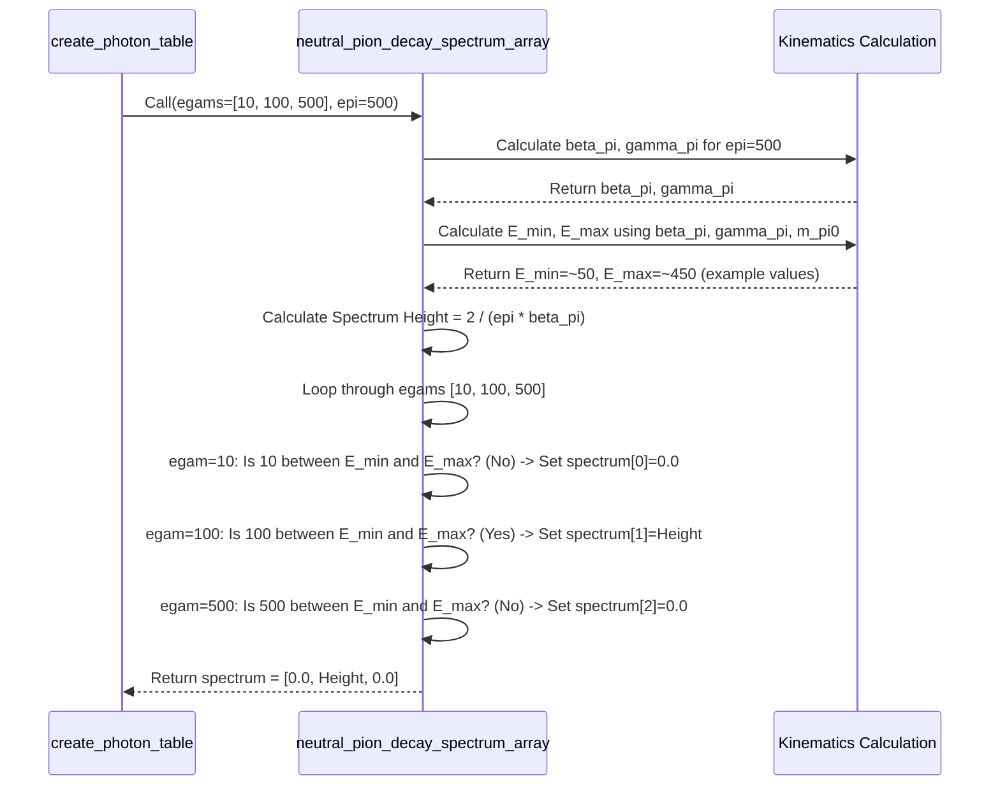

# Chapter 6: Decay Spectrum Calculation (e.g., `neutral_pion_decay_spectrum`)

In the [previous chapter](05_secondarygenerator___secondarytable_.md), we learned about the `SecondaryGenerator` (our 'recipe book') and the `SecondaryTable` (our 'pantry of pre-cooked ingredients'). We saw how the `SecondaryGenerator` uses physics models to fill the `SecondaryTable` with data about secondary particles produced from primary particle decays.

But *how* does the `SecondaryGenerator` actually figure out the results for its recipes? What calculations are involved in determining, for example, the energy distribution of photons coming from the decay of a high-energy neutral pion?

That's what this chapter is about! We'll look at the specific functions, often found within the `hazma::decay` part of the `secondary` crate, that perform these fundamental decay calculations.

## What's the Big Idea? The Exact Recipe for a Single Decay

Think back to our cooking analogy from Chapter 5. The `SecondaryTable` is the pantry stocked with pre-measured ingredients. The `SecondaryGenerator` is the recipe book that tells us *what* ingredients are needed. Now, we need the **detailed instructions** for preparing *one specific ingredient*.

For example, if our recipe needs "photons from neutral pion decay", we need the specific instructions for how a neutral pion ($\pi^0$), travelling with a certain energy, decays into two photons ($\gamma$). How much energy do those photons typically have? Is it always the same, or is there a range?

**Our Goal:** We need functions that encapsulate the physics of a *single decay process*. Given an unstable parent particle (like a $\pi^0$) with a specific energy (`E_parent`), these functions calculate the *energy spectrum* (dN/dE) of a specific daughter particle (like a photon $\gamma$) produced in that decay. This spectrum tells us how many daughter particles we expect to find per unit of energy.

These functions are the core building blocks used by the `SecondaryGenerator` to populate the `SecondaryTable`.

## Example: Neutral Pion Decay ($\pi^0 \to \gamma \gamma$)

Let's focus on a simple but important example: the decay of a neutral pion into two photons.

*   **What happens:** A neutral pion ($\pi^0$) is unstable and quickly decays into two photons.
*   **Energy:** If the pion is just sitting still (at rest), the two photons fly off in opposite directions, and each carries exactly half of the pion's rest mass energy ($E_\gamma = m_{\pi^0} / 2 \approx 67.5$ MeV).
*   **The Catch:** If the pion is moving very fast (highly energetic, as they often are when produced by PBHs), the energy of the photons we observe in the lab frame gets "boosted". Because the photons can be emitted at different angles relative to the pion's direction of motion in the pion's own rest frame, this leads to a *range* of possible photon energies in our lab frame.

The function `neutral_pion_decay_spectrum` (and its array version `neutral_pion_decay_spectrum_array`) calculates exactly this range and the probability distribution within it.

## How These Functions Are Used (Usually Indirectly)

You typically won't call functions like `neutral_pion_decay_spectrum_array` directly in your final analysis code. Instead, they are called *internally* by the `SecondaryGenerator` when you ask it to create a table.

Remember this code from Chapter 5?

```rust
// // Dummy types for illustration
// use secondary::prelude::*;
// use peroxide::fuga::*;
// fn logspace(_:f64, _:f64, _:usize, _:f64) -> Vec<f64> { vec![100.0, 1000.0] }
// #[derive(Debug, Clone, Archive, Serialize, Deserialize)]
// pub struct SecondaryTable {
//   pub input_energies: Vec<f64>, pub output_energies: Vec<f64>, pub spectra: std::collections::HashMap<String, Matrix>
// }
// use rkyv::{Archive, Deserialize, Serialize};
// type Matrix = Peroxide::Array<f64>;
// impl SecondaryGenerator {
//   pub fn create_photon_table(&self, _:&[f64], _:&[f64]) -> SecondaryTable { unimplemented!() }
//   pub fn to_string(&self) -> String { "Hazma".into() }
// }
// impl SecondaryTable { pub fn write_bin(&self, _:&str) -> Result<(), Box<dyn std::error::Error>> {Ok(())} }
// // End Dummy types

// Define energy grids
let input_energies = logspace(-0.0, 6.69, 100, 10.0); // Pion energies
let output_energies = logspace(-0.0, 6.69, 100, 10.0); // Photon energies

// Choose generator
let generator = SecondaryGenerator::Hazma;

// Generate the table
println!("Generating photon decay table using {}...", generator.to_string());
let photon_table: SecondaryTable = generator.create_photon_table(
    &input_energies,
    &output_energies
);
```

Inside the `create_photon_table` method for the `Hazma` generator, when it needs the data for neutral pions decaying to photons, it will loop through each `e_primary` in `input_energies` and call something like:

```rust
// // Dummy function for illustration
// fn neutral_pion_decay_spectrum_array(egams: &[f64], epi: f64) -> Vec<f64> {
//   vec![0.001 * epi / egams.len() as f64; egams.len()]
// }
// let output_energies = vec![10.0, 50.0, 100.0];
// let e_primary = 1000.0; // Example primary pion energy = 1000 MeV
// For a given primary pion energy, calculate the photon spectrum
// across all desired output photon energies.
let photon_spectrum_at_this_epi = neutral_pion_decay_spectrum_array(
    &output_energies, // The grid of photon energies we want results for
    e_primary          // The energy of the decaying pion
);
// 'photon_spectrum_at_this_epi' now holds [dN/dE(10 MeV), dN/dE(50 MeV), dN/dE(100 MeV)]
// for photons from a 1000 MeV pion. This vector becomes one row in the SecondaryTable matrix.
```

This function calculates one specific "recipe instruction set" that the `SecondaryGenerator` uses to build up the complete `SecondaryTable`.

## A Closer Look: `neutral_pion_decay_spectrum_array`

Even though you might not call it directly, let's look at how you *would* call it to understand its inputs and outputs.

```rust
// Import the function (assuming it's publicly accessible, or we're inside the crate)
use secondary::hazma::decay::neutral_pion::neutral_pion_decay_spectrum_array;

// Define the photon energies we want to calculate the spectrum at (MeV)
let photon_energies_mev = vec![10.0, 50.0, 100.0, 200.0, 500.0];

// Define the energy of the incoming neutral pion (MeV)
let pion_energy_mev = 500.0; // A 500 MeV pion

// Call the function
let dnde_values: Vec<f64> = neutral_pion_decay_spectrum_array(
    &photon_energies_mev,
    pion_energy_mev
);

// Print the results
println!("Pion Energy: {} MeV", pion_energy_mev);
for (i, energy) in photon_energies_mev.iter().enumerate() {
    println!("  dN/dE at Photon Energy {:.1} MeV: {:.4e} MeV^-1", energy, dnde_values[i]);
}
```

**Explanation:**

1.  **Input:**
    *   `&photon_energies_mev`: A slice (`&[f64]`) containing the list of secondary photon energies you are interested in.
    *   `pion_energy_mev`: A single number (`f64`) representing the total energy of the primary neutral pion.
2.  **Output:**
    *   `dnde_values`: A `Vec<f64>` containing the calculated differential spectrum `dN/dE` (photons per MeV) for each corresponding energy in `photon_energies_mev`.

The output numbers tell you the relative likelihood of producing a photon at that specific energy from the decay of the 500 MeV pion. For $\pi^0 \to \gamma \gamma$, you'd find non-zero values only within a specific energy range determined by `pion_energy_mev`.

## Under the Hood: The Physics of $\pi^0 \to \gamma \gamma$

How does `neutral_pion_decay_spectrum_array` actually calculate these values? It uses basic principles of special relativity and kinematics.

1.  **Rest Frame:** Imagine you are riding along with the pion. In this "rest frame", the pion isn't moving. When it decays, it emits two photons back-to-back. Because energy and momentum must be conserved, each photon gets exactly half the pion's rest mass energy: $E'_{\gamma} = m_{\pi^0} c^2 / 2 \approx 67.5$ MeV. (The prime ' denotes the rest frame).

2.  **Lab Frame Boost:** Now, switch back to our view in the lab, where the pion is moving with energy $E_{\pi}$ and velocity $\beta_{\pi} = v/c$. The energy $E_{\gamma}$ of a photon we see in the lab depends on the energy it had in the rest frame ($E'_{\gamma}$) and the angle ($\theta'$) at which it was emitted relative to the pion's direction of motion in the rest frame. This is the relativistic Doppler effect:
    $E_{\gamma} = \gamma_{\pi} E'_{\gamma} (1 + \beta_{\pi} \cos \theta')$
    where $\gamma_{\pi} = 1 / \sqrt{1 - \beta_{\pi}^2}$ is the Lorentz factor.

3.  **Energy Range:** Since the photon can be emitted at any angle in the rest frame ($0 \le \theta' \le \pi$), the observed energy $E_{\gamma}$ in the lab frame has a minimum and maximum value:
    *   Max Energy (photon emitted forward, $\cos \theta' = 1$): $E_{max} = \gamma_{\pi} E'_{\gamma} (1 + \beta_{\pi}) = \frac{E_{\pi}}{2} (1 + \beta_{\pi})$
    *   Min Energy (photon emitted backward, $\cos \theta' = -1$): $E_{min} = \gamma_{\pi} E'_{\gamma} (1 - \beta_{\pi}) = \frac{E_{\pi}}{2} (1 - \beta_{\pi})$

4.  **Flat Spectrum:** The key insight is that the decay $\pi^0 \to \gamma \gamma$ is isotropic in the pion's rest frame (it's equally likely to emit photons in any direction). When boosted to the lab frame, this isotropy results in a *flat* probability distribution for the photon energy $E_{\gamma}$ between $E_{min}$ and $E_{max}$. It's like stretching a uniformly colored ribbon – the color density remains uniform. The height of this flat "box" spectrum is such that the total number of photons integrates to 2 (since each decay produces two photons). The height is $dN/dE_{\gamma} = 2 / (E_{max} - E_{min}) = 2 / (E_{\pi} \beta_{\pi})$.

**Simplified Sequence Diagram:**



## Under the Hood: Code Implementation

Let's look at the actual code (slightly simplified) that implements this logic.

**File:** `secondary/src/hazma/decay/neutral_pion.rs`

```rust
use crate::hazma::constants; // Access constants like MASS_PI0

// Calculates dN/dE for an array of photon energies 'egams'
// given a single pion energy 'epi'.
pub fn neutral_pion_decay_spectrum_array(egams: &[f64], epi: f64) -> Vec<f64> {
    let npts = egams.len();
    // Start with a vector of zeros for the spectrum results
    let mut spectrum = vec![0.0; npts];

    // 1. Kinematic Check: Can the pion even exist?
    if epi < constants::MASS_PI0 {
        return spectrum; // Return all zeros if energy is too low
    }

    // 2. Calculate Pion Velocity (beta)
    let beta_pi = constants::beta(epi, constants::MASS_PI0);

    // If pion is at rest (beta=0), spectrum is zero for continuous calculation
    if beta_pi <= 0.0 {
        return spectrum;
    }

    // 3. Calculate Energy Range (Min and Max photon energy)
    let lower_bound = epi * (1.0 - beta_pi) / 2.0; // E_min
    let upper_bound = epi * (1.0 + beta_pi) / 2.0; // E_max

    // 4. Calculate Spectrum Height inside the range
    // BR_PI0_TO_GG is the branching ratio (~1.0). Height = 2 / (E_pi * beta_pi)
    let spectrum_value = constants::BR_PI0_TO_GG * 2.0 / (epi * beta_pi);

    // 5. Fill the spectrum vector
    for (i, &egam) in egams.iter().enumerate() {
        // Check if the requested photon energy 'egam' is within the allowed range
        if egam >= lower_bound && egam <= upper_bound {
            // If yes, assign the calculated height
            spectrum[i] = spectrum_value;
        }
        // If no, it remains 0.0 (from initialization)
    }

    // Return the calculated spectrum
    spectrum
}

// (Helper function 'constants::beta' calculates velocity from energy and mass)
// fn beta(energy: f64, mass: f64) -> f64 {
//     if energy <= mass { return 0.0; }
//     (1.0 - (mass / energy).powi(2)).sqrt()
// }
```

**Explanation:**

*   The code directly follows the steps outlined in the physics explanation.
*   It first checks if the pion energy `epi` is physically possible (greater than its rest mass).
*   It calculates the pion's velocity `beta_pi` using a helper function.
*   It calculates the minimum (`lower_bound`) and maximum (`upper_bound`) photon energies possible in the lab frame.
*   It calculates the constant value (`spectrum_value`) that the spectrum should have within this range.
*   It iterates through the requested photon energies (`egams`). For each `egam`, it checks if it falls within the calculated bounds [`lower_bound`, `upper_bound`].
*   If an `egam` is within the bounds, the corresponding element in the `spectrum` vector is set to `spectrum_value`; otherwise, it remains zero.
*   Finally, it returns the completed `spectrum` vector.

**Other Decay Functions:**

OSPREY includes similar functions for other decay processes relevant to PBH secondaries, such as:

*   `charged_pion_decay_spectrum_array`: Calculates photons from $\pi^\pm \to \mu^\pm \nu \to e^\pm \nu \bar{\nu} \gamma$ (and direct radiative decay). This is more complex, involving integrals over intermediate particle phase space and potentially numerical integration.
*   `muon_decay_spectrum_array`: Calculates photons from $\mu^\pm \to e^\pm \nu \bar{\nu} \gamma$. This also involves complex calculations based on quantum electrodynamics (QED), sometimes using special functions like the Polylogarithm (`Li2`).

While the physics details differ, the core idea remains the same: take the parent particle's energy and the desired secondary particle energies, apply the relevant physics rules (kinematics, QED, etc.), and return the resulting `dN/dE` spectrum.

## Conclusion

In this chapter, we dove into the specific functions that perform the core physics calculations for particle decays, like `neutral_pion_decay_spectrum_array`.

*   These functions implement the detailed "recipe instructions" based on particle physics and kinematics.
*   They take the energy of an unstable parent particle and calculate the energy spectrum (`dN/dE`) of a specific decay product (like photons).
*   We saw how the simple $\pi^0 \to \gamma \gamma$ decay leads to a characteristic "box" spectrum due to relativistic boosting.
*   These functions are the essential building blocks used by the `SecondaryGenerator` (from [Chapter 5](05_secondarygenerator___secondarytable_.md)) to pre-calculate and store decay results in the `SecondaryTable`.

We now understand how the `SecondaryTable` gets filled with accurate physics data. But the table only stores data at specific grid points for primary and secondary energies. What happens when we need the `dN/dE` value for an energy *between* the grid points? That's where interpolation comes in!

Let's explore how OSPREY handles querying the `SecondaryTable` and interpolating between data points in the next chapter: [Chapter 7: Data Interpolation & Querying (BilinearInterpolation, find_index_or_lower_bound, SecondaryTable::query)](07_data_interpolation___querying__bilinearinterpolation__find_index_or_lower_bound__secondarytable__query__.md)!

---

Generated by [AI Codebase Knowledge Builder](https://github.com/The-Pocket/Tutorial-Codebase-Knowledge)
