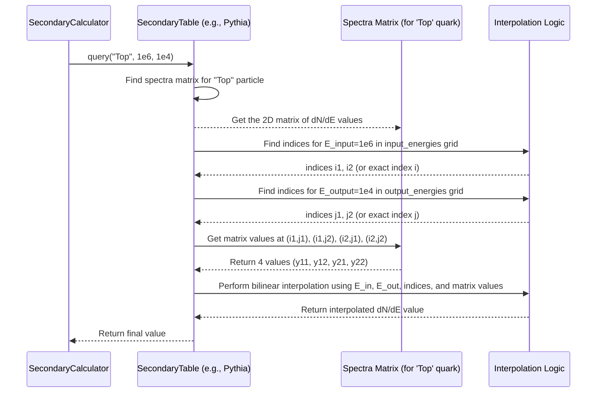

# Chapter 6: Secondary Spectrum Handling

Welcome back! In [Chapter 5: GreyBody Factor Handling](05_greybody_factor_handling_.md), we learned how OSPREY figures out the probability that particles initially produced by a [Primordial Black Hole (PBH)](03_primordial_black_hole__pbh__.md) actually escape its gravitational pull. These escaping particles are called **primary particles**.

But the story doesn't end there! What happens to these primary particles *after* they escape? Many of them are unstable or interact quickly. This chapter explores **Secondary Spectrum Handling** – how OSPREY calculates the particles produced when primary particles decay or interact.

## What's the Problem? The Secondary Sparks

Imagine the primary particles escaping the PBH are like initial, big sparks flying off a grinding wheel. These primary sparks ([Standard Model Particle](04_standard_model_particle_.md)) might include things like quarks, gluons, W/Z bosons, or even unstable particles like pions.

These initial sparks don't travel forever unchanged. They can:

1.  **Decay:** Many particles are unstable and quickly break down into lighter, more stable particles. For example, a neutral pion decays almost instantly into two photons (light particles). A charged pion decays into a muon and a neutrino, and the muon then decays into an electron/positron and more neutrinos.
2.  **Interact (Hadronize):** Quarks and gluons can't exist freely. They immediately interact via the strong force, creating a spray of composite particles called hadrons (like pions, protons, neutrons). This process is called hadronization or fragmentation.

The result is a shower of **secondary particles** – mostly photons, electrons, positrons, and neutrinos – originating from the decay or interaction of the primary particles. Think of these as the **secondary sparks** created when the initial big sparks hit the air or break apart.

For many astronomical searches for PBHs, these *stable* secondary particles (especially photons and electrons/positrons) are what we might actually be able to detect with telescopes or experiments. Therefore, accurately calculating their energy distribution (their spectrum) is crucial.

## The Challenge: Complex Particle Physics

Calculating these secondary spectra is complex. It involves detailed knowledge of particle physics:

*   **Decay Chains:** How exactly does particle A decay into B and C, and what is the energy distribution of B and C?
*   **Hadronization:** How does a high-energy quark turn into a jet of observable particles? This is a complicated process governed by Quantum Chromodynamics (QCD).

Different energy regimes require different theoretical tools or simulation results:

*   **Low Energy Decays:** For simple decays like pions or muons, relatively straightforward calculations (like those implemented in the `Hazma` library, which OSPREY utilizes internally) can be used.
*   **High Energy Interactions/Hadronization:** For high-energy processes involving quarks and gluons, complex event generators like `Pythia` are needed to simulate the particle showers.
*   **Very High Energy:** At even higher energies, specialized calculations or different simulation tools like `HDMSpectra` might provide more accurate results.

## OSPREY's Approach: Different "Recipe Books" and Pre-computation

Calculating these secondary spectra on the fly for every possible primary particle and energy would be incredibly slow. OSPREY uses a smarter approach, similar to how it handles Greybody Factors:

1.  **Multiple "Recipe Books":** OSPREY uses results derived from different sources or methods, each acting like a specialized "recipe book" for a specific energy range or process:
    *   **Hazma:** For low-energy decays (e.g., pion, muon decays producing photons).
    *   **Pythia:** For simulating hadronization and decays at intermediate to high energies.
    *   **HDMSpectra:** For very high-energy hadronization.
2.  **Pre-computed Tables:** The results from these recipe books (often obtained from external sources like `BlackHawk` which bundles Pythia/HDMSpectra tables, or calculated directly using Hazma-like logic) are processed *once* during the [Build & Data Preparation Workflow](01_build___data_preparation_workflow_.md). This step reads the raw data and saves it into efficient binary tables (`.bin` files).
3.  **Energy Cuts:** The [Configuration Management](02_configuration_management_.md) file (e.g., `configs/data_v0.toml`) defines the energy thresholds (cuts) that tell OSPREY when to switch from one recipe book to another.
    ```toml
    # --- File: configs/data_v0.toml (EnergyCut section) ---
    [EnergyCut]
    E_hazma_max = 5.0e+3  # Use Hazma recipes BELOW this input energy (in MeV)
    E_hdm_min = 1.0e+7    # Use HDMSpectra recipes ABOVE this input energy (in MeV)
                          # (Use Pythia recipes for energies in between)
    ```
4.  **`SecondaryTable` for Storage & Interpolation:** A special struct called `SecondaryTable` is used to load and manage the pre-computed data for each "recipe book". It stores the results in a grid format (Input Energy vs. Output Energy) and can quickly look up or **interpolate** values if needed.

## The `SecondaryTable` Struct: The Secondary Spark Cheat Sheet

Think of the `SecondaryTable` as the **pre-compiled cheat sheet** for the secondary sparks. For each primary particle type (like "Electron", "Quark", "W Boson") and each recipe book (Hazma, Pythia, HDMSpectra), there's a table that tells you:

*If a primary particle of type X hits with Input Energy E_in, what is the resulting spectrum of secondary particle Y (e.g., Photon) at Output Energy E_out?*

Specifically, `SecondaryTable` stores:

*   `input_energies`: A list of the primary particle energies for which the spectra were calculated.
*   `output_energies`: A list of the secondary particle energies (the energy grid for the resulting spectrum).
*   `spectra`: A collection (specifically, a `HashMap`) where each entry corresponds to a primary particle type (e.g., "Top") and contains a 2D matrix. This matrix holds the secondary photon spectrum $dN_{\gamma}/dE_{\gamma}$, where rows correspond to `input_energies` and columns correspond to `output_energies`.

## How are Secondary Spectra Used? (Inside `SpectrumCalculator`)

Similar to `GreyBody`, you usually don't interact with `SecondaryTable` directly. It's used internally by the main workhorse, the [SpectrumCalculator](07_spectrumcalculator_.md), which combines primary emission, greybody factors, and secondary production.

The `SpectrumCalculator` relies on a helper struct, `SecondaryCalculator`, which holds the loaded `SecondaryTable` objects for Hazma, Pythia, and HDMSpectra, along with the energy cuts from the configuration.

When calculating the final photon spectrum, the `SpectrumCalculator` does something like this (conceptually):

1.  Calculate the primary emission rate for *all* particle types (using `PBH::emission_rate` which includes greybody factors). Let's say we find the rate for primary particle 'P' at energy `E_in`.
2.  Ask the `SecondaryCalculator`: "If I have a primary particle 'P' with energy `E_in`, what is the spectrum of secondary *photons* it produces?"
3.  The `SecondaryCalculator` checks `E_in` against the energy cuts (`E_hazma_max`, `E_hdm_min`):
    *   If `E_in` is low, it uses the Hazma `SecondaryTable`.
    *   If `E_in` is intermediate, it uses the Pythia `SecondaryTable`.
    *   If `E_in` is high, it uses the HDMSpectra `SecondaryTable`.
4.  The chosen `SecondaryTable` is queried for the secondary photon spectrum corresponding to primary particle 'P' and input energy `E_in`. This query might involve interpolation if `E_in` isn't exactly on the table's grid. The result is a function (or a list of values) describing the photon energy distribution $dN_{\gamma}/dE_{\gamma}(E_{out})$ produced by *one* primary particle 'P' at `E_in`.
5.  Multiply the primary rate (step 1) by the secondary spectrum (step 4). This gives the contribution to the final photon spectrum from primary particle 'P' at energy `E_in`.
6.  Repeat for all primary particle types 'P' and integrate over all relevant input energies `E_in`.
7.  Sum up all contributions to get the total secondary photon spectrum.

Let's look at how the `SecondaryCalculator` decides which table to use:

```rust
// --- File: src/spectrum.rs (Simplified SecondaryCalculator::query) ---
use primary::core::StandardModel::{self, NeutralPion, ChargedPion};
use secondary::io::SecondaryTable; // Import SecondaryTable

// Define some constants related to energy ranges
const HAZMA_MAX_ENERGY: f64 = 5e+3; // Max *output* energy Hazma table covers
const PYTHIA_MAX_ENERGY: f64 = 1e+7; // Max *output* energy Pythia table covers
// ... other constants ...

#[derive(Debug, Clone)] // Assume this struct is defined elsewhere
pub struct SecondaryCalculator {
    pub energy_cut: (f64, f64), // (E_hazma_max_input, E_hdm_min_input)
    pub hazma_table: SecondaryTable,
    pub pythia_table: SecondaryTable,
    pub hdmspectra_table: SecondaryTable,
}

impl SecondaryCalculator {
    // ... constructor `new` loads tables ...

    #[allow(non_snake_case)]
    // Queries the secondary photon spectrum dN/dE_out for a given primary particle
    // with input energy E_input, evaluated at output energy E_output.
    pub fn query(&self, particle: StandardModel, E_input: f64, E_output: f64) -> f64 {
        // Get the energy cuts for input energy
        let (hazma_max_input, hdm_min_input) = self.energy_cut;

        // Determine which table to use based on the INPUT energy E_input
        let table_to_use = if E_input <= hazma_max_input {
            // Low energy -> Use Hazma table
            // Check if the *output* energy is also within Hazma's range
            if E_output > HAZMA_MAX_ENERGY { return 0.0; }
            &self.hazma_table
        } else if E_input <= hdm_min_input {
            // Intermediate energy -> Use Pythia table
            // Check if the *output* energy is within Pythia's range
            if E_output > PYTHIA_MAX_ENERGY { return 0.0; }
            &self.pythia_table
        } else {
            // High energy -> Use HDMSpectra table
            // Check output energy range for HDMSpectra...
            &self.hdmspectra_table
        };

        // Query the chosen table for the specific particle and energies
        // The .query() method handles interpolation internally if needed.
        table_to_use.query(&particle.to_string(), E_input, E_output)
    }
}
```

*   The function first checks the `E_input` against the `energy_cut` values loaded from the configuration.
*   Based on `E_input`, it selects the appropriate `SecondaryTable` (`hazma_table`, `pythia_table`, or `hdmspectra_table`). It also checks if the requested `E_output` is within the valid range for the chosen table.
*   Finally, it calls the `query` method on the *chosen* table.

## Under the Hood: Data Prep and Table Query

**1. Data Preparation (Chapter 1 Revisited):**

The `just build` command you ran in [Chapter 1: Build & Data Preparation Workflow](01_build___data_preparation_workflow_.md) triggered the `secondary-build` recipe. This recipe runs helper programs:

*   `pythia_table.rs` and `hdmspectra_table.rs`: These read the raw text files (often from `BlackHawk`) containing Pythia and HDMSpectra simulation results for different primary particles producing photons, electrons, etc. They parse this data and save it into intermediate binary files (e.g., `data/Photon_pythia.bin`).
*   `gen_secondary_table.rs`: This program takes the intermediate Pythia/HDMSpectra data and also calculates low-energy decay spectra (like from Hazma). It organizes this information into the final `SecondaryTable` structure (with the input/output energy grids and the matrix map) and saves *these* tables as `.bin` files in the `secondary/tables/` directory (e.g., `secondary/tables/Pythia_photon_spectra.bin`).

```makefile
# --- File: secondary/justfile (Simplified) ---
# (Assumes BLACKHAWK_DIR is set)
PYTHIA_TABLES_DIR := "{{BLACKHAWK_DIR}}/src/tables/hadronization_tables/pythia_tables_new"
HDMSPECTRA_TABLES_DIR := "{{BLACKHAWK_DIR}}/src/tables/hadronization_tables/hdmspectra_tables"

# Recipe run by `just build` via `secondary-build`
generate_table:
    # Reads Pythia text tables, writes intermediate .bin
    cargo run --release --bin pythia_table -- "{{PYTHIA_TABLES_DIR}}"
    # Reads HDMSpectra text tables, writes intermediate .bin
    cargo run --release --bin hdmspectra_table -- "{{HDMSPECTRA_TABLES_DIR}}"
    # Reads intermediate .bin, calculates Hazma, writes final SecondaryTable .bin files
    cargo run --release --bin gen_secondary_table
```

**2. `SecondaryTable::query`:**

When `table.query(particle_name, E_input, E_output)` is called:



The code implementing this looks like:

```rust
// --- File: secondary/src/io.rs (Simplified SecondaryTable::query) ---
use crate::utils::find_index_or_lower_bound; // Helper function

#[derive(Debug, Clone, /* ... Archive ... */)] // Assume definition elsewhere
pub struct SecondaryTable {
    pub input_energies: Vec<f64>,
    pub output_energies: Vec<f64>,
    pub spectra: HashMap<String, Matrix>, // Matrix is a 2D array type
}

impl SecondaryTable {
    // ... read_bin, write_bin methods ...

    pub fn load_spectrum(&self, particle: &str) -> Option<&Matrix> {
        self.spectra.get(particle)
    }

    // Simplified query logic (interpolation details omitted)
    pub fn query(&self, particle: &str, input_energy: f64, output_energy: f64) -> f64 {
        // 1. Get the 2D matrix for the requested primary particle
        let spectrum_matrix = match self.load_spectrum(particle) {
            Some(matrix) => matrix,
            None => return 0.0, // Particle not in this table
        };

        // 2. Find where input_energy and output_energy fall in the grids
        // `find_index_or_lower_bound` returns either exact index or bounding indices
        let input_res = find_index_or_lower_bound(&self.input_energies, input_energy);
        let output_res = find_index_or_lower_bound(&self.output_energies, output_energy);

        // 3. Based on indices, perform interpolation (simplified logic)
        match (input_res, output_res) {
            (Err(i), Err(j)) => {
                // Exact match on both grids
                spectrum_matrix[(i, j)] // Direct lookup
            }
            _ => {
                // One or both energies are between grid points
                // Calculate indices i1, i2, j1, j2
                // Get matrix values y11, y12, y21, y22 at grid points
                // Perform linear or bilinear interpolation based on these values
                // ... complex interpolation logic ...
                let interpolated_value = /* ... perform interpolation ... */ 0.0;
                interpolated_value
            }
        }
    }
}
```

*   It first finds the correct 2D data matrix for the requested `particle`.
*   It then uses helper functions (`find_index_or_lower_bound`) to determine the positions of `input_energy` and `output_energy` within the table's energy grids.
*   If the energies match grid points exactly, it reads the value directly.
*   If not, it retrieves the surrounding grid point values from the matrix and performs linear or bilinear interpolation to estimate the value at the requested energies.

## Conclusion

In this chapter, we explored **Secondary Spectrum Handling**, the process of calculating the stable particles (like photons, electrons, positrons) produced when primary particles from Hawking radiation decay or interact.

We learned that:
*   This process is crucial because these secondary particles are often what we might detect.
*   Calculating secondary spectra is complex and requires different physics models ("recipe books" like Hazma, Pythia, HDMSpectra) for different energy ranges.
*   OSPREY uses **pre-computed tables** generated during the build process for efficiency.
*   The **`SecondaryTable`** struct stores these pre-computed results and provides **interpolation** capabilities.
*   The **`SecondaryCalculator`** uses energy cuts (defined in the configuration file) to choose the correct `SecondaryTable` (Hazma, Pythia, or HDMSpectra) based on the primary particle's energy.

Understanding secondary spectra is vital for predicting the signals we might observe from PBHs. Now that we know how primary emission rates and secondary spectra are handled, we are ready to see how OSPREY puts it all together to calculate the final, observable particle spectrum.

**Next Chapter:** [Chapter 7: SpectrumCalculator](07_spectrumcalculator_.md)

---

Generated by [AI Codebase Knowledge Builder](https://github.com/The-Pocket/Tutorial-Codebase-Knowledge)