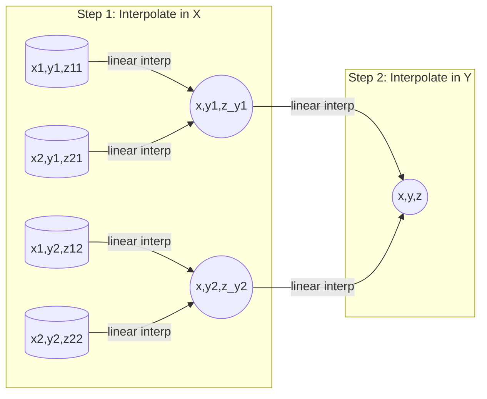
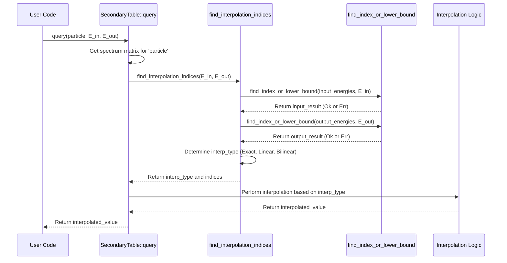

# Chapter 7: Data Interpolation & Querying (`BilinearInterpolation`, `find_index_or_lower_bound`, `SecondaryTable::query`)

In the [previous chapter](06_decay_spectrum_calculation__e_g___neutral_pion_decay_spectrum__.md), we saw how OSPREY uses functions like `neutral_pion_decay_spectrum_array` to calculate the detailed physics of particle decays. We also learned in [Chapter 5](05_secondarygenerator___secondarytable_.md) that these results are often pre-calculated and stored in a `SecondaryTable` for efficiency.

But there's a practical question: the `SecondaryTable` stores decay information (like `dN/dE`) only for specific energy values that we chose when we generated the table (our energy "grid"). What if we need the decay rate for a primary particle energy of, say, 1500 MeV, but our table only has entries for 1000 MeV and 2000 MeV? We can't store data for *every single possible energy* – that would take infinite space!

This is where interpolation and efficient querying come in.

## What's the Big Idea? Reading Between the Lines

Imagine you have a weather chart showing the temperature recorded every hour.

Time  | Temp (°C)
------|----------
1:00 PM | 20
2:00 PM | 22
3:00 PM | 21

What was the temperature at 1:30 PM? It's not explicitly listed! But you can make a good guess by looking at the values at 1:00 PM (20°C) and 2:00 PM (22°C). You'd probably estimate it was around 21°C, halfway between the two known points.

This process of estimating values *between* known data points is called **interpolation**.

**Our Goal:** We need a way to efficiently find the relevant data points in our pre-calculated tables (like `SecondaryTable` or `GreyBodyData`) and then use interpolation to estimate the value at the specific input parameters (like energy or spin) we're actually interested in, even if those exact parameters aren't in the table grid.

OSPREY uses a few key tools for this:

1.  **`find_index_or_lower_bound`:** A helper function to quickly find *where* our desired input value fits within the sorted list of grid points (like finding which two hours 1:30 PM falls between).
2.  **Interpolation Logic:** Mathematical formulas to estimate the value based on the surrounding grid points. For 2D grids (like in `SecondaryTable`), this often involves **bilinear interpolation**.
3.  **Query Functions (`SecondaryTable::query`, `GreyBodyData::query`):** These functions put everything together – they use `find_index_or_lower_bound` to locate the spot in the grid and then apply the appropriate interpolation to give us our estimated value.

## Key Concepts: Grids, Finding, and Estimating

Let's break down how OSPREY "reads between the lines".

### 1. Data Grids: The Spreadsheets of Physics

Think of `SecondaryTable` (from [Chapter 5](05_secondarygenerator___secondarytable_.md)) and `GreyBodyData` (from [Chapter 3](03_greybody_factors__greybody___greybodydata___greybodyfit__.md)) as spreadsheets or charts.

*   **Axes:** The rows and columns represent the input parameters for which we pre-calculated data.
    *   For `SecondaryTable`, the rows might represent the primary particle energy (`E_in`), and the columns the secondary particle energy (`E_out`).
    *   For `GreyBodyData`, the rows might be the black hole spin (`a`), and the columns the dimensionless energy (`x`).
*   **Cells:** Each cell in the grid contains the pre-calculated result corresponding to the specific combination of input parameters for that row and column (e.g., `dN/dE` for `SecondaryTable`, or the `Q_s` factor for `GreyBodyData`).

Here's a tiny example of what the `dN/dE` data for "Neutral Pion -> Photon" decay might look like inside a `SecondaryTable`:


  Values  | E_photon=10 | E_photon=50 | E_photon=100
------|-------------|-------------|-------------
E_pion=100 | 0.0         | 1.5e-2      | 1.5e-2
E_pion=200 | 0.0         | 0.0         | 7.5e-3
E_pion=500 | 0.0         | 0.0         | 0.0


*(These are just illustrative numbers)*

### 2. Finding Your Place: `find_index_or_lower_bound`

Before we can interpolate, we need to find the right *location* in our grid. If we want the `dN/dE` for `E_pion = 150` MeV and `E_photon = 75` MeV, we need to find:

*   Which two `E_pion` values in our grid does 150 fall between? (Answer: 100 and 200)
*   Which two `E_photon` values in our grid does 75 fall between? (Answer: 50 and 100)

This is what `find_index_or_lower_bound` does. You give it a sorted list (like `input_energies` or `output_energies` from `SecondaryTable`) and the target value you're looking for.

```rust
use secondary::utils::find_index_or_lower_bound; // Assuming this path

let energy_grid = vec![10.0, 50.0, 100.0, 200.0]; // Our known points

// Case 1: Target value is *between* grid points
let target1 = 75.0;
let result1 = find_index_or_lower_bound(&energy_grid, target1);
// result1 will be Ok(1) because 75.0 falls between index 1 (50.0) and index 2 (100.0).
// Ok(lower_idx) tells us the index of the grid point *just below* our target.

// Case 2: Target value is *exactly* on a grid point
let target2 = 100.0;
let result2 = find_index_or_lower_bound(&energy_grid, target2);
// result2 will be Err(2) because 100.0 is exactly at index 2.
// Err(exact_idx) tells us the exact index where the target was found.

println!("Result for {}: {:?}", target1, result1); // Output: Result for 75.0: Ok(1)
println!("Result for {}: {:?}", target2, result2); // Output: Result for 100.0: Err(2)
```

**Explanation:**

*   We provide the function with our sorted `energy_grid` and the `target` energy.
*   It uses an efficient algorithm called **binary search** (like quickly finding a word in a dictionary) to locate the target.
*   **Output:**
    *   `Ok(lower_idx)`: If the target falls *between* grid points, it returns the index `lower_idx` of the grid point immediately *before* the target. This signals that interpolation is needed between `grid[lower_idx]` and `grid[lower_idx + 1]`.
    *   `Err(exact_idx)`: If the target *exactly matches* a grid point, it returns the index `exact_idx` of that point. This signals that no interpolation is needed along this axis.

### 3. Estimating Between Lines: Interpolation

Once we know *where* our target value falls relative to the grid points, we can estimate the value using interpolation.

**a) Linear Interpolation (1D)**

This is the simplest form, used when our target falls between two points on a single axis (like our temperature example at 1:30 PM). We just draw a straight line between the known points and find the value on that line corresponding to our target.

```
Known Point 1: (x1, y1)  (e.g., 1:00 PM, 20°C)
Known Point 2: (x2, y2)  (e.g., 2:00 PM, 22°C)
Target x:      x         (e.g., 1:30 PM)
Estimated y:   y = y1 + (y2 - y1) * (x - x1) / (x2 - x1)
```
If `x = 1.5` (for 1:30 PM), `x1 = 1`, `x2 = 2`, `y1 = 20`, `y2 = 22`:
`y = 20 + (22 - 20) * (1.5 - 1) / (2 - 1) = 20 + 2 * 0.5 / 1 = 21`

**b) Bilinear Interpolation (2D - `BilinearInterpolation`)**

Our `SecondaryTable` (and `GreyBodyData`) grids are often 2D. We need to interpolate based on *two* input values (e.g., `E_pion` and `E_photon`). Bilinear interpolation extends the linear idea to 2D.

Imagine you have a value defined at the four corners of a square (or rectangle) in your grid, and your target point lies somewhere inside that square.

```
(x1, y1) +------+ (x2, y1)
         |      |
         |  *P  | <-- Our target point (x, y)
         |      |
(x1, y2) +------+ (x2, y2)
```

We know the values (let's call them `z`) at the four corners: `z11` (at `x1,y1`), `z21` (at `x2,y1`), `z12` (at `x1,y2`), `z22` (at `x2,y2`).

Bilinear interpolation works in two steps:

1.  **Interpolate along one axis (e.g., x-axis):**
    *   Linearly interpolate between `z11` and `z21` to find an intermediate value `z_y1` at `(x, y1)`.
    *   Linearly interpolate between `z12` and `z22` to find an intermediate value `z_y2` at `(x, y2)`.
2.  **Interpolate along the other axis (e.g., y-axis):**
    *   Linearly interpolate between the two intermediate values `z_y1` and `z_y2` to find the final estimated value `z` at our target point `(x, y)`.



OSPREY has a helper structure `BilinearInterpolation` (often used by `GreyBodyData::query`) that bundles the grid data and performs this calculation.

## How It's Used: `SecondaryTable::query`

Now let's see how `SecondaryTable::query` uses these pieces to give us the `dN/dE` value even for energies not exactly on the grid.

When you call `loaded_table.query("Neutral Pion", 150.0, 75.0)`:

1.  **Load Spectrum:** It first gets the correct 2D `Matrix` of `dN/dE` values for the "Neutral Pion" from its internal `spectra` map.
2.  **Find Indices:** It calls `find_interpolation_indices(150.0, 75.0)`. This helper function internally calls `find_index_or_lower_bound` twice:
    *   For `input_energy = 150.0` on `self.input_energies` (e.g., `[100, 200, 500]`). Result: `Ok(0)` (between index 0 and 1).
    *   For `output_energy = 75.0` on `self.output_energies` (e.g., `[10, 50, 100]`). Result: `Ok(1)` (between index 1 and 2).
3.  **Determine Interpolation Type:** Based on the `Ok`/`Err` results from the index searches, it determines *how* to interpolate:
    *   `Err, Err`: Both energies match grid points -> `Exact` (no interpolation needed, just return `matrix[i, j]`).
    *   `Err, Ok`: Input energy matches, output needs interpolation -> `LinearOutput` (linear interpolation along the output energy axis).
    *   `Ok, Err`: Output energy matches, input needs interpolation -> `LinearInput` (linear interpolation along the input energy axis).
    *   `Ok, Ok`: Both energies are between grid points -> `Bilinear` (full bilinear interpolation needed).
    In our example (`Ok(0)`, `Ok(1)`), it determines `Bilinear`.
4.  **Perform Interpolation:** It executes the appropriate interpolation logic:
    *   For `Bilinear`, it identifies the 4 corner points in the matrix (indices `(0, 1)`, `(1, 1)`, `(0, 2)`, `(1, 2)`).
    *   It fetches the `dN/dE` values at these 4 corners.
    *   It applies the bilinear interpolation formula using the corner values and the target energies (150.0, 75.0) relative to the grid energies (e.g., E_pion=100, 200; E_photon=50, 100).
5.  **Return Result:** It returns the final calculated (interpolated) `dN/dE` value.

Here's a simplified look at the `query` method's structure:

```rust
// Simplified from secondary/src/io.rs
use crate::utils::find_index_or_lower_bound;
// // --- Dummy types ---
// use std::collections::HashMap;
// pub type Matrix = Vec<Vec<f64>>; // Dummy Matrix
// #[derive(Debug, Clone)] pub struct SecondaryTable {
//   pub input_energies: Vec<f64>, pub output_energies: Vec<f64>, pub spectra: HashMap<String, Matrix>
// }
// #[derive(Debug, Clone, Copy)] enum InterpolationInfo { Exact(usize, usize), Bilinear([(usize,usize);4]), LinearInput([(usize,usize);2]), LinearOutput([(usize,usize);2]) }
// // --- End Dummy types ---

impl SecondaryTable {
    pub fn query(&self, particle: &str, input_energy: f64, output_energy: f64) -> f64 {
        // 1. Get the data matrix for the particle
        let spectrum = self.spectra.get(particle)
            .expect("Particle not found");

        // 2. Find where energies fall on the grid & determine interpolation type
        let interp_info = self.find_interpolation_indices(input_energy, output_energy);

        // 3. Perform lookup or interpolation based on type
        match interp_info {
            InterpolationInfo::Exact(i, j) => {
                // Energies match grid points exactly - direct lookup!
                spectrum[i][j]
            }
            InterpolationInfo::LinearInput(points) => {
                // Interpolate linearly along input energy axis
                // ... implementation uses linear formula ...
                # 0.0 // Placeholder
            }
            InterpolationInfo::LinearOutput(points) => {
                // Interpolate linearly along output energy axis
                // ... implementation uses linear formula ...
                 # 0.0 // Placeholder
            }
            InterpolationInfo::Bilinear(points) => {
                // Interpolate bilinearly using 4 corner points
                let [(i1, j1), (i2, _), (_, j2), (_, _)] = points; // Get indices
                let y11 = spectrum[i1][j1]; // Get values at corners
                let y12 = spectrum[i1][j2];
                let y21 = spectrum[i2][j1];
                let y22 = spectrum[i2][j2];
                // ... apply bilinear formula using these values and energies ...
                 y11 // Placeholder for actual calculation
            }
        }
    }

    // Helper to find indices and determine interpolation type
    fn find_interpolation_indices(
        &self, input_energy: f64, output_energy: f64
    ) -> InterpolationInfo {
        // Calls find_index_or_lower_bound for input_energy and output_energy
        let input_res = find_index_or_lower_bound(&self.input_energies, input_energy);
        let output_res = find_index_or_lower_bound(&self.output_energies, output_energy);

        // Logic to return Exact, LinearInput, LinearOutput, or Bilinear
        // based on Ok/Err results of input_res and output_res
        // ... implementation omitted for brevity ...
        # InterpolationInfo::Bilinear([(0,0), (1,0), (0,1), (1,1)]) // Dummy return
    }
}
```

## Under the Hood: Implementation Details

Let's peek at the simplified implementations of the core components.

**`find_index_or_lower_bound`**

This function efficiently finds the position using binary search.

```rust
// Simplified from secondary/src/utils.rs

// Searches a sorted slice `values` for `target`.
// Returns Err(index) if found exactly, Ok(lower_index) if between points.
pub fn find_index_or_lower_bound(values: &[f64], target: f64) -> Result<usize, usize> {
    // Use built-in binary search
    match values.binary_search_by(|probe| {
        probe.partial_cmp(&target).unwrap_or(std::cmp::Ordering::Less)
    }) {
        Ok(exact_idx) => {
            // Found exact match at index 'exact_idx'
            Err(exact_idx)
        }
        Err(insert_idx) => {
            // Not found exactly. 'insert_idx' is where it *would* be inserted.
            // Calculate the index of the element *before* the insertion point.
            let lower_idx = if insert_idx == 0 { 0 } // Target is below the first element
                          else if insert_idx == values.len() { values.len() - 2 } // Target is above last element
                          else { insert_idx - 1 }; // Target is between elements
            Ok(lower_idx)
        }
    }
}
```

**`BilinearInterpolation::interpolate`**

This is used, for instance, by `GreyBodyData::query`. It encapsulates the 2D interpolation logic.

```rust
// Simplified from primary/src/util.rs
use peroxide::structure::matrix::Matrix; // Using peroxide's Matrix type

#[derive(Debug, Clone)]
pub struct BilinearInterpolation {
    x_axis: Vec<f64>, // Grid points along x (e.g., black hole spin 'a')
    y_axis: Vec<f64>, // Grid points along y (e.g., dimensionless energy 'x')
    z_values: Matrix, // The grid data (e.g., Qs factor)
}

impl BilinearInterpolation {
    // Creates a new interpolator instance
    pub fn new(x: Vec<f64>, y: Vec<f64>, z: Matrix) -> Self {
        BilinearInterpolation { x_axis: x, y_axis: y, z_values: z }
    }

    // Performs the bilinear interpolation
    pub fn interpolate(&self, target_x: f64, target_y: f64) -> f64 {
        // 1. Find the lower indices for x and y (using binary search or similar)
        // (Assume find_lower_index returns the index `i` such that axis[i] <= target < axis[i+1])
        let x_idx = find_lower_index(&self.x_axis, target_x);
        let y_idx = find_lower_index(&self.y_axis, target_y);

        // 2. Get coordinates of the 4 surrounding grid points
        let x0 = self.x_axis[x_idx];
        let x1 = self.x_axis[x_idx + 1];
        let y0 = self.y_axis[y_idx];
        let y1 = self.y_axis[y_idx + 1];

        // 3. Get the z-values at the 4 corners from the matrix
        let z00 = self.z_values[(x_idx, y_idx)];
        let z01 = self.z_values[(x_idx, y_idx + 1)];
        let z10 = self.z_values[(x_idx + 1, y_idx)];
        let z11 = self.z_values[(x_idx + 1, y_idx + 1)];

        // 4. Calculate interpolation fractions (how far target is between points)
        let x_frac = (target_x - x0) / (x1 - x0);
        let y_frac = (target_y - y0) / (y1 - y0);

        // 5. Interpolate along y-axis at x0 and x1
        let z_at_y_interp_x0 = z00 + (z01 - z00) * y_frac;
        let z_at_y_interp_x1 = z10 + (z11 - z10) * y_frac;

        // 6. Interpolate along x-axis between the results from step 5
        let final_z = z_at_y_interp_x0 + (z_at_y_interp_x1 - z_at_y_interp_x0) * x_frac;

        final_z
    }
}
// // Dummy helper function
// fn find_lower_index(vals: &[f64], target: f64) -> usize {
//     match vals.binary_search_by(|p| p.partial_cmp(&target).unwrap()) {
//         Ok(idx) => idx.min(vals.len()-2),
//         Err(idx) => if idx == 0 {0} else {(idx-1).min(vals.len()-2)},
//     }
// }
```

**Query Flow Diagram (`SecondaryTable::query`)**



## Connection to Greybody Factors

The same principles apply when querying the `GreyBodyData` table we encountered in [Chapter 3](03_greybody_factors__greybody___greybodydata___greybodyfit__.md). The `GreyBodyData::query(a, x)` method needs to find the dimensionless emissivity factor $Q_s$ for a specific black hole spin `a` and dimensionless energy `x`. Since the data is stored on a 2D grid of `a` and `x`, it uses `BilinearInterpolation` (or a similar internal logic) to estimate the value if the exact `a` and `x` aren't grid points.

## Conclusion

In this chapter, we learned how OSPREY efficiently retrieves data from its pre-calculated tables even when the exact input parameters aren't listed.

*   Pre-calculated data (like decay spectra in `SecondaryTable` or greybody factors in `GreyBodyData`) is often stored on **grids**.
*   The `find_index_or_lower_bound` function quickly locates where a target value falls within a sorted grid axis using **binary search**.
*   **Interpolation** (linear for 1D, bilinear for 2D) is used to estimate values *between* the known grid points.
*   Functions like `SecondaryTable::query` and `GreyBodyData::query` combine index finding and interpolation to provide accurate results for any valid input.

This ability to interpolate is crucial for making the use of large, pre-computed datasets practical and efficient. But how are these large datasets (like `SecondaryTable` and `GreyBodyData`) stored in files and loaded back into memory so quickly? That involves serialization.

Let's explore how OSPREY saves and loads data efficiently in the next chapter: [Chapter 8: Data Serialization/Deserialization (rkyv, Parquet)](08_data_serialization_deserialization__rkyv__parquet__.md)!

---

Generated by [AI Codebase Knowledge Builder](https://github.com/The-Pocket/Tutorial-Codebase-Knowledge)
