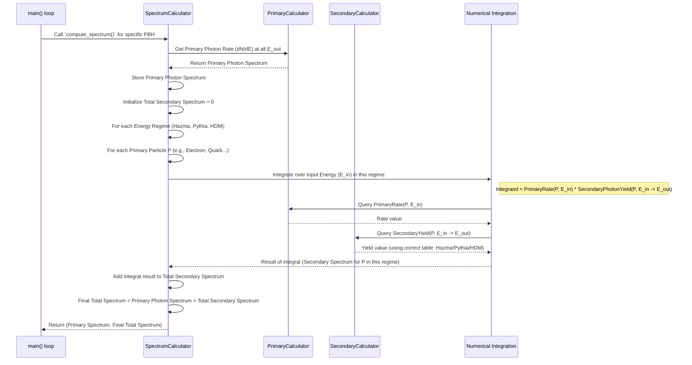

# Chapter 7: SpectrumCalculator

Welcome back! In [Chapter 6: Secondary Spectrum Handling](06_secondary_spectrum_handling_.md), we saw how OSPREY determines the spectrum of secondary particles (like photons) that result from the decay or interaction of the primary particles emitted by a Primordial Black Hole (PBH).

Now, we have all the pieces:
1.  The primary emission rate of various particles directly from the PBH, corrected for escape probability ([Chapter 5: GreyBody Factor Handling](05_greybody_factor_handling_.md)).
2.  The secondary spectra of stable particles (like photons) produced by those primary particles ([Chapter 6: Secondary Spectrum Handling](06_secondary_spectrum_handling_.md)).

How do we combine these to get the *total* spectrum of photons (or other target particles) that we might actually observe? This is the job of the **`SpectrumCalculator`**.

## The Goal: The Final Recipe

Imagine you're baking a complex cake. You have the base cake layer (primary emission) and various fillings and toppings derived from other ingredients (secondary particles). The `SpectrumCalculator` is like the master chef who knows how to combine all these components in the right proportions to present the final, complete cake (the total observable spectrum).

Specifically, for a given [Primordial Black Hole (PBH)](03_primordial_black_hole__pbh__.md), we want to calculate the total rate at which photons (or electrons/positrons) are produced across a range of energies. This total rate includes:

*   **Primary Photons:** Photons emitted directly by the PBH.
*   **Secondary Photons:** Photons produced when *other* primary particles (like quarks, electrons, W bosons, etc.) decay or hadronize.

The `SpectrumCalculator` orchestrates this calculation, bringing together all the concepts we've learned so far.

## Introducing the `SpectrumCalculator`

The `SpectrumCalculator` is the main engine in OSPREY responsible for computing the final, observable particle spectrum for a specific PBH. It takes the information about the PBH, the primary emission physics, and the secondary particle yields, and combines them through integration.

To do its job, it relies on a few key ingredients:

1.  **A Specific `PBH`:** It needs to know the mass of the PBH it's calculating the spectrum for.
2.  **Energy Grids:** It needs to know the range of energies to consider for both the primary particles (`input_energies`) and the final target particles (`output_energies`). Often, these are the same grid.
3.  **A `PrimaryCalculator`:** This is a helper component *within* the `SpectrumCalculator`. It efficiently calculates the primary emission rate (dN/dE/dt) for *any* [Standard Model Particle](04_standard_model_particle_.md) at any given energy. It pre-calculates these rates on the `input_energies` grid and uses interpolation (splines) for efficiency. It uses the `PBH::emission_rate` method internally, which already includes the [GreyBody Factor Handling](05_greybody_factor_handling_.md).
4.  **A `SecondaryCalculator`:** This component, which we learned about in [Chapter 6: Secondary Spectrum Handling](06_secondary_spectrum_handling_.md), provides the secondary particle yields (e.g., dN_photon/dE_out from a primary particle P at E_in) using its pre-loaded Hazma, Pythia, and HDMSpectra tables and the energy cuts defined in the configuration.

## How It's Used: Computing the Spectrum

The main purpose of the `SpectrumCalculator` is exposed through its `compute_spectrum` method. Let's see how it's set up and used in the main part of OSPREY (`src/main.rs`).

```rust
// --- File: src/main.rs (Simplified Snippet) ---
use osprey::{
    config::Config, // Configuration loader
    spectrum::{SecondaryCalculator, SpectrumCalculator}, // Our stars!
    core::PBH // The PBH struct
};
use rayon::prelude::*; // For parallel processing

fn main() -> Result<(), Box<dyn std::error::Error>> {
    // 1. Load configuration (includes PBH masses, energy grid, energy cuts)
    let data_config = Config::from_toml("configs/data_v0.toml")?;
    let pbhs: Vec<PBH> = data_config.generate_pbhs(); // Get list of PBHs to simulate
    let energy_grid: Vec<f64> = data_config.generate_primary_energies(); // Shared energy grid

    // 2. Create the SecondaryCalculator (loads Hazma/Pythia/HDM tables)
    let secondary_calculator = SecondaryCalculator::new(data_config.energy_cut())?;

    // 3. Loop through each PBH mass (in parallel)
    pbhs.par_iter().for_each(|pbh| {
        // 4. Create a SpectrumCalculator for THIS specific PBH
        let spectrum_calculator = SpectrumCalculator::new(
            *pbh,                   // The current PBH object
            energy_grid.clone(),    // Input energy grid
            energy_grid.clone(),    // Output energy grid (photons)
            &secondary_calculator,  // Reference to the secondary calc
        );

        // 5. Compute the primary and total photon spectra!
        let (primary_photon_spectrum, total_photon_spectrum) =
            spectrum_calculator.compute_spectrum();

        // 6. Save the results (see Chapter 8)
        // ... code to write spectra to a file ...
        println!("Calculated spectrum for PBH mass: {:.2e} g", pbh.mass);
    });

    Ok(())
}
```

**Explanation:**

1.  We load the simulation settings from a TOML file using the `Config` struct ([Chapter 2: Configuration Management](02_configuration_management_.md)). This gives us the list of PBH masses and the energy grid.
2.  We create *one* `SecondaryCalculator` instance. It loads the secondary particle tables (Hazma, Pythia, HDMSpectra) from their `.bin` files. This is done only once.
3.  We loop through each `PBH` object defined by the configuration.
4.  Inside the loop, for *each* PBH, we create a *new* `SpectrumCalculator`. We pass it the current `pbh`, the energy grids, and a reference to the single `secondary_calculator`.
5.  We call `spectrum_calculator.compute_spectrum()`. This is where the main calculation happens for this specific PBH. It returns two lists of numbers: the spectrum of primary photons and the spectrum of *total* photons (primary + secondary).
6.  The resulting spectra are then saved (more on this in [Chapter 8: Data Output (Parquet) & Plotting](08_data_output__parquet____plotting_.md)).

So, the `SpectrumCalculator` is created per-PBH and does the heavy lifting of combining primary and secondary contributions for that specific black hole mass.

## Under the Hood: The `compute_spectrum` Workflow

What actually happens inside `compute_spectrum`? It's a careful orchestration involving integration:

**Conceptual Flow:**



**Step-by-Step Breakdown:**

1.  **Calculate Primary Rates Efficiently:** The `SpectrumCalculator` first uses its internal `PrimaryCalculator`. This helper pre-calculates the primary emission rate $dN/dE_{in}$ for *all* [Standard Model Particle](04_standard_model_particle_.md) types over the `input_energies` grid using `PBH::emission_rate` (which includes greybody factors). It then creates interpolation functions (splines) for each particle type. This allows for very fast lookups of the primary rate at any intermediate `E_in`.
2.  **Get Primary Photon Spectrum:** It directly queries the `PrimaryCalculator` for the spectrum of `StandardModel::Photon`. This is the first part of our result.
3.  **Initialize Secondary Spectrum:** It creates a list (vector) of zeros, with the same length as the `output_energies` grid, to store the accumulating secondary photon spectrum.
4.  **Integrate Over Secondary Contributions:** This is the core loop. It breaks the calculation into the energy regimes defined by the `energy_cut` from the configuration (Hazma, Pythia, HDMSpectra):
    *   **For each regime (e.g., Pythia regime from `E_hazma_max` to `E_hdm_min`):**
        *   **For each primary particle `P`** known to the corresponding secondary table (e.g., all particles in `pythia_table.spectra.keys()`):
            *   **For each output energy bin `E_out`:**
                *   Calculate the contribution to this bin by integrating over the input energy range `E_in` appropriate for this regime. The function being integrated (the integrand) is:
                    ```
                    Integrand(E_in) = PrimaryRate(P, E_in) * SecondaryPhotonYield(P, E_in -> E_out)
                    ```
                    where:
                    *   `PrimaryRate(P, E_in)` is obtained quickly from the `PrimaryCalculator`'s interpolation spline for particle `P`.
                    *   `SecondaryPhotonYield(P, E_in -> E_out)` is obtained from the `SecondaryCalculator`'s `query` method, which automatically selects the correct table (Hazma, Pythia, or HDMSpectra) based on `E_in` and performs interpolation on the secondary tables.
                *   OSPREY uses a specific numerical integration method (logarithmic trapezoidal rule, `log_trapezoid_integral`) optimized for spectra that span many orders of magnitude.
            *   Add the result of this integral (which represents the total number of secondary photons at `E_out` produced by primary particle `P` originating from the current `E_in` regime) to the corresponding `E_out` bin in the accumulating secondary spectrum.
5.  **Combine Spectra:** Add the primary photon spectrum (from step 2) to the total accumulated secondary photon spectrum (from step 4).
6.  **Return Results:** Return both the primary photon spectrum and the final total photon spectrum.

## Code Insights

Let's look at the structures and the simplified logic within `src/spectrum.rs`.

**1. The `SpectrumCalculator` and `PrimaryCalculator` Structs:**

```rust
// --- File: src/spectrum.rs (Struct Definitions) ---
use std::collections::HashMap;
use primary::core::{PBH, StandardModel};
use peroxide::fuga::{CubicHermiteSpline}; // For interpolation
use crate::spectrum::SecondaryCalculator; // Import SecondaryCalculator

#[derive(Debug, Clone)]
pub struct SpectrumCalculator<'a> {
    pub pbh: PBH,
    pub input_energies: Vec<f64>,
    pub output_energies: Vec<f64>,
    // Helper for fast primary rate lookups
    pub primary_calculator: PrimaryCalculator,
    // Reference to the calculator holding secondary tables
    pub secondary_calculator: &'a SecondaryCalculator,
}

#[derive(Debug, Clone)]
pub struct PrimaryCalculator {
    // Stores an interpolation function (spline) for each primary particle type
    pub particle_spline_map: HashMap<StandardModel, CubicHermiteSpline>,
}

impl PrimaryCalculator {
    // Constructor: Calculates primary spectra and creates splines
    pub fn new(pbh: PBH, input_energies: &[f64]) -> Self {
        let particles = StandardModel::all(); // Get all SM particles
        let mut particle_spline_map = HashMap::new();

        for particle in particles {
            // Calculate spectrum using PBH::emission_rate (includes greybody)
            let spectrum = pbh.emission_rate(*particle, input_energies);
            // Create an interpolation spline from the calculated points
            let spline = /* ... create cubic_hermite_spline ... */ ;
            particle_spline_map.insert(*particle, spline);
        }
        Self { particle_spline_map }
    }

    // Query: Evaluates the spline for a given particle and energy
    pub fn query(&self, particle: StandardModel, energy: f64) -> f64 {
        self.particle_spline_map
            .get(&particle)
            // Evaluate the spline at 'energy', ensuring non-negative result
            .map_or(0.0, |spline| spline.eval(energy).max(0.0))
    }
}

impl<'a> SpectrumCalculator<'a> {
    // Constructor for SpectrumCalculator
    pub fn new(
        pbh: PBH,
        input_energies: Vec<f64>,
        output_energies: Vec<f64>,
        secondary_calculator: &'a SecondaryCalculator,
    ) -> Self {
        // Create the internal PrimaryCalculator
        let primary_calculator = PrimaryCalculator::new(pbh, &input_energies);
        Self {
            pbh,
            input_energies,
            output_energies,
            primary_calculator,
            secondary_calculator,
        }
    }
    // ... compute_spectrum method below ...
}
```

*   `PrimaryCalculator` stores a map where keys are `StandardModel` particles and values are `CubicHermiteSpline` objects, which allow fast interpolation of the primary emission rate. Its `new` method calculates the rates and builds these splines. Its `query` method evaluates the spline.
*   `SpectrumCalculator` holds the PBH, energy grids, the created `PrimaryCalculator`, and a reference to the `SecondaryCalculator`.

**2. Simplified `compute_spectrum` Logic:**

```rust
// --- File: src/spectrum.rs (Inside SpectrumCalculator impl) ---
use crate::spectrum::log_trapezoid_integral; // Our integration function

#[allow(non_snake_case)]
pub fn compute_spectrum(&self) -> (Vec<f64>, Vec<f64>) {
    // Get lists of particles handled by each secondary table
    let hazma_particles = /* ... get particles from hazma_table ... */;
    let pythia_particles = /* ... get particles from pythia_table ... */;
    let hdmspectra_particles = /* ... get particles from hdmspectra_table ... */;

    // Get energy cuts (e.g., E_hazma_max, E_hdm_min)
    let (E_hazma_cut, E_hdm_cut) = self.secondary_calculator.energy_cut;

    // 1. Calculate primary photon spectrum directly
    let primary_photon_spectrum: Vec<f64> = self.output_energies.iter().map(|&E_out| {
        self.primary_calculator.query(StandardModel::Photon, E_out)
    }).collect();

    // 2. Initialize total secondary spectrum
    let mut secondary_spectrum = vec![0f64; self.output_energies.len()];
    let n_integration_steps = 1000; // Number of steps for numerical integration

    // --- 3. Integration loop (Example for Pythia regime) ---
    let regime_start_E_in = E_hazma_cut;
    let regime_end_E_in = E_hdm_cut;

    if regime_start_E_in < regime_end_E_in {
        // Loop over output energy bins
        for output_index in 0..self.output_energies.len() {
            let E_output = self.output_energies[output_index];
            // Loop over relevant primary particles for this regime
            for particle in pythia_particles.iter() {
                // Define the function to integrate
                let integrand = |log_E_input: f64| -> f64 {
                    let E_input = log_E_input.exp(); // Work in log space
                    if E_input < particle.mass() { return 0.0; } // Cannot produce below mass

                    let primary_rate = self.primary_calculator.query(*particle, E_input);
                    let secondary_yield = self.secondary_calculator.query(*particle, E_input, E_output);

                    E_input * primary_rate * secondary_yield // E_input factor from log integration
                };

                // Perform the integration over E_in for this regime
                let integral_result = log_trapezoid_integral(
                    integrand,
                    (regime_start_E_in.max(particle.mass()), regime_end_E_in), // Integration bounds
                    n_integration_steps
                );
                secondary_spectrum[output_index] += integral_result;
            }
        }
    }
    // --- (Similar blocks for Hazma and HDMSpectra regimes) ---

    // 4. Calculate final total spectrum
    let total_spectrum: Vec<f64> = primary_photon_spectrum.iter()
        .zip(secondary_spectrum.iter())
        .map(|(primary, secondary)| primary + secondary)
        .collect();

    // 5. Return both spectra
    (primary_photon_spectrum, total_spectrum)
}
```

*   The code first gets the primary photon spectrum.
*   It initializes the `secondary_spectrum`.
*   It then enters blocks for each energy regime (Hazma, Pythia, HDMSpectra - only Pythia shown for brevity).
*   Inside each block, it loops through output energies and relevant primary particles.
*   The `integrand` function captures the core physics: `PrimaryRate * SecondaryYield`. It uses the fast `query` methods of `PrimaryCalculator` and `SecondaryCalculator`.
*   `log_trapezoid_integral` performs the numerical integration over the appropriate `E_in` range for that regime.
*   The results are accumulated in `secondary_spectrum`.
*   Finally, the primary and accumulated secondary spectra are added together.

## Conclusion

The `SpectrumCalculator` is the grand orchestrator in OSPREY. It brings together the concepts of PBH properties, primary particle emission (including greybody factors via `PrimaryCalculator`), and secondary particle production (via `SecondaryCalculator` and its Hazma/Pythia/HDMSpectra tables).

By performing numerical integration over the contributions from all relevant primary particles across different energy regimes, it computes the **total observable spectrum** (e.g., for photons) originating from a specific PBH. The `compute_spectrum` method is the key function that yields both the primary component and the final combined spectrum.

Now that we know how to calculate these crucial spectra, the final step is to save this valuable data and visualize it.

**Next Chapter:** [Chapter 8: Data Output (Parquet) & Plotting](08_data_output__parquet____plotting_.md)

---

Generated by [AI Codebase Knowledge Builder](https://github.com/The-Pocket/Tutorial-Codebase-Knowledge)