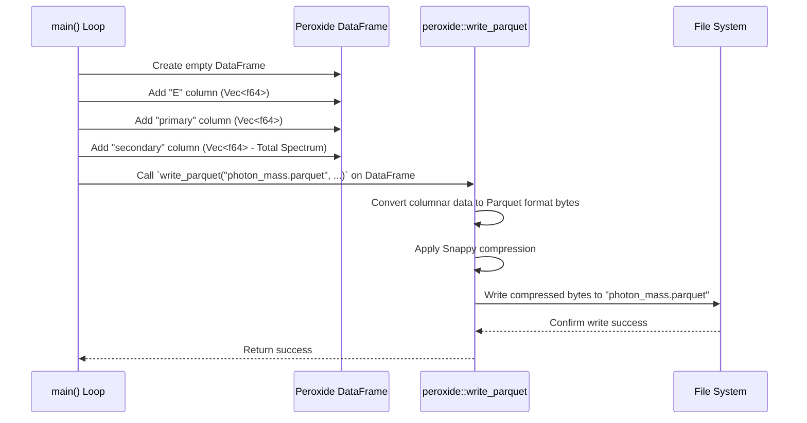

# Chapter 8: Data Output (Parquet) & Plotting

Welcome to the final chapter in our tour of OSPREY's core concepts! In [Chapter 7: SpectrumCalculator](07_spectrumcalculator_.md), we saw how OSPREY brings everything together to calculate the final, observable particle spectra (like photons) from a specific Primordial Black Hole (PBH), carefully combining both primary and secondary contributions.

But just calculating numbers isn't the end goal. We need to save these valuable results for later analysis and visualize them to understand the physics. This chapter covers how OSPREY handles **Data Output** using the efficient Parquet format and how you can easily **Plot** these results. Think of this as the final packaging and presentation stage of our PBH simulation "product".

## Why Save and Plot? Packaging and Presenting the Results

Imagine you've just baked that amazing cake using the `SpectrumCalculator` recipe from the last chapter. What do you do now?

1.  **Package it:** You want to store the cake (the calculated spectra) safely and efficiently, perhaps in a standard container that others can easily open and use.
2.  **Present it:** You want to show off your creation! A picture (a plot) is worth a thousand words (or data points) and helps you and others understand the results immediately.

In OSPREY:
*   **Packaging** means saving the calculated energy spectra (primary and secondary/total components) into files.
*   **Presentation** means creating plots from these saved files to visualize the spectra.

OSPREY is designed to make both steps straightforward.

## The Packaging: Efficient Storage with Parquet

How does OSPREY store the results? It uses the **Parquet (`.parquet`)** file format.

**What is Parquet?**
Parquet is a special file format designed for storing large datasets efficiently. Think of it like a high-tech, standardized shipping container for data. Its key advantages are:
*   **Columnar Storage:** It stores data column by column, which is very efficient for the kind of analysis we do (e.g., reading all energy values or all primary rate values).
*   **Compression:** It automatically compresses the data, saving disk space.
*   **Widely Compatible:** Many data analysis tools, especially in the Python ecosystem (like `pandas` and `polars`), can read Parquet files very easily.

**How OSPREY Uses Parquet:**
OSPREY uses a powerful Rust library called `peroxide` (specifically, its DataFrame feature) to organize the results and write them to `.parquet` files.

Recall the main loop in `src/main.rs` from Chapter 7:

```rust
// --- File: src/main.rs (Simplified Saving Snippet) ---
use osprey::{
    config::Config,
    spectrum::{SecondaryCalculator, SpectrumCalculator},
    core::PBH
};
use peroxide::fuga::{DataFrame, Series, CompressionOptions}; // Peroxide tools
use rayon::prelude::*;
use std::path::Path;

fn main() -> Result<(), Box<dyn std::error::Error>> {
    // ... (Load config, create calculators, loop through pbhs) ...
    let data_config = Config::from_toml("configs/data_v0.toml")?;
    let pbhs = data_config.generate_pbhs();
    let energy_grid = data_config.generate_primary_energies();
    let secondary_calculator = SecondaryCalculator::new(data_config.energy_cut())?;
    let data_dir = Path::new("./data_ML/data_v0"); // Output directory
    std::fs::create_dir_all(&data_dir)?;

    pbhs.par_iter().for_each(|pbh| {
        let spectrum_calculator = SpectrumCalculator::new(
            *pbh,
            energy_grid.clone(),
            energy_grid.clone(),
            &secondary_calculator,
        );
        // --- Calculation ---
        let (primary_photon, total_photon) = spectrum_calculator.compute_spectrum();

        // --- Packaging Starts Here ---
        // 1. Create an empty DataFrame (like an empty spreadsheet)
        let mut df = DataFrame::new(vec![]);

        // 2. Add columns: Energy, Primary Spectrum, Total Spectrum
        df.push("E", Series::new(energy_grid.clone())); // Energy values
        df.push("primary", Series::new(primary_photon)); // Primary photon rates
        // NOTE: We save the TOTAL spectrum as 'secondary' for historical reasons/plotting script compatibility
        df.push("secondary", Series::new(total_photon)); // Total (Primary + Secondary) rates

        // 3. Define the output filename (e.g., photon_1.0000e+15.parquet)
        let df_name = data_dir.join(format!("photon_{:.4e}.parquet", pbh.mass));

        // 4. Write the DataFrame to a Parquet file!
        df.write_parquet(df_name.to_str().unwrap(), CompressionOptions::Snappy)
            .expect("Failed to write parquet file");
        // --- Packaging Ends Here ---

        println!("Saved spectrum for PBH mass: {:.2e} g to {}", pbh.mass, df_name.display());
    });

    Ok(())
}
```

**Explanation:**

1.  After `spectrum_calculator.compute_spectrum()` returns the `primary_photon` and `total_photon` spectra (which are lists of numbers), we create an empty `DataFrame` using `peroxide`.
2.  We add columns to this DataFrame:
    *   `"E"`: The list of energy points where the spectra were calculated.
    *   `"primary"`: The calculated primary photon spectrum.
    *   `"secondary"`: The calculated **total** photon spectrum (primary + secondary). *Note: The column is named `secondary` for compatibility with existing plotting scripts, but it contains the total spectrum.*
3.  We construct a filename that includes the PBH mass, ensuring each PBH mass gets its own output file (e.g., `data_ML/data_v0/photon_1.0000e+15.parquet`).
4.  The magic happens with `df.write_parquet(...)`. This command tells `peroxide` to take all the data organized in the `DataFrame` and write it to the specified file in the efficient Parquet format, using Snappy compression.

**Expected Outcome:**
After running OSPREY (e.g., via `cargo run --release -- --data-config configs/data_v0.toml`), you will find `.parquet` files in the specified output directory (e.g., `./data_ML/data_v0/`). Each file contains the energy grid and the calculated primary and total photon spectra for one PBH mass.

## Under the Hood (Saving): The `peroxide` Assistant

The process of saving is quite straightforward thanks to the `peroxide` library.



`peroxide` handles all the complexities of the Parquet format specification and compression internally. We just need to organize our data into its `DataFrame` structure and call the `write_parquet` function.

## The Presentation: Plotting with Python

Now that we have our results neatly packaged in `.parquet` files, how do we visualize them?

While OSPREY itself focuses on the calculation, it's designed to work seamlessly with external tools for plotting. The most common tool for this is **Python**, using libraries like:

*   **`polars`** (or `pandas`/`pyarrow`): To easily read the `.parquet` files into a familiar table-like structure in Python.
*   **`matplotlib`**: A standard and powerful plotting library in Python.
*   **`numpy`**: For numerical operations if needed.
*   **`scienceplots`**: A helper library to make `matplotlib` plots look nice for scientific publications (optional but used in the provided scripts).

OSPREY includes example Python scripts in the `scripts/` directory to get you started. Let's look at `scripts/data_plot.py`.

**How to Use the Plotting Script:**

1.  **Install Python Dependencies:** Make sure you have Python installed. Then, navigate to the main OSPREY directory in your terminal and install the required libraries using the provided `requirements.txt` file (found in the root directory):
    ```bash
    # Make sure you have pip (Python's package installer)
    # Create a virtual environment (optional but recommended)
    # python -m venv .venv
    # source .venv/bin/activate  # On Linux/macOS
    # .venv\Scripts\activate    # On Windows

    # Install required packages
    pip install -r requirements.txt
    ```
    *(The specific `requirements.txt` file mentioned here might differ slightly based on project structure, but the principle is the same: install the listed Python packages.)*

2.  **Run the Script:** Execute the Python script from the main OSPREY directory, telling it which PBH mass's data file to plot. For example, to plot the results for a PBH mass of 1e14 g (assuming the file `data_ML/data_v0/photon_1.0000e+14.parquet` exists):
    ```bash
    python scripts/data_plot.py --pbh_mass 1.0000e+14
    ```

**Expected Outcome:**
The script will read the specified `.parquet` file, generate a plot showing the primary, secondary (which is actually the total), and calculated total spectra against energy, and save it as a PNG image file (e.g., `figs/data_v0_1.0000e+14_photon_plot.png`).

## Under the Hood (Plotting): The Python Recipe

Let's peek inside `scripts/data_plot.py` to see how it works.

```python
# --- File: scripts/data_plot.py (Simplified Snippets) ---

# 1. Import necessary libraries
import polars as pl              # For reading Parquet files
import matplotlib.pyplot as plt  # For plotting
import scienceplots              # For nice plot styling
import numpy as np               # For array operations
import argparse                  # For handling command-line arguments like --pbh_mass

# --- Argument Parsing (Gets the PBH mass from the command line) ---
parser = argparse.ArgumentParser(description='Plot data from parquet file')
parser.add_argument('--pbh_mass', type=str, required=True, help='PBH mass (e.g., 1.0000e+14)')
args = parser.parse_args()
pbh_mass = args.pbh_mass
# ---

# 2. Read the Parquet file using Polars
parquet_file = f"data_ML/data_v0/photon_{pbh_mass}.parquet"
try:
    df = pl.read_parquet(parquet_file)
except FileNotFoundError:
    print(f"Error: File not found - {parquet_file}")
    exit()

# 3. Prepare data for plotting
E = np.array(df['E'])             # Get Energy column as a NumPy array
primary = np.array(df['primary'])   # Get Primary spectrum column
# Remember: 'secondary' column in the file holds the TOTAL spectrum
total_from_file = np.array(df['secondary'])
# We can also calculate the secondary component if needed: total - primary
secondary_calculated = total_from_file - primary

# 4. Set up plot parameters (labels, scales, limits)
pparam = dict(
    xlabel = r'$E$ [MeV]',
    ylabel = r'${\rm d}^2N/{\rm d}E {\rm d}t$ [MeV$^{-1}$s$^{-1}$]', # Adjusted units for clarity
    xscale = 'log',
    yscale = 'log',
    # ylim = (1e+10, 1e+30), # Example axis limits
)

# 5. Create the plot using Matplotlib
with plt.style.context(["science", "nature"]): # Use scienceplots style
    fig, ax = plt.subplots()
    ax.autoscale(tight=True)
    ax.set(**pparam) # Apply plot parameters

    # Plot the data series
    ax.plot(E, primary, label='Primary')
    ax.plot(E, secondary_calculated, label='Secondary (Calculated)')
    ax.plot(E, total_from_file, label='Total (from file)', color='black', linestyle='--')

    ax.legend() # Add a legend

    # 6. Save the plot to a file
    output_filename = f'figs/data_v0_{pbh_mass}_photon_plot.png'
    fig.savefig(output_filename, dpi=600)
    print(f"Plot saved to {output_filename}")
```

**Explanation:**

1.  **Imports:** Bring in the necessary tools (`polars`, `matplotlib`, etc.).
2.  **Read Data:** Use `polars.read_parquet()` to load the data from the `.parquet` file specified by the `--pbh_mass` argument into a DataFrame `df`.
3.  **Prepare Data:** Extract the columns (`E`, `primary`, `secondary` which is total) from the DataFrame and convert them into `numpy` arrays, which `matplotlib` works well with. It also calculates the secondary-only contribution for plotting purposes.
4.  **Plot Setup:** Define labels, axis scales (logarithmic), and potentially axis limits for the plot.
5.  **Plotting:** Use `matplotlib` functions (`plt.subplots`, `ax.plot`, `ax.legend`, `ax.set`) to create the plot figure, add the data lines with labels, and apply the defined parameters. The `with plt.style.context(...)` line applies the nice formatting from `scienceplots`.
6.  **Save Plot:** Use `fig.savefig()` to save the generated plot as a PNG image file.

This script provides a clear example of how to take the `.parquet` files generated by OSPREY and turn them into informative visualizations using standard Python tools. You can adapt this script or create your own for different plotting needs.

## Conclusion

Congratulations! You've reached the end of the OSPREY core concepts tutorial. In this chapter, we learned how OSPREY handles the crucial final steps of **Data Output and Plotting**.

*   We saw that OSPREY saves the calculated spectra (primary and total) into efficient, compressed **Parquet (`.parquet`) files** using the `peroxide` crate's DataFrame capabilities. This makes the data easy to store and share.
*   We learned that visualization is typically handled by external tools, primarily **Python scripts**, which can easily read the Parquet files (using libraries like `polars`) and generate plots (using `matplotlib`). OSPREY provides example scripts in the `scripts/` directory to facilitate this.

Being able to reliably save and visualize your results is essential for any scientific simulation. OSPREY's use of Parquet ensures data integrity and efficiency, while the Python ecosystem provides powerful tools for plotting and further analysis.

You now have a solid understanding of the main components of OSPREY, from configuration and data preparation to the core physics calculations and final output. Happy exploring the physics of Primordial Black Holes with OSPREY!

---

Generated by [AI Codebase Knowledge Builder](https://github.com/The-Pocket/Tutorial-Codebase-Knowledge)