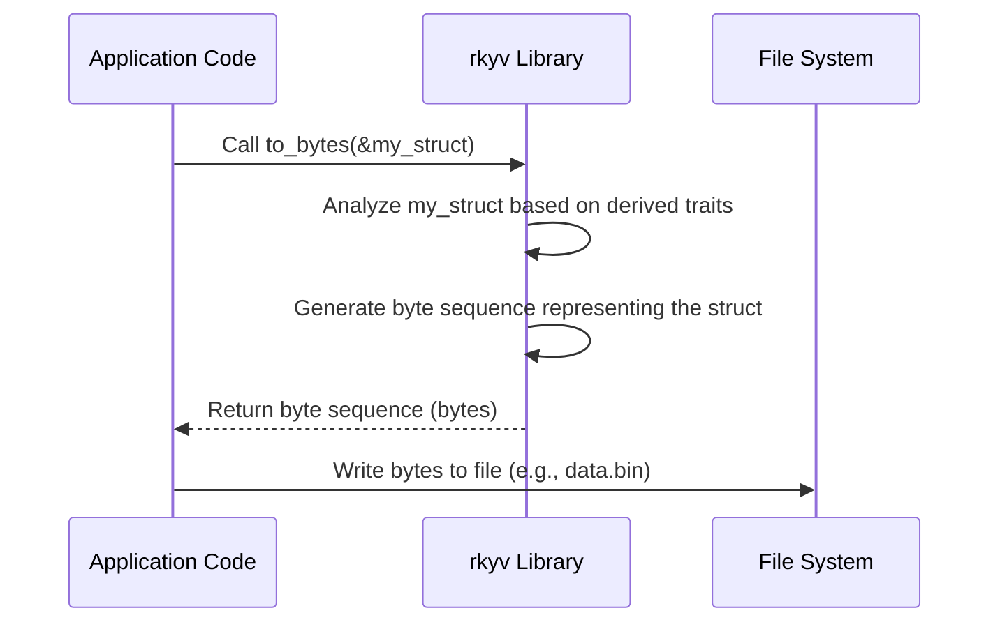
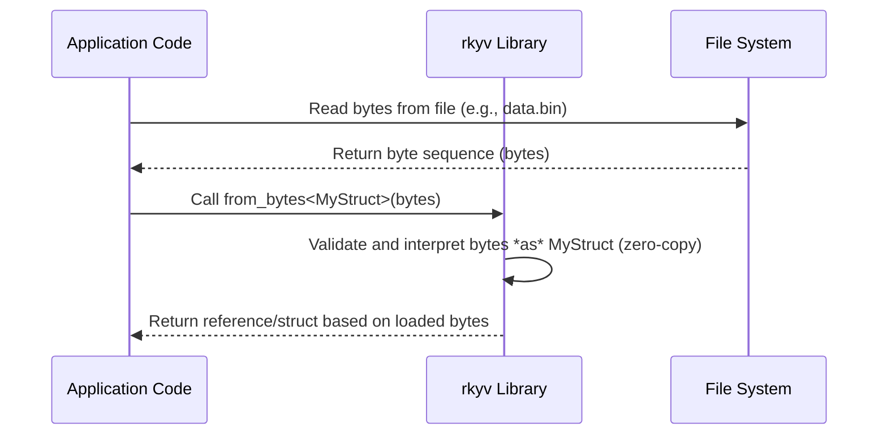

# Chapter 8: Data Serialization/Deserialization (`rkyv`, `Parquet`)

Welcome to the final chapter of the main OSPREY tutorial sequence! In [Chapter 7: Data Interpolation & Querying](07_data_interpolation___querying__bilinearinterpolation__find_index_or_lower_bound__secondarytable__query__.md), we saw how OSPREY efficiently retrieves pre-calculated data using interpolation, even when we need values between the grid points stored in tables like `SecondaryTable` or `GreyBodyData`.

But how did those tables get saved to files in the first place? And how are they loaded back so quickly when OSPREY starts? Furthermore, how can we save the results of our complex OSPREY simulations (like the final photon spectrum) in a way that other tools, perhaps written in Python, can easily read and analyze?

This involves **Data Serialization** and **Deserialization**.

## What's the Big Idea? Packing and Unpacking Data

Imagine you have complex data structures in your Rust code, like the results of a simulation stored in a `DataFrame` or the detailed physics data inside a `GreyBodyData` struct. These structures exist only in your computer's temporary memory (RAM) while your program is running.

*   **Saving:** If you want to save this data to a file (e.g., to reuse it later without recalculating, or to send it to someone else), you need to convert it from its in-memory representation into a sequence of bytes that can be written to disk. This process is called **Serialization**. Think of it like **packing** your delicate items (data structures) into boxes (files) for storage or shipping.

*   **Loading:** Later, when you (or another program) want to use the data stored in the file, you need to read the bytes from the file and reconstruct the original data structure back into memory. This reverse process is called **Deserialization**. It's like **unpacking** the boxes to get your items back.

**Our Goal:** We need efficient ways to "pack" our OSPREY data (like `GreyBodyData`, `SecondaryTable`, or simulation results) into files and "unpack" them later. OSPREY uses two main packing strategies:

1.  **`rkyv`:** This is a super-fast method used for saving and loading Rust data structures (like `GreyBodyData` or `SecondaryTable`) within OSPREY itself. It creates binary files (often ending in `.bin`). Think of `rkyv` like using **vacuum-sealed bags**: extremely efficient for storing specific items (Rust structs) and very quick to open (deserialize) because the structure is preserved almost perfectly. It's mainly used for internal data OSPREY needs to load quickly.

2.  **`Parquet`:** This is a popular format for storing large datasets, especially tabular data (like rows and columns). It saves data in a columnar format, which is very efficient for analysis tasks. Files often end in `.parquet`. Think of `Parquet` like using **well-organized, labeled boxes**: great for shipping large amounts of structured data (like simulation results) so that other tools (like Python scripts for plotting) can easily find and use specific pieces without unpacking everything.

## How OSPREY Uses Serialization/Deserialization

You've actually already seen the *results* of deserialization in previous chapters!

### `rkyv`: For Fast Internal Data

*   **Loading (Deserialization):** When you call `GreyBody::from_bin` ([Chapter 3](03_greybody_factors__greybody___greybodydata___greybodyfit__.md)) or `SecondaryTable::read_bin` ([Chapter 5](05_secondarygenerator___secondarytable_.md)), OSPREY is using `rkyv` behind the scenes to quickly load the pre-calculated data from `.bin` files into the corresponding Rust structs.

    ```rust
    // We saw this in Chapter 5
    use secondary::prelude::SecondaryTable;

    let filename = "secondary/tables/Hazma_photon_spectra.bin"; // Path to pre-calculated table

    // This uses rkyv internally to deserialize the bytes from the file
    // back into a SecondaryTable struct.
    println!("Loading table from {}...", filename);
    let loaded_table = match SecondaryTable::read_bin(filename) {
        Ok(table) => {
            println!("Table loaded using rkyv!");
            table
        }
        Err(e) => panic!("Could not load table: {}", e),
    };
    ```
    **Input:** Path to a `.bin` file containing serialized `SecondaryTable` data.
    **Output:** A fully functional `SecondaryTable` object in memory.

*   **Saving (Serialization):** Similarly, when generating tables (as shown briefly in Chapter 5), the `SecondaryTable::write_bin` method uses `rkyv` to serialize the data structure into a byte stream and save it to a `.bin` file.

    ```rust
    // // Dummy types for illustration
    // use std::collections::HashMap; use secondary::prelude::*;
    // use peroxide::fuga::*; type Matrix = Peroxide::Array<f64>;
    // #[derive(Debug, Clone, Archive, Serialize, Deserialize)]
    // pub struct SecondaryTable { pub input_energies: Vec<f64>, pub output_energies: Vec<f64>, pub spectra: HashMap<String, Matrix>}
    // impl SecondaryTable { pub fn write_bin(&self, _:&str)->Result<(),String> { Ok(()) } }
    // let photon_table = SecondaryTable { input_energies: vec![], output_energies: vec![], spectra: HashMap::new() };
    // // End dummy types
    let filename = "my_photon_table.bin";

    // This uses rkyv internally to serialize the 'photon_table' object
    // into bytes and write them to the file.
    match photon_table.write_bin(filename) {
        Ok(_) => println!("Table saved using rkyv to {}", filename),
        Err(e) => println!("Error saving table: {}", e),
    }
    ```
    **Input:** A `SecondaryTable` object in memory.
    **Output:** A `.bin` file containing the serialized representation of the table.

`rkyv` is chosen here because it's incredibly fast, especially for loading, as it tries to avoid extra copying and processing (more on that later).

### `Parquet`: For Analysis and Sharing

OSPREY often produces results, like the final calculated energy spectra of photons, electrons, or other particles. We might want to plot this data or perform further analysis using tools like Python. `Parquet` is ideal for this.

*   **Saving (Serialization):** OSPREY often uses the `peroxide` crate's `DataFrame` structure to hold final results. This `DataFrame` can be easily saved to a Parquet file. You saw this in example code like `primary/examples/primary_test.rs` and `src/main.rs`.

    ```rust
    // Example from src/main.rs (simplified)
    use peroxide::fuga::*; // Using peroxide's DataFrame

    // // Dummy data
    // let output_energies = vec![10.0, 100.0, 1000.0];
    // let primary_photon = vec![1e15, 1e14, 1e12];
    // let secondary_pi0 = vec![5e14, 6e13, 3e11];
    // // End dummy data

    // Assume we have calculated energies and spectra
    let mut df = DataFrame::new(vec![]);
    df.push("E", Series::new(output_energies)); // Energy column
    df.push("primary", Series::new(primary_photon)); // Primary photon spectrum
    df.push("secondary_pi0", Series::new(secondary_pi0)); // Secondary from pi0
    // ... add other columns ...

    let output_filename = "data/final_photon_spectrum.parquet";
    println!("Saving results to {}...", output_filename);

    // This serializes the DataFrame into the Parquet format
    // and writes it to the specified file.
    match df.write_parquet(output_filename, CompressionOptions::Snappy) {
        Ok(_) => println!("Results saved successfully using Parquet!"),
        Err(e) => println!("Error saving Parquet file: {}", e),
    }
    ```
    **Input:** A `DataFrame` containing simulation results (energies, rates, etc.).
    **Output:** A `.parquet` file that can be read by other tools.

*   **Loading (Deserialization in Python):** The beauty of Parquet is that other languages and tools can easily read it. For example, a Python script (like `scripts/pq_plot.py` used in OSPREY) can load the data using libraries like `polars` or `pandas`.

    ```python
    # Python code (example similar to scripts/pq_plot.py)
    import polars as pl # Using the polars library in Python

    parquet_filename = "data/final_photon_spectrum.parquet"
    print(f"Loading data from {parquet_filename} in Python...")

    # This uses the polars library to deserialize the Parquet file
    # into a Polars DataFrame object in Python.
    try:
        df_python = pl.read_parquet(parquet_filename)
        print("Data loaded successfully into Python!")
        print(df_python) # Display the loaded data
    except Exception as e:
        print(f"Error loading Parquet file in Python: {e}")

    # Now you can plot df_python['E'], df_python['primary'], etc. using matplotlib
    ```
    **Input:** Path to a `.parquet` file created by OSPREY.
    **Output:** A `DataFrame` object in Python, ready for analysis or plotting.

Parquet is chosen for results because it's standard, efficient for large tables, and widely supported across different data science tools and languages.

## Under the Hood: How `rkyv` Works

`rkyv` achieves its speed through a concept called **zero-copy deserialization**.

*   **Traditional Deserialization:** Reads bytes from a file, allocates new memory for the Rust struct, and carefully copies the data from the file bytes into the newly allocated struct, often involving validation and parsing.
*   **`rkyv` Deserialization:** When you load data, `rkyv` reads the bytes from the file into memory. Then, instead of allocating *new* structs and copying data, it cleverly interprets the loaded bytes *directly* as if they were the Rust struct. It calculates where each field *would* be in the byte sequence and just gives you references to those locations. This avoids most of the allocation and copying, making it very fast.

**How does `rkyv` know how to do this?**

Through special instructions you add to your struct definitions using `derive`:

```rust
// From secondary/src/io.rs
use rkyv::{Archive, Deserialize, Serialize};
use std::collections::HashMap;
// // Dummy Matrix type
// use peroxide::fuga::Matrix;

// These derive macros automatically generate the code rkyv needs
// to understand how to serialize and deserialize SecondaryTable.
#[derive(Debug, Clone, Archive, Serialize, Deserialize)]
#[archive(check_bytes)] // Optional: Adds validation during deserialization
pub struct SecondaryTable {
    pub input_energies: Vec<f64>,
    pub output_energies: Vec<f64>,
    pub spectra: HashMap<String, Matrix>,
}
```

*   `#[derive(Archive, Serialize, Deserialize)]`: Tells `rkyv` to generate the necessary code for this struct. `Archive` is core to `rkyv`'s zero-copy mechanism. `Serialize` enables saving, `Deserialize` enables reconstructing (though `Archive` is often sufficient for reading).

**Simplified Saving (`write_bin`)**

```rust
// Simplified view of SecondaryTable::write_bin
use rkyv::{to_bytes, rancor}; // rancor is rkyv's error type
use std::io::{Write, BufWriter};
use std::collections::HashMap; use rkyv::{Archive, Serialize, Deserialize};
use peroxide::fuga::*;

#[derive(Debug, Clone, Archive, Serialize, Deserialize)]
pub struct SecondaryTable { pub input_energies: Vec<f64>, pub output_energies: Vec<f64>, pub spectra: HashMap<String, Matrix>}
impl SecondaryTable {
    fn write_bin_simplified(&self, filename: &str) -> Result<(), Box<dyn std::error::Error>> {
        let mut file = std::fs::File::create(filename)?;
        let mut writer = BufWriter::new(&mut file);

        // 1. Serialize the struct (`self`) into a byte sequence using rkyv
        let bytes = to_bytes::<rancor::Error>(self)?;

        // 2. Write the resulting bytes to the file
        writer.write_all(&bytes)?;
        writer.flush()?; // Ensure all data is written

        Ok(())
    }
}
```

**Simplified Loading (`read_bin`)**

```rust
// Simplified view of SecondaryTable::read_bin
use rkyv::{from_bytes, rancor};
use std::io::{Read, BufReader};
// Dummy types
use std::collections::HashMap; use rkyv::{Archive, Serialize, Deserialize};
use peroxide::fuga::Matrix;
#[derive(Debug, Clone, Archive, Serialize, Deserialize)]
pub struct SecondaryTable { pub input_energies: Vec<f64>, pub output_energies: Vec<f64>, pub spectra: HashMap<String, Matrix>}
impl SecondaryTable {
    fn read_bin_simplified(filename: &str) -> Result<Self, Box<dyn std::error::Error>> {
        let mut file = std::fs::File::open(filename)?;
        let mut reader = BufReader::new(&mut file);
        let mut bytes = Vec::new();
    
        // 1. Read all bytes from the file into a buffer
        reader.read_to_end(&mut bytes)?;
    
        // 2. Deserialize the bytes back into the struct using rkyv
        // This is where the magic happens - ideally zero-copy!
        let table = from_bytes::<SecondaryTable, rancor::Error>(&bytes)?;
    
        Ok(table)
    }
}
```

**Serialization Flow (`rkyv`)**



**Deserialization Flow (`rkyv`)**



## Under the Hood: How `Parquet` Works

`Parquet` uses a **columnar storage** format.

*   **Row-based (like CSV):** Stores data row by row (e.g., `Energy1, Rate1, Error1` then `Energy2, Rate2, Error2`, ...). To read just the 'Rate' column, you have to read and discard energy and error data from every row.
*   **Columnar (like Parquet):** Stores data column by column (e.g., `Energy1, Energy2, ...` then `Rate1, Rate2, ...` then `Error1, Error2, ...`). To read just the 'Rate' column, you can directly access and read only the block of data containing all the rates. This is much more efficient for analysis queries that often focus on specific columns.

Parquet also includes features like:

*   **Compression:** Reduces file size (OSPREY often uses `Snappy` compression).
*   **Encoding:** Stores data within columns efficiently (e.g., using dictionary encoding for repeated values).
*   **Schema:** Stores information about the data types and structure within the file itself.

**How OSPREY handles it:**

OSPREY doesn't implement the Parquet format itself. It relies on powerful crates like `polars` (often via `peroxide`), which handle the complexities of reading and writing Parquet files.

When you call `df.write_parquet(...)` in Rust:

1.  The `DataFrame` object (`df`) contains the data organized logically into columns (like "E", "primary").
2.  The `write_parquet` function (provided by the `polars` crate) takes this `DataFrame`.
3.  `polars` iterates through each column, applies efficient encoding and compression, and arranges the data in the columnar Parquet format.
4.  It writes the formatted bytes, along with metadata (schema, etc.), to the specified file.

When Python's `polars` or `pandas` reads the file, it uses the schema information embedded in the Parquet file to understand the structure and efficiently load the requested columns.

## Conclusion

In this final chapter, we learned about saving and loading data in OSPREY using serialization and deserialization.

*   **Serialization** ("packing") converts in-memory data structures into bytes for file storage.
*   **Deserialization** ("unpacking") converts bytes from a file back into usable data structures.
*   OSPREY uses **`rkyv`** for extremely fast serialization/deserialization of internal Rust data (like `GreyBodyData`, `SecondaryTable`) into `.bin` files, often using zero-copy techniques.
*   OSPREY uses the **`Parquet`** format for saving tabular results (like simulation spectra in `DataFrames`) into `.parquet` files. This format is efficient for large datasets and easily readable by external analysis tools like Python.

Understanding serialization helps explain how OSPREY efficiently manages its pre-calculated data and how you can export results for further analysis.

This concludes the main tutorial sequence for OSPREY. We hope you now have a good understanding of the core concepts, from the [PBH (Primordial Black Hole)](01_pbh__primordial_black_hole__.md) itself to calculating [primary emissions](04_emission_rate_calculation__pbh__emission_rate__.md), handling [secondary decays](05_secondarygenerator___secondarytable_.md), and managing the data involved ([interpolation](07_data_interpolation___querying__bilinearinterpolation__find_index_or_lower_bound__secondarytable__query__.md) and [serialization](08_data_serialization_deserialization__rkyv__parquet__.md)). Happy simulating!

---

Generated by [AI Codebase Knowledge Builder](https://github.com/The-Pocket/Tutorial-Codebase-Knowledge)
