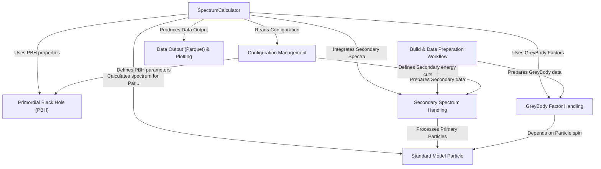

# Tutorial: OSPREY

OSPREY simulates the **Hawking radiation** emitted by *Primordial Black Holes* (PBHs).
It calculates the energy **spectra** of various *Standard Model particles* produced both directly (primary emission, affected by gravity's **GreyBody** filter) and indirectly (secondary particles from decays/interactions).
The project involves preparing necessary physics data (**Build Workflow**), configuring simulation parameters (**Configuration**), running the main calculation (**SpectrumCalculator**), and saving the results (**Data Output**) for analysis and plotting.

**Source Repository:** [None](None)

## Chapters

1. [Build & Data Preparation Workflow
](01_build___data_preparation_workflow_.md)
2. [Configuration Management
](02_configuration_management_.md)
3. [Primordial Black Hole (PBH)
](03_primordial_black_hole__pbh__.md)
4. [Standard Model Particle
](04_standard_model_particle_.md)
5. [GreyBody Factor Handling
](05_greybody_factor_handling_.md)
6. [Secondary Spectrum Handling
](06_secondary_spectrum_handling_.md)
7. [SpectrumCalculator
](07_spectrumcalculator_.md)
8. [Data Output (Parquet) & Plotting
](08_data_output__parquet____plotting_.md)

---

Generated by [AI Codebase Knowledge Builder](https://github.com/The-Pocket/Tutorial-Codebase-Knowledge)