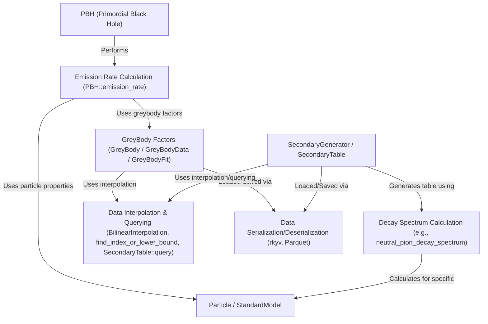

# Tutorial: OSPREY

OSPREY simulates the physics of **Primordial Black Holes (PBH)**.
It calculates the rate at which these tiny black holes emit *Standard Model particles* via **Hawking radiation**, accounting for *greybody factors* (how gravity affects particle escape).
It then simulates the **decay** of unstable primary particles into secondary particles (like photons), using pre-calculated tables.
The final output is the combined energy *spectrum* of particles originating from the PBH, useful for astrophysical analyses.

**Source Repository:** [OSPREY](https://github.com/Axect/OSPREY)

## Chapters

1. [PBH (Primordial Black Hole)
](01_pbh__primordial_black_hole__.html)
2. [Particle / StandardModel
](02_particle___standardmodel_.html)
3. [GreyBody Factors (GreyBody / GreyBodyData / GreyBodyFit)
](03_greybody_factors__greybody___greybodydata___greybodyfit__.html)
4. [Emission Rate Calculation (PBH::emission_rate)
](04_emission_rate_calculation__pbh__emission_rate__.html)
5. [SecondaryGenerator / SecondaryTable
](05_secondarygenerator___secondarytable_.html)
6. [Decay Spectrum Calculation (e.g., neutral_pion_decay_spectrum)
](06_decay_spectrum_calculation__e_g___neutral_pion_decay_spectrum__.html)
7. [Data Interpolation & Querying (BilinearInterpolation, find_index_or_lower_bound, SecondaryTable::query)
](07_data_interpolation___querying__bilinearinterpolation__find_index_or_lower_bound__secondarytable__query__.html)
8. [Data Serialization/Deserialization (rkyv, Parquet)
](08_data_serialization_deserialization__rkyv__parquet__.html)

---

Generated by [AI Codebase Knowledge Builder](https://github.com/The-Pocket/Tutorial-Codebase-Knowledge)
